# NodeAngularFullStack - Comprehensive Codebase Analysis

## Executive Summary

NodeAngularFullStack is a modern, enterprise-ready full-stack application implementing a complete authentication and user management system. Built with TypeScript, Angular 20, Express.js, and PostgreSQL, it follows industry best practices for security, scalability, and maintainability.

## Table of Contents

1. [Architecture Overview](#architecture-overview)
2. [Technology Stack](#technology-stack)
3. [Project Structure](#project-structure)
4. [Backend Architecture](#backend-architecture)
5. [Frontend Architecture](#frontend-architecture)
6. [Database Design](#database-design)
7. [Authentication & Security](#authentication--security)
8. [API Design](#api-design)
9. [Testing Strategy](#testing-strategy)
10. [Deployment & DevOps](#deployment--devops)
11. [Development Workflow](#development-workflow)
12. [Performance Considerations](#performance-considerations)
13. [Future Roadmap](#future-roadmap)

## Architecture Overview

### High-Level Architecture

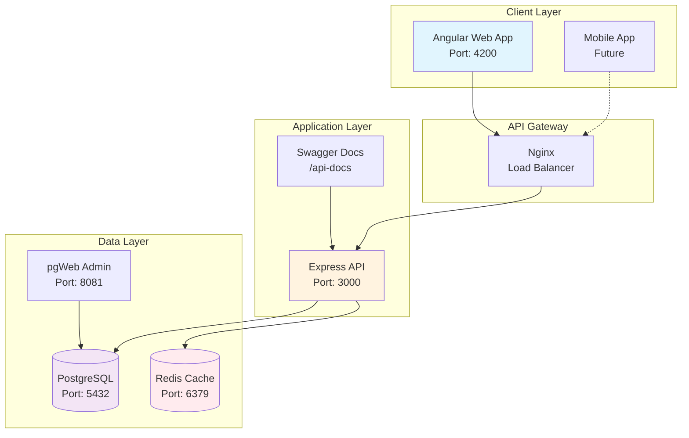

### System Context

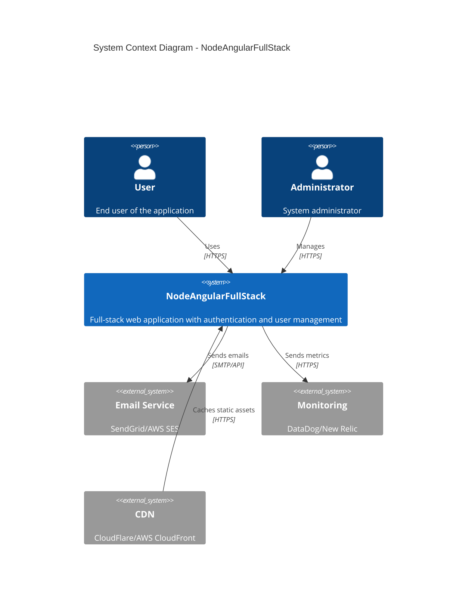

## Technology Stack

### Core Technologies

| Layer | Technology | Version | Purpose |
|-------|------------|---------|---------|
| **Frontend** | Angular | 20.3.0 | SPA Framework |
| | TypeScript | 5.9.2 | Type Safety |
| | RxJS | 7.8.0 | Reactive Programming |
| | TailwindCSS | 3.4.17 | Utility-First CSS |
| | PrimeNG | 20.1.2 | UI Component Library |
| **Backend** | Node.js | ≥18.0.0 | Runtime Environment |
| | Express | 5.1.0 | Web Framework |
| | TypeScript | 5.9.2 | Type Safety |
| | Passport | 0.7.0 | Authentication |
| **Database** | PostgreSQL | 15 | Primary Database |
| | Redis | 7 | Caching & Sessions |
| **DevOps** | Docker | Latest | Containerization |
| | Docker Compose | Latest | Orchestration |
| | Nginx | Latest | Reverse Proxy |

### Development Tools

- **Build Tools**: npm workspaces, TypeScript Compiler
- **Testing**: Jest, Supertest, Karma, Jasmine
- **Code Quality**: ESLint, Prettier
- **Documentation**: Swagger/OpenAPI 3.0
- **Version Control**: Git

## Project Structure

### Monorepo Architecture

```
NodeAngularFullStack/
├── apps/                    # Application packages
│   ├── api/                # Express backend
│   │   ├── src/
│   │   │   ├── controllers/    # Request handlers
│   │   │   ├── services/       # Business logic
│   │   │   ├── repositories/   # Data access layer
│   │   │   ├── middleware/     # Express middleware
│   │   │   ├── routes/         # API routes
│   │   │   ├── utils/          # Utility functions
│   │   │   └── validators/     # Input validation
│   │   ├── tests/
│   │   │   ├── unit/           # Unit tests
│   │   │   ├── integration/    # Integration tests
│   │   │   └── performance/    # Performance tests
│   │   └── database/
│   │       └── migrations/     # SQL migrations
│   └── web/                # Angular frontend
│       └── src/
│           ├── app/
│           │   ├── core/       # Core services & guards
│           │   ├── features/   # Feature modules
│           │   ├── layouts/    # Layout components
│           │   └── shared/     # Shared components
│           └── environments/   # Environment configs
├── packages/               # Shared packages
│   ├── shared/            # Shared types & utilities
│   └── config/            # Shared configuration
├── infrastructure/        # Infrastructure as Code
│   └── docker/           # Docker configurations
├── scripts/              # Build & deploy scripts
├── tests/               # E2E tests
└── docs/               # Documentation
```

### Module Organization

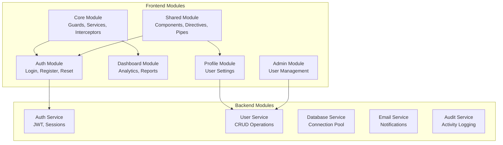

## Backend Architecture

### Layered Architecture

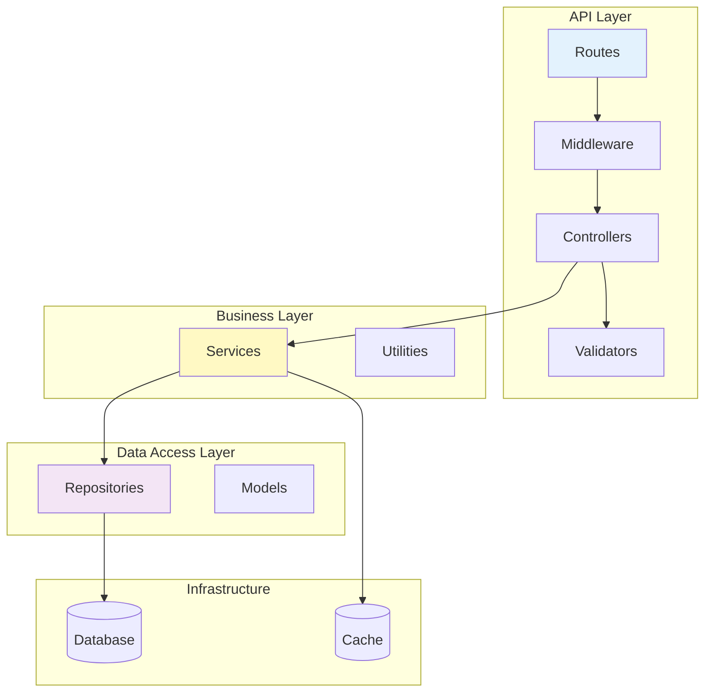

### Request Flow

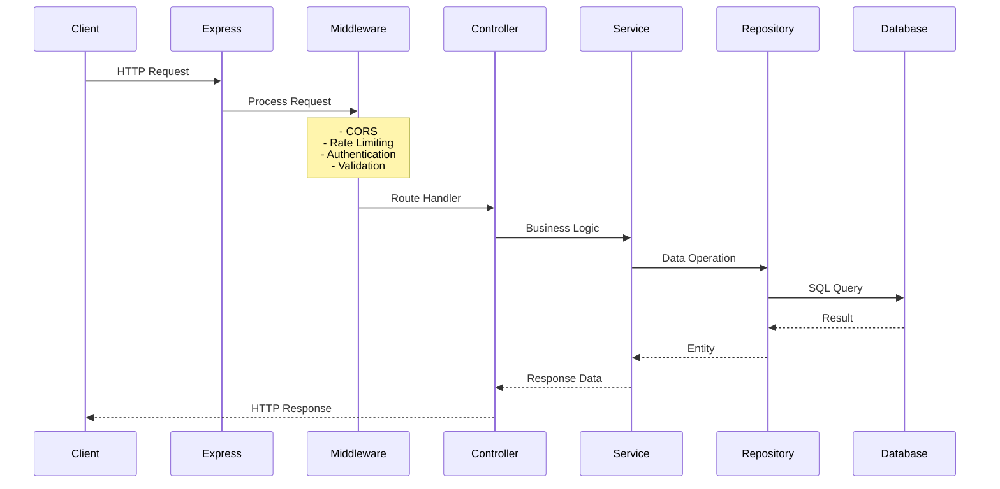

### Key Backend Components

#### 1. **Server Configuration** (`server.ts`)
- Express application setup
- Middleware initialization (Helmet, CORS, Compression, Morgan)
- Route configuration
- Error handling
- Graceful shutdown handling

#### 2. **Database Service** (`database.service.ts`)
- PostgreSQL connection pooling
- Query execution with parameterization
- Transaction support
- Connection health checks

#### 3. **Authentication Service** (`auth.service.ts`)
- User registration with password hashing (bcrypt)
- JWT token generation and validation
- Session management
- Password reset functionality
- Multi-tenant support

#### 4. **Repository Pattern**
- Data access abstraction
- SQL query encapsulation
- Entity mapping
- CRUD operations

## Frontend Architecture

### Angular Application Structure

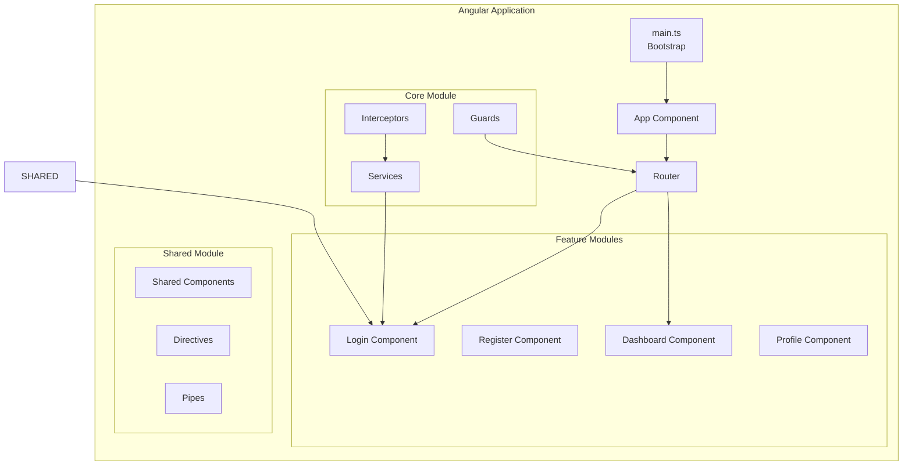

### Component Architecture

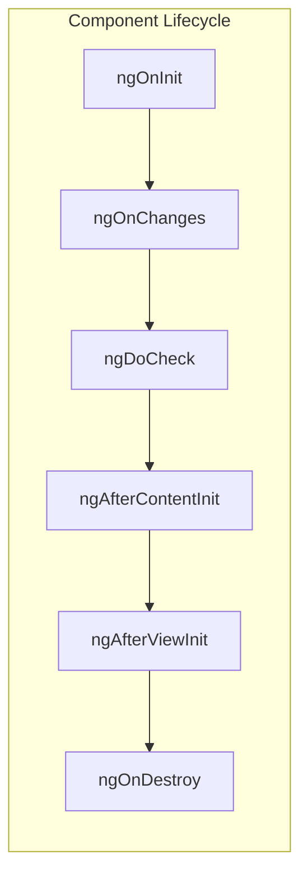

### State Management Pattern

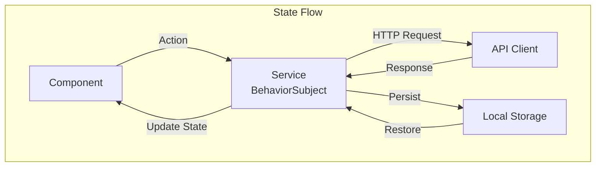

### Key Frontend Features

#### 1. **Authentication Module**
- Login/Logout functionality
- Registration with validation
- Password reset flow
- JWT token management
- Auto-refresh tokens

#### 2. **Route Guards**
- `authGuard`: Protects authenticated routes
- `adminGuard`: Admin-only access
- `userGuard`: User role validation

#### 3. **HTTP Interceptor**
- Automatic JWT token injection
- Token refresh on 401
- Global error handling
- Request/Response logging

#### 4. **Responsive Design**
- Mobile-first approach
- TailwindCSS utilities
- PrimeNG components
- Adaptive layouts

## Database Design

### Entity Relationship Diagram

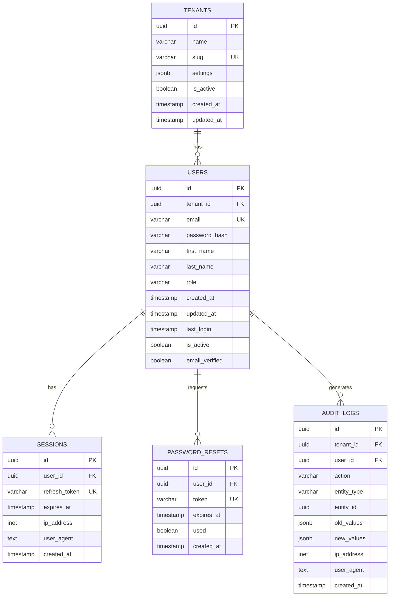

### Database Schema Details

#### Tables

1. **users** - Core user authentication and profile data
   - UUID primary keys for security
   - Email uniqueness per tenant
   - bcrypt password hashing
   - Role-based access control (admin, user, readonly)

2. **sessions** - JWT refresh token management
   - Tracks active user sessions
   - IP and user agent logging
   - Automatic expiration cleanup

3. **password_resets** - Password reset tokens
   - Secure random tokens
   - Time-limited validity
   - Single-use enforcement

4. **tenants** - Multi-tenancy support
   - Isolated data per organization
   - Customizable settings
   - Slug-based routing

5. **audit_logs** - Comprehensive activity tracking
   - All CRUD operations logged
   - Before/after value tracking
   - Compliance-ready

### Database Optimization

- **Indexes**: Created on all foreign keys and frequently queried columns
- **Triggers**: Auto-update `updated_at` timestamps
- **Functions**: Cleanup procedures for expired sessions and tokens
- **Connection Pooling**: 20 connections with automatic management
- **Query Optimization**: Parameterized queries to prevent SQL injection

## Authentication & Security

### Security Architecture

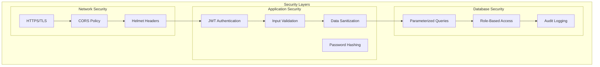

### JWT Token Flow

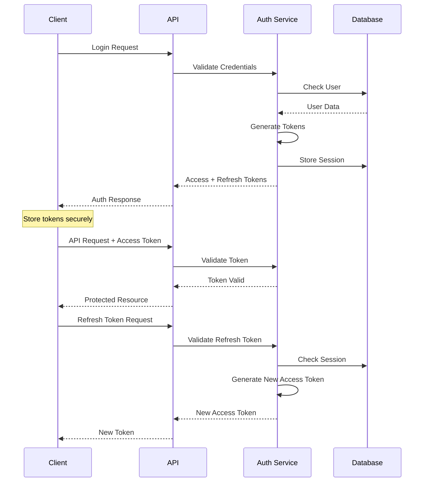

### Security Features

#### 1. **Authentication**
- JWT-based authentication
- Access tokens (15min expiry)
- Refresh tokens (7 days expiry)
- Secure token storage
- Automatic token refresh

#### 2. **Authorization**
- Role-based access control (RBAC)
- Route-level protection
- API endpoint authorization
- Multi-tenant data isolation

#### 3. **Password Security**
- bcrypt hashing (12 rounds)
- Password complexity requirements
- Password reset via email
- Account lockout protection

#### 4. **API Security**
- Rate limiting (100 req/15min production)
- CORS configuration
- Helmet.js security headers
- Input validation & sanitization
- SQL injection prevention

#### 5. **Audit & Compliance**
- Comprehensive activity logging
- PII data protection
- GDPR compliance ready
- Security event tracking

## API Design

### RESTful API Structure

```
BASE URL: http://localhost:3000/api/v1

Authentication Endpoints:
POST   /auth/register      - User registration
POST   /auth/login         - User login
POST   /auth/refresh       - Token refresh
POST   /auth/logout        - User logout
GET    /auth/profile       - Get current user profile
PATCH  /auth/profile       - Update profile
GET    /auth/me           - Validate token

User Management Endpoints:
POST   /users             - Create user (admin)
GET    /users             - List users with pagination (admin)
GET    /users/:id         - Get user by ID
PUT    /users/:id         - Update user (admin)
PATCH  /users/:id         - Partial update
DELETE /users/:id         - Delete user (admin)

Health Check:
GET    /health            - Basic health check
GET    /health/detailed   - Detailed system status
```

### API Documentation

The API is fully documented using OpenAPI 3.0 specification, accessible at `/api-docs`.

#### Request/Response Format

```typescript
// Standard API Response
interface ApiResponse<T> {
  success: boolean;
  data?: T;
  error?: {
    code: string;
    message: string;
    details?: any;
  };
  metadata?: {
    timestamp: string;
    requestId: string;
    version: string;
  };
}

// Paginated Response
interface PaginatedResponse<T> {
  items: T[];
  pagination: {
    page: number;
    limit: number;
    total: number;
    totalPages: number;
  };
}
```

### API Versioning Strategy

- URL-based versioning (`/api/v1/`)
- Backward compatibility for 2 versions
- Deprecation notices in headers
- Migration guides for breaking changes

## Testing Strategy

### Test Pyramid

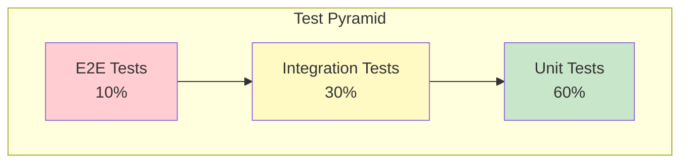

### Testing Coverage

#### Backend Testing

1. **Unit Tests** (`tests/unit/`)
   - Service logic testing
   - Utility function testing
   - Validator testing
   - Controller testing with mocks

2. **Integration Tests** (`tests/integration/`)
   - API endpoint testing
   - Database operations
   - Authentication flows
   - Middleware testing

3. **Performance Tests** (`tests/performance/`)
   - Load testing
   - Response time validation
   - Database query performance
   - Memory usage monitoring

#### Frontend Testing

1. **Component Tests**
   - Component rendering
   - User interaction
   - State management
   - Event handling

2. **Service Tests**
   - API client testing
   - State service testing
   - Guard testing
   - Interceptor testing

3. **E2E Tests**
   - User journey testing
   - Cross-browser testing
   - Mobile responsiveness
   - Performance testing

### Test Execution

```bash
# Backend tests
npm run test:api         # All tests
npm run test:unit        # Unit tests only
npm run test:integration # Integration tests
npm run test:performance # Performance tests
npm run test:security    # Security tests

# Frontend tests
npm run test:web        # All Angular tests
npm run test:e2e        # E2E tests

# Coverage reports
npm run test:coverage   # Generate coverage report
```

## Deployment & DevOps

### Container Architecture

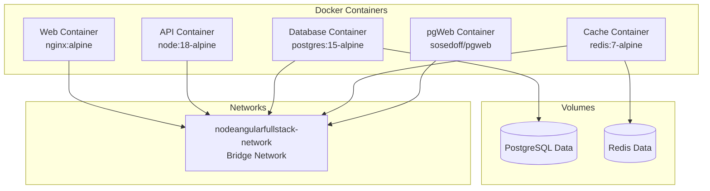

### CI/CD Pipeline

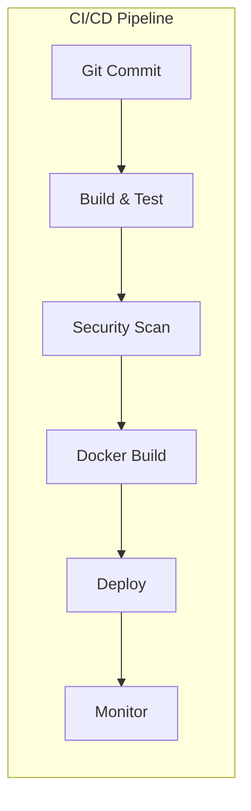

### Deployment Environments

| Environment | Purpose | Configuration |
|------------|---------|---------------|
| **Development** | Local development | Docker Compose, hot reload |
| **Staging** | Pre-production testing | Docker, production-like |
| **Production** | Live environment | Kubernetes, auto-scaling |

### Infrastructure as Code

```yaml
# docker-compose.yml highlights
services:
  postgres:
    image: postgres:15-alpine
    healthcheck:
      test: ["CMD-SHELL", "pg_isready"]
    deploy:
      resources:
        limits:
          memory: 512M

  api:
    build:
      context: .
      target: production
    depends_on:
      postgres:
        condition: service_healthy
    deploy:
      resources:
        limits:
          memory: 1024M
```

## Development Workflow

### Local Development Setup

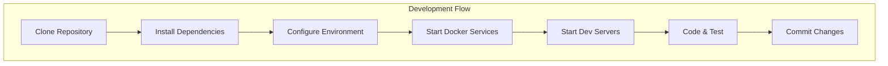

### Development Commands

```bash
# Initial setup
npm install              # Install all dependencies
cp .env.example .env    # Configure environment

# Development
npm run dev             # Start all services
npm run dev:api         # Start API only
npm run dev:web         # Start web only

# Docker operations
npm run docker:up       # Start containers
npm run docker:down     # Stop containers
npm run docker:logs     # View logs
npm run docker:clean    # Clean volumes

# Database operations
npm run db:migrate      # Run migrations
npm run db:seed         # Seed data
npm run db:reset        # Reset database

# Testing
npm run test            # Run all tests
npm run lint            # Lint code
npm run test:coverage   # Coverage report
```

### Git Workflow

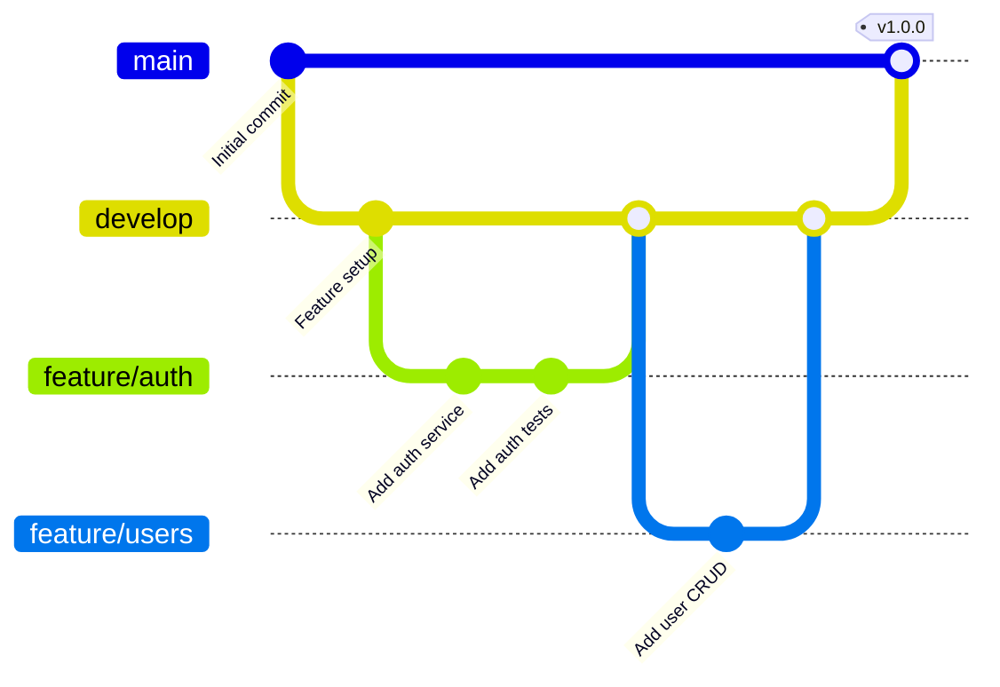

## Performance Considerations

### Performance Optimizations

#### Backend Performance

1. **Database Optimization**
   - Connection pooling (20 connections)
   - Indexed queries
   - Query result caching with Redis
   - Prepared statements

2. **API Performance**
   - Response compression (gzip)
   - Request rate limiting
   - Async/await for non-blocking operations
   - Efficient data pagination

3. **Caching Strategy**
   - Redis for session storage
   - Query result caching
   - Static asset caching
   - CDN integration ready

#### Frontend Performance

1. **Bundle Optimization**
   - Lazy loading modules
   - Tree shaking
   - Code splitting
   - Production builds with AOT

2. **Runtime Performance**
   - Change detection optimization
   - OnPush strategy
   - Async pipe usage
   - Virtual scrolling for lists

3. **Network Optimization**
   - HTTP/2 support
   - Service worker ready
   - Efficient API calls
   - Request debouncing

### Performance Metrics

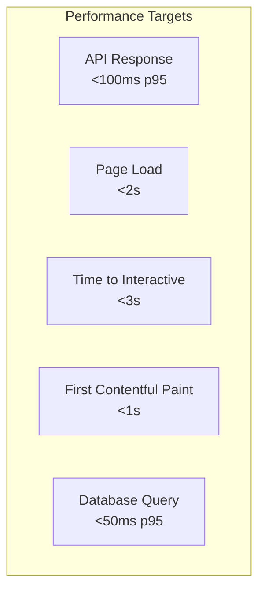

## Future Roadmap

### Phase 1: Core Enhancements (Q1 2025)
- [ ] WebSocket support for real-time features
- [ ] Advanced search with Elasticsearch
- [ ] File upload with S3 integration
- [ ] Two-factor authentication (2FA)
- [ ] OAuth2 social login

### Phase 2: Scalability (Q2 2025)
- [ ] Microservices architecture
- [ ] GraphQL API layer
- [ ] Message queue (RabbitMQ/Kafka)
- [ ] Distributed caching
- [ ] Kubernetes deployment

### Phase 3: Advanced Features (Q3 2025)
- [ ] Machine learning integration
- [ ] Advanced analytics dashboard
- [ ] Multi-language support (i18n)
- [ ] Webhook system
- [ ] API rate limiting per client

### Phase 4: Enterprise Features (Q4 2025)
- [ ] SSO integration (SAML/OIDC)
- [ ] Advanced audit logging
- [ ] Compliance reporting (SOC2, GDPR)
- [ ] White-label support
- [ ] Advanced multi-tenancy

## Software Architect Perspective

### Architectural Decisions

1. **Monorepo Structure**: Chosen for code sharing, consistent tooling, and simplified dependency management.

2. **JWT Authentication**: Stateless authentication for scalability, with refresh tokens for security.

3. **PostgreSQL**: ACID compliance, JSON support, and excellent performance for relational data.

4. **TypeScript**: Type safety across the stack, better IDE support, and reduced runtime errors.

5. **Docker**: Consistent environments, easy deployment, and microservices ready.

### Design Patterns Implemented

- **Repository Pattern**: Data access abstraction
- **Service Layer**: Business logic encapsulation
- **Dependency Injection**: Loose coupling
- **Observer Pattern**: RxJS reactive programming
- **Middleware Pattern**: Express request processing
- **Guard Pattern**: Angular route protection

### Quality Attributes

- **Scalability**: Horizontal scaling ready with Docker and stateless design
- **Security**: Multiple security layers, encryption, and audit logging
- **Maintainability**: Clean architecture, comprehensive testing, and documentation
- **Performance**: Optimized queries, caching, and lazy loading
- **Reliability**: Error handling, health checks, and graceful degradation

## Software Developer Perspective

### Development Best Practices

1. **Code Organization**
   - Feature-based folder structure
   - Separation of concerns
   - Single responsibility principle
   - DRY (Don't Repeat Yourself)

2. **Code Quality**
   - TypeScript strict mode
   - ESLint configuration
   - Prettier formatting
   - Comprehensive JSDoc comments

3. **Testing Approach**
   - TDD for critical paths
   - Mock external dependencies
   - Integration test coverage
   - Performance benchmarking

4. **Version Control**
   - Semantic versioning
   - Conventional commits
   - Feature branch workflow
   - Code review process

### Developer Experience

- **Hot Reload**: Both frontend and backend
- **TypeScript IntelliSense**: Full IDE support
- **Debugging**: Source maps and logging
- **Documentation**: Swagger API docs
- **Tooling**: Consistent npm scripts

## Product Manager Perspective

### Business Value

1. **Time to Market**
   - Ready authentication system
   - Reusable components
   - Rapid feature development
   - CI/CD automation

2. **User Experience**
   - Responsive design
   - Fast page loads
   - Intuitive navigation
   - Consistent UI/UX

3. **Operational Efficiency**
   - Automated deployment
   - Performance monitoring
   - Error tracking
   - User analytics ready

4. **Scalability**
   - Multi-tenant architecture
   - Horizontal scaling
   - Cloud-ready deployment
   - API-first design

### Feature Capabilities

#### Current Features
- ✅ User registration and authentication
- ✅ Role-based access control
- ✅ Password reset functionality
- ✅ User profile management
- ✅ Admin user management
- ✅ API documentation
- ✅ Audit logging
- ✅ Multi-tenant support

#### Planned Features
- 🔄 Real-time notifications
- 🔄 File management
- 🔄 Advanced search
- 🔄 Reporting dashboard
- 🔄 Workflow automation
- 🔄 Third-party integrations

### Market Positioning

This application provides a solid foundation for:
- SaaS applications
- Enterprise portals
- Multi-tenant platforms
- API-first products
- Modern web applications

## Conclusion

NodeAngularFullStack represents a production-ready, enterprise-grade full-stack application that follows industry best practices and modern architectural patterns. The codebase is well-structured, thoroughly tested, and designed for scalability and maintainability.

### Key Strengths

1. **Modern Tech Stack**: Latest versions of Angular, Express, and TypeScript
2. **Security First**: Comprehensive security measures at every layer
3. **Scalable Architecture**: Microservices-ready with Docker containerization
4. **Developer Friendly**: Excellent tooling and documentation
5. **Production Ready**: Complete with monitoring, logging, and deployment scripts

### Areas for Enhancement

1. **Caching**: Implement more aggressive caching strategies
2. **Monitoring**: Add APM (Application Performance Monitoring)
3. **Testing**: Increase E2E test coverage
4. **Documentation**: Add API client SDKs
5. **Features**: Implement real-time capabilities

This codebase provides an excellent foundation for building scalable, secure, and maintainable web applications. The architecture supports both rapid development and long-term evolution, making it suitable for startups and enterprises alike.

---

*Document Generated: September 2025*
*Version: 1.0.0*
*Last Updated: Analysis of current main branch*