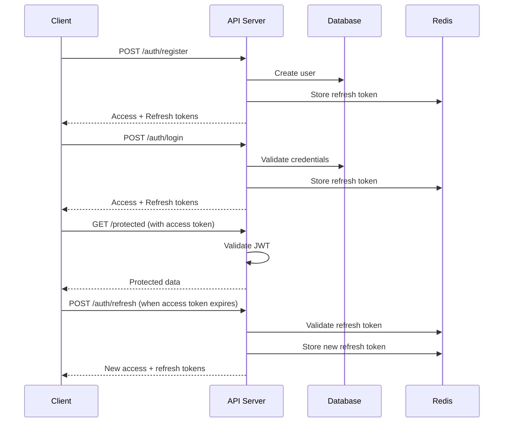

# Authentication API Documentation

## Overview

The NodeAngularFullStack authentication system uses JWT (JSON Web Tokens) for stateless
authentication with access and refresh token patterns. This document covers all authentication
endpoints and patterns.

## Authentication Flow



## Base URL

- **Development**: `http://localhost:3000/api/v1/auth`
- **Production**: `https://your-api-domain.com/api/v1/auth`

## Endpoints

### POST /register

Register a new user account.

**Request Body:**

```json
{
  "email": "user@example.com",
  "password": "SecurePass123!",
  "firstName": "John",
  "lastName": "Doe"
}
```

**Response (201 Created):**

```json
{
  "success": true,
  "data": {
    "accessToken": "eyJhbGciOiJIUzI1NiIsInR5cCI6IkpXVCJ9...",
    "refreshToken": "eyJhbGciOiJIUzI1NiIsInR5cCI6IkpXVCJ9...",
    "user": {
      "id": "123e4567-e89b-12d3-a456-426614174000",
      "email": "user@example.com",
      "firstName": "John",
      "lastName": "Doe",
      "role": "user",
      "tenantId": "tenant-uuid",
      "createdAt": "2024-01-15T10:30:00.000Z"
    }
  },
  "message": "Registration successful",
  "meta": {
    "timestamp": "2024-01-15T10:30:00.000Z",
    "requestId": "req_123456789"
  }
}
```

**Validation Rules:**

- Email: Valid email format, unique per tenant
- Password: Minimum 8 characters, must contain uppercase, lowercase, number, and special character
- FirstName/LastName: 1-50 characters, required

**Example Request:**

```bash
curl -X POST http://localhost:3000/api/v1/auth/register \
  -H "Content-Type: application/json" \
  -d '{
    "email": "user@example.com",
    "password": "SecurePass123!",
    "firstName": "John",
    "lastName": "Doe"
  }'
```

---

### POST /login

Authenticate user with email and password.

**Request Body:**

```json
{
  "email": "user@example.com",
  "password": "SecurePass123!"
}
```

**Response (200 OK):**

```json
{
  "success": true,
  "data": {
    "accessToken": "eyJhbGciOiJIUzI1NiIsInR5cCI6IkpXVCJ9...",
    "refreshToken": "eyJhbGciOiJIUzI1NiIsInR5cCI6IkpXVCJ9...",
    "user": {
      "id": "123e4567-e89b-12d3-a456-426614174000",
      "email": "user@example.com",
      "firstName": "John",
      "lastName": "Doe",
      "role": "user",
      "tenantId": "tenant-uuid",
      "createdAt": "2024-01-15T10:30:00.000Z"
    }
  },
  "meta": {
    "timestamp": "2024-01-15T10:30:00.000Z",
    "requestId": "req_123456789"
  }
}
```

**Example Request:**

```bash
curl -X POST http://localhost:3000/api/v1/auth/login \
  -H "Content-Type: application/json" \
  -d '{
    "email": "user@example.com",
    "password": "SecurePass123!"
  }'
```

---

### POST /refresh

Refresh access token using refresh token.

**Request Body:**

```json
{
  "refreshToken": "eyJhbGciOiJIUzI1NiIsInR5cCI6IkpXVCJ9..."
}
```

**Response (200 OK):**

```json
{
  "success": true,
  "data": {
    "accessToken": "eyJhbGciOiJIUzI1NiIsInR5cCI6IkpXVCJ9...",
    "refreshToken": "eyJhbGciOiJIUzI1NiIsInR5cCI6IkpXVCJ9...",
    "user": {
      "id": "123e4567-e89b-12d3-a456-426614174000",
      "email": "user@example.com",
      "firstName": "John",
      "lastName": "Doe",
      "role": "user"
    }
  },
  "meta": {
    "timestamp": "2024-01-15T10:30:00.000Z",
    "requestId": "req_123456789"
  }
}
```

**Example Request:**

```bash
curl -X POST http://localhost:3000/api/v1/auth/refresh \
  -H "Content-Type: application/json" \
  -d '{
    "refreshToken": "your-refresh-token"
  }'
```

---

### POST /logout

Logout user and invalidate refresh token.

**Headers:**

```
Authorization: Bearer <access-token>
```

**Response (200 OK):**

```json
{
  "success": true,
  "message": "Logged out successfully",
  "meta": {
    "timestamp": "2024-01-15T10:30:00.000Z",
    "requestId": "req_123456789"
  }
}
```

**Example Request:**

```bash
curl -X POST http://localhost:3000/api/v1/auth/logout \
  -H "Authorization: Bearer your-access-token"
```

---

### POST /logout-all

Logout user from all devices by invalidating all refresh tokens.

**Headers:**

```
Authorization: Bearer <access-token>
```

**Response (200 OK):**

```json
{
  "success": true,
  "message": "Logged out from all devices successfully",
  "meta": {
    "timestamp": "2024-01-15T10:30:00.000Z",
    "requestId": "req_123456789"
  }
}
```

---

### GET /profile

Get authenticated user's profile information.

**Headers:**

```
Authorization: Bearer <access-token>
```

**Response (200 OK):**

```json
{
  "success": true,
  "data": {
    "id": "123e4567-e89b-12d3-a456-426614174000",
    "email": "user@example.com",
    "firstName": "John",
    "lastName": "Doe",
    "role": "user",
    "tenantId": "tenant-uuid",
    "createdAt": "2024-01-15T10:30:00.000Z",
    "updatedAt": "2024-01-15T10:30:00.000Z"
  },
  "meta": {
    "timestamp": "2024-01-15T10:30:00.000Z",
    "requestId": "req_123456789"
  }
}
```

---

### PATCH /profile

Update authenticated user's profile information.

**Headers:**

```
Authorization: Bearer <access-token>
```

**Request Body:**

```json
{
  "firstName": "Jane",
  "lastName": "Smith",
  "email": "jane.smith@example.com"
}
```

**Response (200 OK):**

```json
{
  "success": true,
  "data": {
    "id": "123e4567-e89b-12d3-a456-426614174000",
    "email": "jane.smith@example.com",
    "firstName": "Jane",
    "lastName": "Smith",
    "role": "user",
    "tenantId": "tenant-uuid",
    "createdAt": "2024-01-15T10:30:00.000Z",
    "updatedAt": "2024-01-15T12:00:00.000Z"
  },
  "message": "Profile updated successfully",
  "meta": {
    "timestamp": "2024-01-15T12:00:00.000Z",
    "requestId": "req_123456789"
  }
}
```

---

### POST /password-reset

Request password reset email.

**Request Body:**

```json
{
  "email": "user@example.com"
}
```

**Response (200 OK):**

```json
{
  "success": true,
  "message": "Password reset email sent if account exists",
  "meta": {
    "timestamp": "2024-01-15T10:30:00.000Z",
    "requestId": "req_123456789"
  }
}
```

**Note:** This endpoint always returns success for security reasons, even if the email doesn't
exist.

---

### GET /password-reset/validate/{token}

Validate password reset token without consuming it.

**Parameters:**

- `token` (path): Password reset token

**Response (200 OK):**

```json
{
  "success": true,
  "data": {
    "valid": true,
    "expiresAt": "2024-01-15T11:30:00.000Z"
  },
  "meta": {
    "timestamp": "2024-01-15T10:30:00.000Z",
    "requestId": "req_123456789"
  }
}
```

---

### POST /password-reset/confirm

Confirm password reset with token and new password.

**Request Body:**

```json
{
  "token": "reset-token-string",
  "newPassword": "NewSecurePass123!"
}
```

**Response (200 OK):**

```json
{
  "success": true,
  "message": "Password reset successful",
  "meta": {
    "timestamp": "2024-01-15T10:30:00.000Z",
    "requestId": "req_123456789"
  }
}
```

---

### GET /me

Get user information from access token (useful for token validation).

**Headers:**

```
Authorization: Bearer <access-token>
```

**Response (200 OK):**

```json
{
  "success": true,
  "data": {
    "user": {
      "id": "123e4567-e89b-12d3-a456-426614174000",
      "email": "user@example.com",
      "firstName": "John",
      "lastName": "Doe",
      "role": "user",
      "tenantId": "tenant-uuid"
    },
    "tokenInfo": {
      "issuedAt": "2024-01-15T10:00:00.000Z",
      "expiresAt": "2024-01-15T11:00:00.000Z"
    }
  },
  "meta": {
    "timestamp": "2024-01-15T10:30:00.000Z",
    "requestId": "req_123456789"
  }
}
```

---

### GET /test-credentials

Get test user credentials (development environment only).

**Response (200 OK):**

```json
{
  "success": true,
  "data": {
    "testUsers": [
      {
        "email": "admin@test.com",
        "password": "TestAdmin123!",
        "role": "admin"
      },
      {
        "email": "user@test.com",
        "password": "TestUser123!",
        "role": "user"
      },
      {
        "email": "readonly@test.com",
        "password": "TestReadonly123!",
        "role": "readonly"
      }
    ]
  },
  "meta": {
    "timestamp": "2024-01-15T10:30:00.000Z",
    "requestId": "req_123456789"
  }
}
```

**Note:** This endpoint is only available in development environment.

## Token Structure

### Access Token (JWT)

**Header:**

```json
{
  "alg": "HS256",
  "typ": "JWT"
}
```

**Payload:**

```json
{
  "sub": "123e4567-e89b-12d3-a456-426614174000",
  "email": "user@example.com",
  "role": "user",
  "tenantId": "tenant-uuid",
  "iat": 1642248000,
  "exp": 1642251600,
  "iss": "nodeangularfullstack-api",
  "aud": "nodeangularfullstack-app"
}
```

**Properties:**

- `sub`: User ID
- `email`: User email
- `role`: User role (admin, user, readonly)
- `tenantId`: Tenant ID for multi-tenancy
- `iat`: Issued at timestamp
- `exp`: Expiration timestamp
- `iss`: Issuer
- `aud`: Audience

### Refresh Token (JWT)

**Payload:**

```json
{
  "sub": "123e4567-e89b-12d3-a456-426614174000",
  "type": "refresh",
  "jti": "unique-token-id",
  "iat": 1642248000,
  "exp": 1642853600,
  "iss": "nodeangularfullstack-api",
  "aud": "nodeangularfullstack-app"
}
```

**Properties:**

- `sub`: User ID
- `type`: Token type (always "refresh")
- `jti`: Unique token ID for revocation
- `iat`: Issued at timestamp
- `exp`: Expiration timestamp (7 days default)

## Error Responses

### 400 Bad Request - Validation Error

```json
{
  "success": false,
  "error": {
    "code": "VALIDATION_ERROR",
    "message": "Invalid input data",
    "details": [
      {
        "field": "email",
        "message": "Email is required"
      },
      {
        "field": "password",
        "message": "Password must be at least 8 characters"
      }
    ],
    "timestamp": "2024-01-15T10:30:00.000Z",
    "requestId": "req_123456789"
  }
}
```

### 401 Unauthorized - Authentication Failed

```json
{
  "success": false,
  "error": {
    "code": "AUTHENTICATION_FAILED",
    "message": "Invalid email or password",
    "timestamp": "2024-01-15T10:30:00.000Z",
    "requestId": "req_123456789"
  }
}
```

### 401 Unauthorized - Invalid Token

```json
{
  "success": false,
  "error": {
    "code": "INVALID_TOKEN",
    "message": "Invalid or expired access token",
    "timestamp": "2024-01-15T10:30:00.000Z",
    "requestId": "req_123456789"
  }
}
```

### 409 Conflict - Email Already Exists

```json
{
  "success": false,
  "error": {
    "code": "EMAIL_ALREADY_EXISTS",
    "message": "An account with this email already exists",
    "timestamp": "2024-01-15T10:30:00.000Z",
    "requestId": "req_123456789"
  }
}
```

### 429 Too Many Requests - Rate Limit Exceeded

```json
{
  "success": false,
  "error": {
    "code": "RATE_LIMIT_EXCEEDED",
    "message": "Too many requests. Please try again later.",
    "details": {
      "limit": 5,
      "windowMs": 900000,
      "resetTime": "2024-01-15T10:45:00.000Z"
    },
    "timestamp": "2024-01-15T10:30:00.000Z",
    "requestId": "req_123456789"
  }
}
```

## Security Features

### Password Requirements

- Minimum 8 characters
- At least one uppercase letter
- At least one lowercase letter
- At least one number
- At least one special character (!@#$%^&\*)

### Token Security

- Access tokens expire in 1 hour (configurable)
- Refresh tokens expire in 7 days (configurable)
- All tokens are signed with HMAC SHA256
- Refresh tokens are stored in Redis for revocation capability

### Rate Limiting

- Login attempts: 5 attempts per 15 minutes per IP
- Registration: 3 attempts per hour per IP
- Password reset: 3 attempts per hour per email

### Multi-Tenancy

- Users are isolated by tenant ID
- Tokens include tenant context
- All operations respect tenant boundaries

## Client Integration Examples

### JavaScript/TypeScript

```typescript
class AuthClient {
  private accessToken: string | null = null;
  private refreshToken: string | null = null;

  async login(email: string, password: string) {
    const response = await fetch('/api/v1/auth/login', {
      method: 'POST',
      headers: { 'Content-Type': 'application/json' },
      body: JSON.stringify({ email, password }),
    });

    const data = await response.json();

    if (data.success) {
      this.accessToken = data.data.accessToken;
      this.refreshToken = data.data.refreshToken;
      localStorage.setItem('refreshToken', this.refreshToken);
    }

    return data;
  }

  async refreshAccessToken() {
    if (!this.refreshToken) {
      throw new Error('No refresh token available');
    }

    const response = await fetch('/api/v1/auth/refresh', {
      method: 'POST',
      headers: { 'Content-Type': 'application/json' },
      body: JSON.stringify({ refreshToken: this.refreshToken }),
    });

    const data = await response.json();

    if (data.success) {
      this.accessToken = data.data.accessToken;
      this.refreshToken = data.data.refreshToken;
      localStorage.setItem('refreshToken', this.refreshToken);
    }

    return data;
  }

  async makeAuthenticatedRequest(url: string, options: RequestInit = {}) {
    const headers = {
      'Content-Type': 'application/json',
      ...options.headers,
    };

    if (this.accessToken) {
      headers['Authorization'] = `Bearer ${this.accessToken}`;
    }

    let response = await fetch(url, { ...options, headers });

    // Handle token expiration
    if (response.status === 401) {
      await this.refreshAccessToken();
      headers['Authorization'] = `Bearer ${this.accessToken}`;
      response = await fetch(url, { ...options, headers });
    }

    return response;
  }
}
```

### Angular Service

```typescript
@Injectable({ providedIn: 'root' })
export class AuthService {
  private readonly baseUrl = '/api/v1/auth';

  constructor(private readonly http: HttpClient) {}

  login(credentials: LoginRequest): Observable<AuthResponse> {
    return this.http.post<AuthResponse>(`${this.baseUrl}/login`, credentials);
  }

  register(userData: RegisterRequest): Observable<AuthResponse> {
    return this.http.post<AuthResponse>(`${this.baseUrl}/register`, userData);
  }

  logout(): Observable<any> {
    return this.http.post(`${this.baseUrl}/logout`, {});
  }

  refreshToken(refreshToken: string): Observable<AuthResponse> {
    return this.http.post<AuthResponse>(`${this.baseUrl}/refresh`, { refreshToken });
  }

  getProfile(): Observable<UserProfile> {
    return this.http.get<UserProfile>(`${this.baseUrl}/profile`);
  }
}
```

## Environment Configuration

### Required Environment Variables

```bash
# JWT Configuration
JWT_SECRET=your-256-bit-secret-key
JWT_EXPIRES_IN=1h
JWT_REFRESH_EXPIRES_IN=7d

# Password Requirements
PASSWORD_MIN_LENGTH=8
PASSWORD_REQUIRE_UPPERCASE=true
PASSWORD_REQUIRE_LOWERCASE=true
PASSWORD_REQUIRE_NUMBERS=true
PASSWORD_REQUIRE_SYMBOLS=true

# Rate Limiting
AUTH_RATE_LIMIT_WINDOW_MS=900000  # 15 minutes
AUTH_RATE_LIMIT_MAX_ATTEMPTS=5
REGISTRATION_RATE_LIMIT_MAX=3
PASSWORD_RESET_RATE_LIMIT_MAX=3

# Redis (for refresh token storage)
REDIS_URL=redis://localhost:6379
REDIS_PREFIX=auth:

# Email Service (for password reset)
SENDGRID_API_KEY=your-sendgrid-key
PASSWORD_RESET_FROM_EMAIL=noreply@yourdomain.com
PASSWORD_RESET_EXPIRES_IN=1h
```

## Testing

### Running Authentication Tests

```bash
# Unit tests
npm run test:auth

# Integration tests
npm run test:auth:integration

# Load testing
npm run test:auth:load
```

### Test Users (Development)

The `/test-credentials` endpoint provides test users for development:

- **Admin**: admin@test.com / TestAdmin123!
- **User**: user@test.com / TestUser123!
- **Readonly**: readonly@test.com / TestReadonly123!

These credentials are only available in development environment and can be used for testing and
development purposes.
