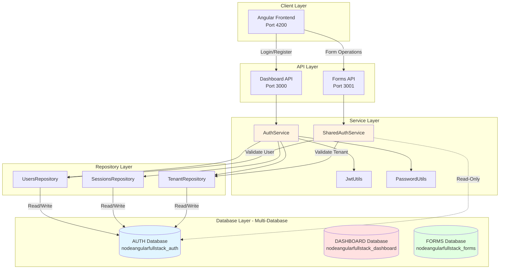
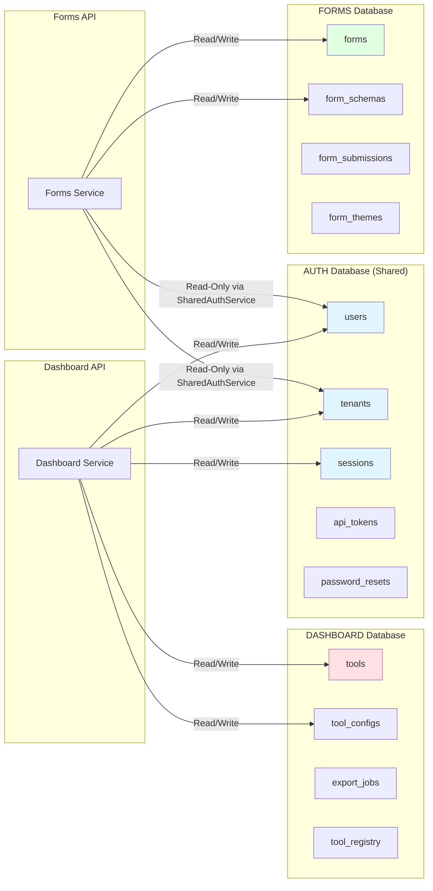
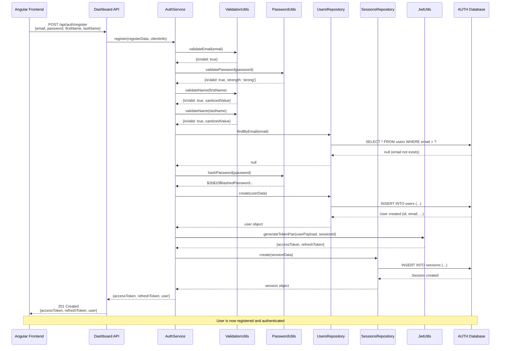
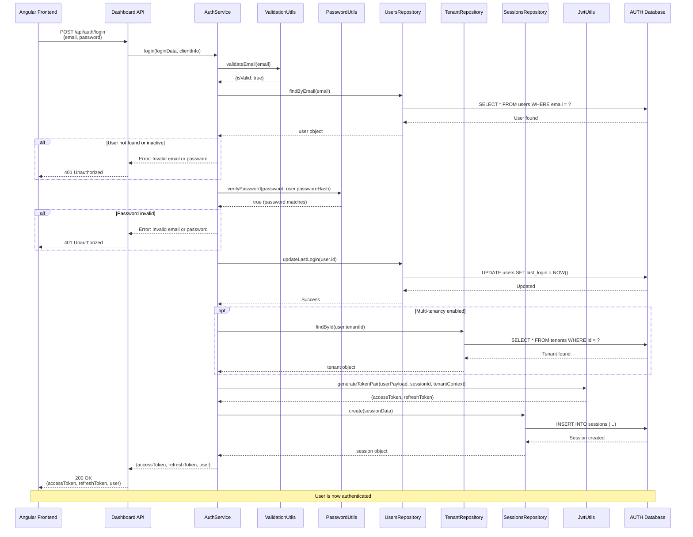
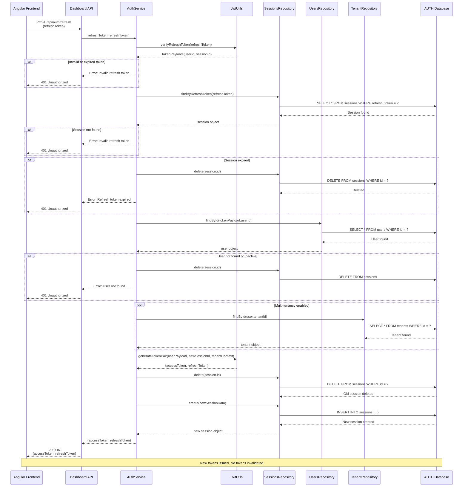
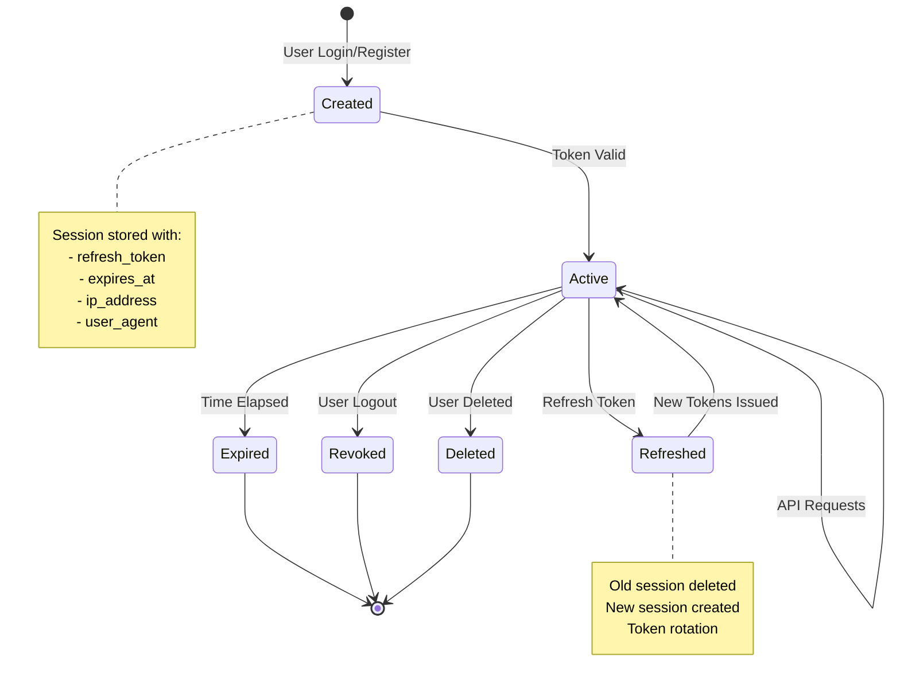
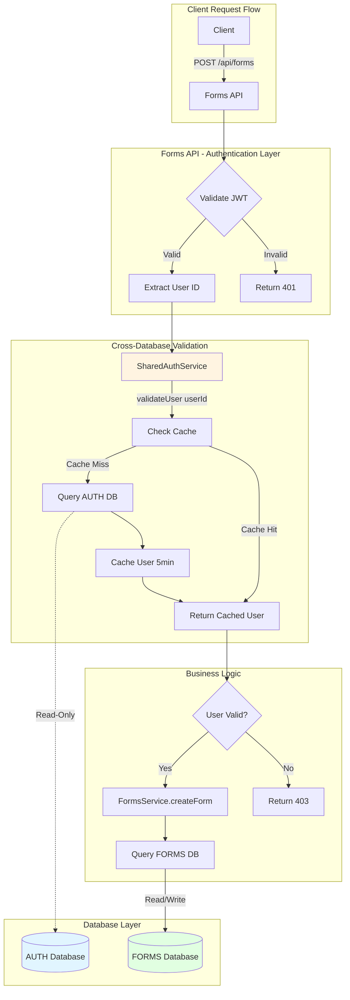
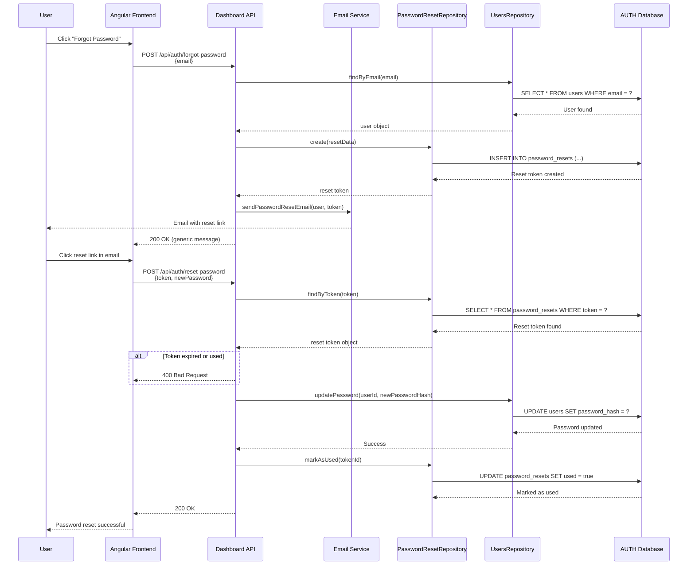
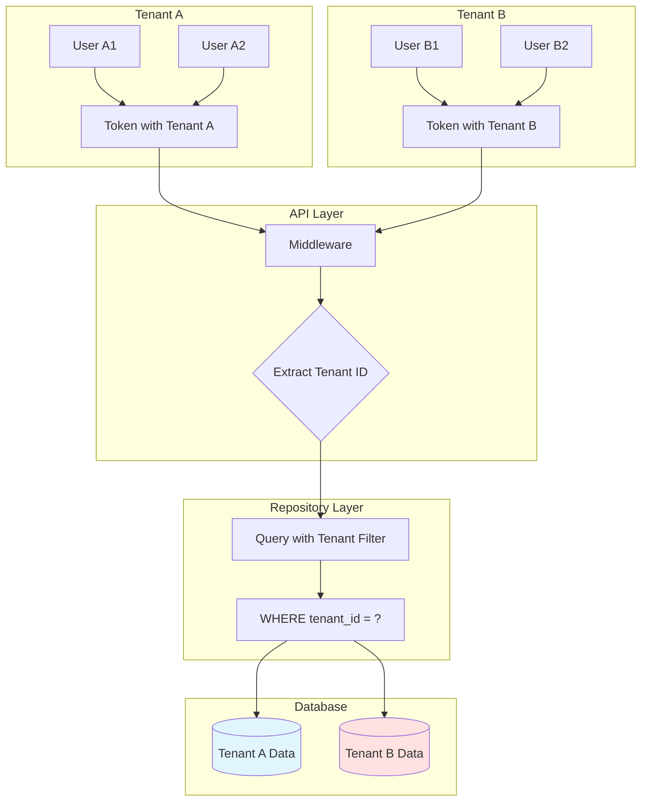
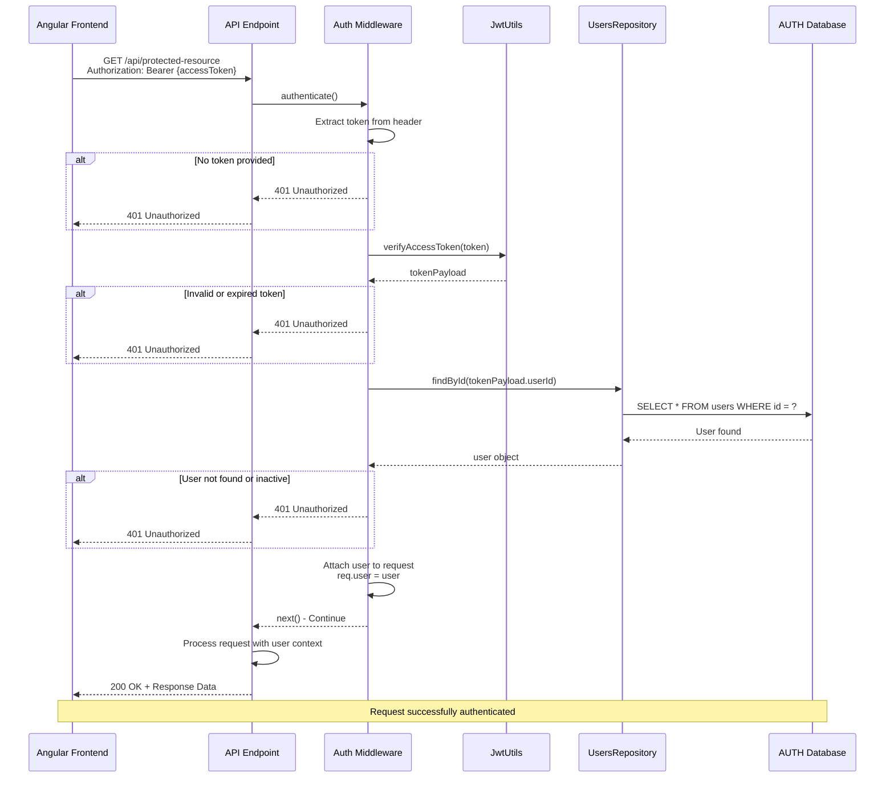

# Authentication System Documentation

## Table of Contents

1. [Overview](#overview)
2. [Authentication Architecture](#authentication-architecture)
3. [Registration Flow](#registration-flow)
4. [Login Flow](#login-flow)
5. [Token Refresh Flow](#token-refresh-flow)
6. [JWT Token Structure](#jwt-token-structure)
7. [Session Management](#session-management)
8. [Multi-Database Integration](#multi-database-integration)
9. [Password Security](#password-security)
10. [Multi-Tenancy Support](#multi-tenancy-support)
11. [API Request Authentication](#api-request-authentication)
12. [Security Best Practices](#security-best-practices)

---

## Overview

The NodeAngularFullStack application uses a **JWT-based authentication system** with refresh token
rotation. This architecture provides:

- **Stateless authentication** via JWT access tokens
- **Secure session management** with refresh tokens stored in database
- **Password hashing** using bcrypt
- **Multi-database isolation** with AUTH database for user data
- **Multi-tenancy support** with tenant context in tokens
- **Role-based access control** (RBAC)

### Key Components

| Component              | Purpose                               | Location                                                     |
| ---------------------- | ------------------------------------- | ------------------------------------------------------------ |
| **AuthService**        | Business logic for authentication     | `apps/dashboard-api/src/services/auth.service.ts`            |
| **JwtUtils**           | JWT token generation and verification | `apps/dashboard-api/src/utils/jwt.utils.ts`                  |
| **PasswordUtils**      | Password hashing and validation       | `apps/dashboard-api/src/utils/password.utils.ts`             |
| **UsersRepository**    | User data access                      | `apps/dashboard-api/src/repositories/users.repository.ts`    |
| **SessionsRepository** | Session data access                   | `apps/dashboard-api/src/repositories/sessions.repository.ts` |
| **SharedAuthService**  | Cross-database user validation        | `packages/shared/src/services/shared-auth.service.ts`        |

---

## Authentication Architecture

### High-Level Architecture Diagram



### Database Isolation Architecture



---

## Registration Flow

### Registration Process Diagram



### Registration Steps

1. **Input Validation**
   - Email format validation (RFC 5322 compliant)
   - Password strength validation (min 8 chars, uppercase, lowercase, number, special char)
   - Name sanitization (XSS prevention)

2. **Duplicate Check**
   - Query AUTH database for existing email
   - Return error if email already registered

3. **Password Hashing**
   - Use bcrypt with 10 salt rounds
   - Store hashed password (never plain text)

4. **User Creation**
   - Insert user record into AUTH database
   - Default role: `user`
   - Generate UUID for user ID

5. **Token Generation**
   - Generate JWT access token (15 minutes expiry)
   - Generate JWT refresh token (7 days expiry)
   - Include user info and tenant context in tokens

6. **Session Creation**
   - Store refresh token in sessions table
   - Record client IP address and user agent
   - Set expiration date for session

7. **Response**
   - Return access token, refresh token, and user profile
   - Client stores tokens (access token in memory, refresh token in httpOnly cookie)

---

## Login Flow

### Login Process Diagram



### Login Steps

1. **Input Validation**
   - Validate email format
   - Check password is provided

2. **User Lookup**
   - Query AUTH database by email
   - Check user exists and is active

3. **Password Verification**
   - Compare provided password with stored hash using bcrypt
   - Use timing-safe comparison to prevent timing attacks

4. **Last Login Update**
   - Update `last_login` timestamp in users table

5. **Tenant Context Retrieval** (if multi-tenancy enabled)
   - Query tenant data from AUTH database
   - Include tenant features, limits, and plan in token

6. **Token Generation**
   - Generate new JWT access token (15 minutes)
   - Generate new JWT refresh token (7 days)
   - Include user info, role, and tenant context

7. **Session Creation**
   - Store refresh token with expiration
   - Record client metadata (IP, user agent)

8. **Response**
   - Return tokens and sanitized user profile (no password hash)

---

## Token Refresh Flow

### Token Refresh Process Diagram



### Token Refresh Steps

1. **Refresh Token Verification**
   - Verify JWT signature and expiration
   - Extract userId and sessionId from token payload

2. **Session Validation**
   - Query sessions table for refresh token
   - Check session exists and not expired
   - Delete session if expired

3. **User Validation**
   - Query user by ID from token payload
   - Verify user exists and is active
   - Delete session if user invalid

4. **Tenant Context Refresh** (if multi-tenancy)
   - Fetch latest tenant data
   - Update tenant limits and features

5. **Token Rotation**
   - Generate new access token (15 minutes)
   - Generate new refresh token (7 days)
   - Delete old session from database

6. **Session Recreation**
   - Create new session with new refresh token
   - Reset expiration date

7. **Response**
   - Return new token pair
   - Client replaces old tokens

### Token Rotation Benefits

- **Security**: Old tokens immediately invalidated
- **Compromise Detection**: Prevents reuse of stolen tokens
- **Session Management**: Single active session per refresh
- **Auditability**: Session history tracked in database

---

## JWT Token Structure

### Access Token Payload

```json
{
  "userId": "uuid-here",
  "email": "user@example.com",
  "firstName": "John",
  "lastName": "Doe",
  "role": "admin",
  "tenantId": "tenant-uuid",
  "avatarUrl": "https://example.com/avatar.jpg",
  "type": "access",
  "tenant": {
    "id": "tenant-uuid",
    "slug": "acme-corp",
    "plan": "professional",
    "features": ["forms", "analytics", "export"],
    "limits": {
      "maxUsers": 50,
      "maxStorage": 10737418240,
      "maxApiCalls": 100000
    },
    "status": "active"
  },
  "iat": 1699564800,
  "exp": 1699565700,
  "aud": "nodeangularfullstack-client",
  "iss": "nodeangularfullstack-api"
}
```

### Refresh Token Payload

```json
{
  "userId": "uuid-here",
  "sessionId": "session-uuid-here",
  "type": "refresh",
  "iat": 1699564800,
  "exp": 1700169600,
  "aud": "nodeangularfullstack-client",
  "iss": "nodeangularfullstack-api"
}
```

### Token Configuration

| Token Type        | Expiry     | Storage                          | Purpose            |
| ----------------- | ---------- | -------------------------------- | ------------------ |
| **Access Token**  | 15 minutes | Memory (client-side)             | API authentication |
| **Refresh Token** | 7 days     | httpOnly cookie / sessionStorage | Token renewal      |

### JWT Claims

| Claim      | Description                       | Example                         |
| ---------- | --------------------------------- | ------------------------------- |
| `userId`   | Unique user identifier (UUID)     | `"a1b2c3d4-..."`                |
| `email`    | User email address                | `"user@example.com"`            |
| `role`     | User role for RBAC                | `"admin"`, `"user"`             |
| `tenantId` | Tenant identifier (multi-tenancy) | `"tenant-uuid"`                 |
| `type`     | Token type                        | `"access"` or `"refresh"`       |
| `iat`      | Issued at (Unix timestamp)        | `1699564800`                    |
| `exp`      | Expires at (Unix timestamp)       | `1699565700`                    |
| `aud`      | Audience (intended recipient)     | `"nodeangularfullstack-client"` |
| `iss`      | Issuer (token creator)            | `"nodeangularfullstack-api"`    |

---

## Session Management

### Session Database Schema

```sql
CREATE TABLE sessions (
  id UUID PRIMARY KEY DEFAULT gen_random_uuid(),
  user_id UUID NOT NULL REFERENCES users(id) ON DELETE CASCADE,
  refresh_token TEXT NOT NULL UNIQUE,
  expires_at TIMESTAMP NOT NULL,
  ip_address VARCHAR(45),
  user_agent TEXT,
  created_at TIMESTAMP DEFAULT CURRENT_TIMESTAMP
);

CREATE INDEX idx_sessions_user_id ON sessions(user_id);
CREATE INDEX idx_sessions_refresh_token ON sessions(refresh_token);
CREATE INDEX idx_sessions_expires_at ON sessions(expires_at);
```

### Session Lifecycle



### Session Cleanup

Expired sessions are automatically cleaned up by a scheduled job:

```typescript
// Session cleanup runs every 24 hours
async cleanupExpiredSessions(): Promise<number> {
  const query = `
    DELETE FROM sessions
    WHERE expires_at < CURRENT_TIMESTAMP
    RETURNING id
  `;
  const result = await this.pool.query(query);
  return result.rowCount || 0;
}
```

---

## Multi-Database Integration

### Authentication with Separated Databases



### SharedAuthService Integration

The `SharedAuthService` provides cross-database user and tenant validation:

```typescript
// Usage in Forms API
const isValidUser = await this.sharedAuthService.validateUser(userId);
if (!isValidUser) {
  throw new Error('Invalid or inactive user');
}

// Validates against AUTH database
// Caches results for 5 minutes (users) / 1 hour (tenants)
// Handles database connection pooling
```

### Authentication Flow with Multi-Database

1. **Client sends request** with JWT access token
2. **API middleware validates** JWT signature and expiration
3. **Extract user ID** from token payload
4. **SharedAuthService validates** user exists in AUTH database
5. **Check user cache** (5-minute TTL)
6. **Query AUTH database** if cache miss
7. **Cache user data** for subsequent requests
8. **Proceed with business logic** if user valid
9. **Query service database** (DASHBOARD or FORMS)

### Benefits of Shared AUTH Database

- ✅ **Single source of truth** for user data
- ✅ **Consistent authentication** across all services
- ✅ **Reduced database queries** via caching
- ✅ **Simplified user management** (single users table)
- ✅ **Cross-service user validation** without duplication

---

## Password Security

### Password Hashing with bcrypt

```typescript
// Password hashing (registration)
const saltRounds = 10;
const passwordHash = await bcrypt.hash(password, saltRounds);

// Password verification (login)
const isValid = await bcrypt.compare(password, storedHash);
```

### Password Requirements

| Requirement      | Rule                             | Example           |
| ---------------- | -------------------------------- | ----------------- |
| **Min Length**   | At least 8 characters            | ✅ `Pass123!`     |
| **Max Length**   | Max 72 characters (bcrypt limit) | ✅ `LongPass...`  |
| **Uppercase**    | At least 1 uppercase letter      | ✅ `Password123!` |
| **Lowercase**    | At least 1 lowercase letter      | ✅ `Password123!` |
| **Number**       | At least 1 digit                 | ✅ `Password123!` |
| **Special Char** | At least 1 special character     | ✅ `Password123!` |

### Password Reset Flow



---

## Multi-Tenancy Support

### Tenant Context in Tokens

When multi-tenancy is enabled (`tenantConfig.tokenIsolation = true`), tenant information is included
in JWT access tokens:

```typescript
// Token includes tenant context
{
  userId: "user-uuid",
  email: "user@example.com",
  role: "user",
  tenantId: "tenant-uuid",
  tenant: {
    id: "tenant-uuid",
    slug: "acme-corp",
    plan: "professional",
    features: ["forms", "analytics", "export"],
    limits: {
      maxUsers: 50,
      maxStorage: 10737418240,
      maxApiCalls: 100000
    },
    status: "active"
  }
}
```

### Tenant Isolation



### Tenant Data Isolation

All tenant-aware repositories filter queries by `tenant_id`:

```typescript
// BaseRepository tenant filtering
async findMany(
  filters: Record<string, any> = {},
  tenantContext?: TenantContext
): Promise<T[]> {
  let query = `SELECT * FROM ${this.tableName} WHERE 1=1`;

  // Apply tenant filtering first
  if (tenantContext && this.supportsTenancy()) {
    query += ` AND tenant_id = $1`;
    params.push(tenantContext.id);
  }

  // ... rest of query
}
```

---

## API Request Authentication

### Authentication Middleware Flow



### Protected Route Example

```typescript
// Protect routes with authentication middleware
router.get('/api/forms', authenticateToken, async (req, res) => {
  const userId = req.user.userId; // From JWT payload
  const tenantId = req.user.tenantId; // From JWT payload

  // User is authenticated, proceed with business logic
  const forms = await formsService.getUserForms(userId, tenantId);
  res.json(forms);
});
```

### Authorization (Role-Based)

```typescript
// Protect routes with role-based authorization
router.post('/api/admin/users', authenticateToken, requireRole(['admin']), async (req, res) => {
  // Only admin role can access this endpoint
  // ...
});
```

---

## Security Best Practices

### Implemented Security Measures

#### 1. Password Security

- ✅ **bcrypt hashing** with 10 salt rounds
- ✅ **Password strength validation** enforced
- ✅ **Timing-safe password comparison** (prevents timing attacks)
- ✅ **Password never logged** or exposed in responses

#### 2. Token Security

- ✅ **Short-lived access tokens** (15 minutes)
- ✅ **Token rotation** on refresh (old tokens invalidated)
- ✅ **Secure token signing** with HS256 algorithm
- ✅ **Token payload validation** (aud, iss claims)
- ✅ **httpOnly cookies** for refresh tokens (XSS protection)

#### 3. Session Security

- ✅ **Session expiration** enforced
- ✅ **Session cleanup** job removes expired sessions
- ✅ **Client metadata tracking** (IP, user agent)
- ✅ **Single session per refresh token** (prevents token reuse)

#### 4. Database Security

- ✅ **Database isolation** (AUTH/DASHBOARD/FORMS separation)
- ✅ **Read-only AUTH access** for services
- ✅ **Parameterized queries** (SQL injection prevention)
- ✅ **Connection pooling** with limits

#### 5. Input Validation

- ✅ **Email validation** (RFC 5322 compliant)
- ✅ **Name sanitization** (XSS prevention)
- ✅ **SQL injection prevention** via parameterized queries
- ✅ **Request rate limiting** configured

#### 6. Error Handling

- ✅ **Generic error messages** (don't reveal user existence)
- ✅ **No sensitive data in logs** (passwords, tokens filtered)
- ✅ **Consistent error responses** (prevent enumeration attacks)

### Recommended Additional Measures

#### 1. Multi-Factor Authentication (MFA)

- ⏳ **TOTP-based 2FA** (Google Authenticator, Authy)
- ⏳ **Backup codes** for account recovery
- ⏳ **MFA enforcement** for admin roles

#### 2. Account Security

- ⏳ **Login attempt rate limiting** (prevent brute force)
- ⏳ **Account lockout** after failed attempts
- ⏳ **Email verification** required
- ⏳ **Security event notifications** (new login, password change)

#### 3. Advanced Token Security

- ⏳ **Token fingerprinting** (bind token to device)
- ⏳ **Token revocation list** (blacklist compromised tokens)
- ⏳ **Refresh token rotation tracking** (detect token theft)

#### 4. Monitoring & Auditing

- ⏳ **Authentication audit log** (all login attempts)
- ⏳ **Suspicious activity detection** (unusual IP, location)
- ⏳ **Session analytics** (concurrent sessions, devices)

---

## References

### Related Documentation

- [Database Separation Plan](./database-separation-plan.md)
- [Multi-Database Configuration](../../apps/dashboard-api/src/config/multi-database.config.ts)
- [SharedAuthService](../../packages/shared/src/services/shared-auth.service.ts)
- [Migration Guide](../../scripts/db/MIGRATION_README.md)

### External Resources

- [JWT Best Practices (RFC 8725)](https://datatracker.ietf.org/doc/html/rfc8725)
- [OWASP Authentication Cheat Sheet](https://cheatsheetseries.owasp.org/cheatsheets/Authentication_Cheat_Sheet.html)
- [bcrypt Documentation](https://github.com/kelektiv/node.bcrypt.js)
- [Passport.js Documentation](http://www.passportjs.org/docs/)

---

**Last Updated**: November 2024 **Maintained By**: Development Team **Version**: 2.0 (Multi-Database
Architecture)
