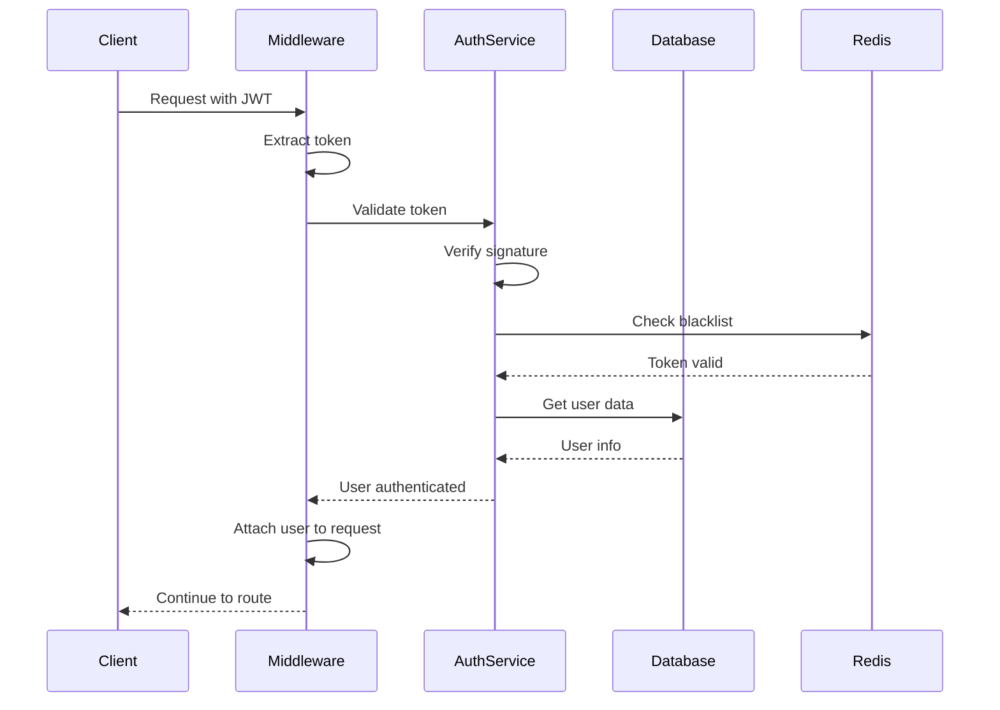

# Backend Architecture

## Service Architecture

### Controller/Route Organization
```text
src/
├── routes/
│   ├── auth.routes.ts
│   ├── users.routes.ts
│   └── index.ts
├── controllers/
│   ├── auth.controller.ts
│   └── users.controller.ts
├── services/
│   ├── auth.service.ts
│   ├── users.service.ts
│   └── tenant.service.ts
├── repositories/
│   ├── users.repository.ts
│   └── base.repository.ts
├── middleware/
│   ├── auth.middleware.ts
│   ├── tenant.middleware.ts
│   └── validation.middleware.ts
└── utils/
    ├── jwt.utils.ts
    └── password.utils.ts
```

### Controller Template
```typescript
// controllers/users.controller.ts
import { Request, Response, NextFunction } from 'express';
import { UsersService } from '../services/users.service';
import { AsyncHandler } from '../utils/async-handler';
import { ApiError } from '../utils/api-error';

export class UsersController {
  constructor(private usersService: UsersService) {}

  getProfile = AsyncHandler(async (
    req: Request,
    res: Response,
    next: NextFunction
  ) => {
    const userId = req.user!.id;
    const tenantId = req.tenant?.id;

    const user = await this.usersService.findById(userId, tenantId);

    if (!user) {
      throw new ApiError(404, 'User not found');
    }

    res.json({
      success: true,
      data: user
    });
  });

  updateProfile = AsyncHandler(async (
    req: Request,
    res: Response,
    next: NextFunction
  ) => {
    const userId = req.user!.id;
    const updates = req.body;

    const updatedUser = await this.usersService.update(userId, updates);

    res.json({
      success: true,
      data: updatedUser
    });
  });
}
```

## Database Architecture

### Schema Design
```sql
-- Additional tables for complete system

-- Audit log for compliance
CREATE TABLE audit_logs (
    id UUID PRIMARY KEY DEFAULT uuid_generate_v4(),
    tenant_id UUID REFERENCES tenants(id),
    user_id UUID REFERENCES users(id),
    action VARCHAR(100) NOT NULL,
    resource_type VARCHAR(50),
    resource_id UUID,
    changes JSONB,
    ip_address INET,
    user_agent TEXT,
    created_at TIMESTAMP WITH TIME ZONE DEFAULT CURRENT_TIMESTAMP
);

-- API rate limiting
CREATE TABLE rate_limits (
    id UUID PRIMARY KEY DEFAULT uuid_generate_v4(),
    identifier VARCHAR(255) NOT NULL, -- IP or user ID
    endpoint VARCHAR(255) NOT NULL,
    requests INTEGER DEFAULT 0,
    window_start TIMESTAMP WITH TIME ZONE DEFAULT CURRENT_TIMESTAMP,
    UNIQUE(identifier, endpoint, window_start)
);
```

### Data Access Layer
```typescript
// repositories/base.repository.ts
import { Pool } from 'pg';
import { QueryResult } from 'pg';

export abstract class BaseRepository<T> {
  constructor(
    protected pool: Pool,
    protected tableName: string
  ) {}

  async findById(id: string, tenantId?: string): Promise<T | null> {
    let query = `SELECT * FROM ${this.tableName} WHERE id = $1`;
    const params: any[] = [id];

    if (tenantId && this.supportsTenancy()) {
      query += ' AND tenant_id = $2';
      params.push(tenantId);
    }

    const result = await this.pool.query(query, params);
    return result.rows[0] || null;
  }

  async create(data: Partial<T>): Promise<T> {
    const fields = Object.keys(data);
    const values = Object.values(data);
    const placeholders = fields.map((_, i) => `$${i + 1}`);

    const query = `
      INSERT INTO ${this.tableName} (${fields.join(', ')})
      VALUES (${placeholders.join(', ')})
      RETURNING *
    `;

    const result = await this.pool.query(query, values);
    return result.rows[0];
  }

  protected supportsTenancy(): boolean {
    return ['users', 'audit_logs'].includes(this.tableName);
  }
}
```

## Authentication and Authorization

### Auth Flow


### Middleware/Guards
```typescript
// middleware/auth.middleware.ts
import { Request, Response, NextFunction } from 'express';
import { JwtService } from '../services/jwt.service';
import { UsersService } from '../services/users.service';
import { ApiError } from '../utils/api-error';

export interface AuthRequest extends Request {
  user?: User;
  tenant?: Tenant;
}

export const authenticate = async (
  req: AuthRequest,
  res: Response,
  next: NextFunction
) => {
  try {
    const token = extractToken(req);

    if (!token) {
      throw new ApiError(401, 'No token provided');
    }

    const payload = await JwtService.verify(token);
    const user = await UsersService.findById(payload.userId);

    if (!user || !user.isActive) {
      throw new ApiError(401, 'Invalid token');
    }

    req.user = user;

    if (user.tenantId) {
      req.tenant = await TenantService.findById(user.tenantId);
    }

    next();
  } catch (error) {
    next(error);
  }
};

export const authorize = (roles: string[]) => {
  return (req: AuthRequest, res: Response, next: NextFunction) => {
    if (!req.user) {
      return next(new ApiError(401, 'Unauthorized'));
    }

    if (!roles.includes(req.user.role)) {
      return next(new ApiError(403, 'Insufficient permissions'));
    }

    next();
  };
};
```
