# Component Interaction Diagrams

## Overview

This document provides detailed component interaction diagrams that illustrate how different parts
of the NodeAngularFullStack system communicate and collaborate.

## Authentication Flow

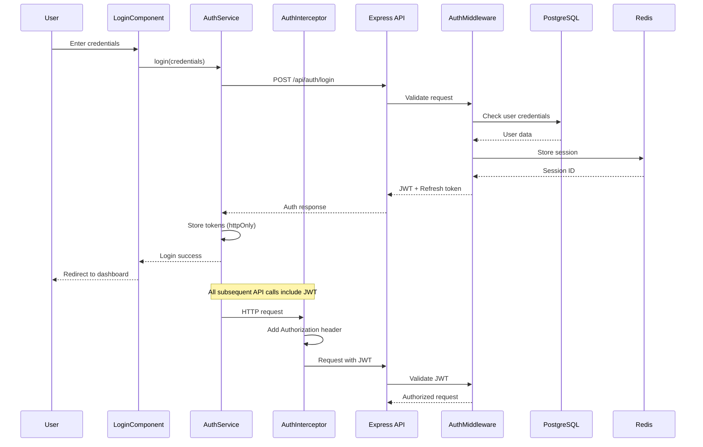

## Feature Module Loading

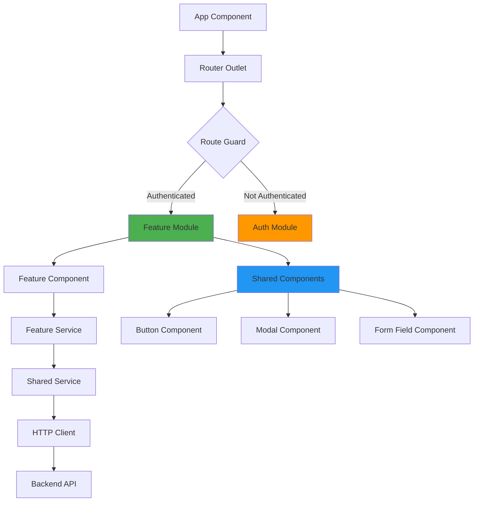

## State Management Flow

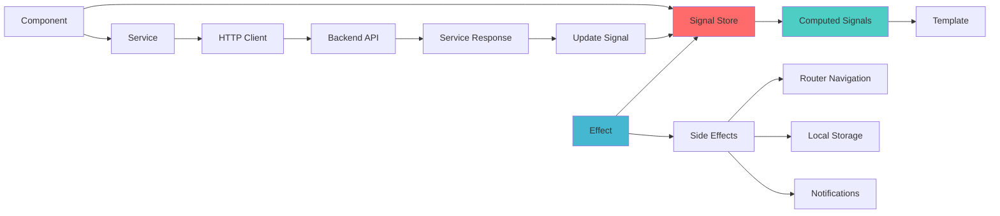

## Backend Service Architecture

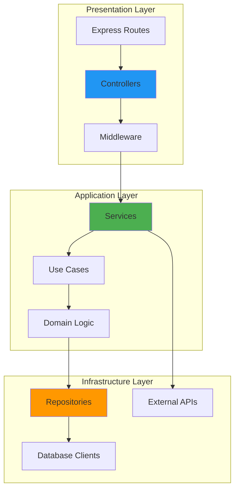

## Database Transaction Flow

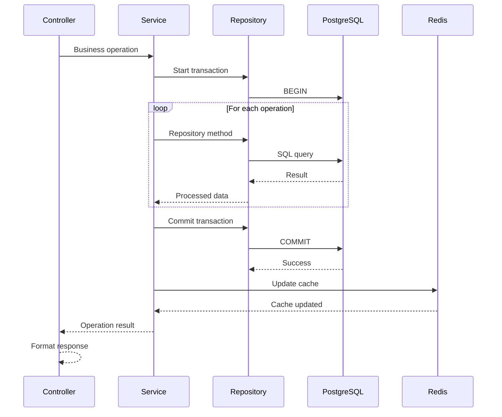

## Error Handling Flow

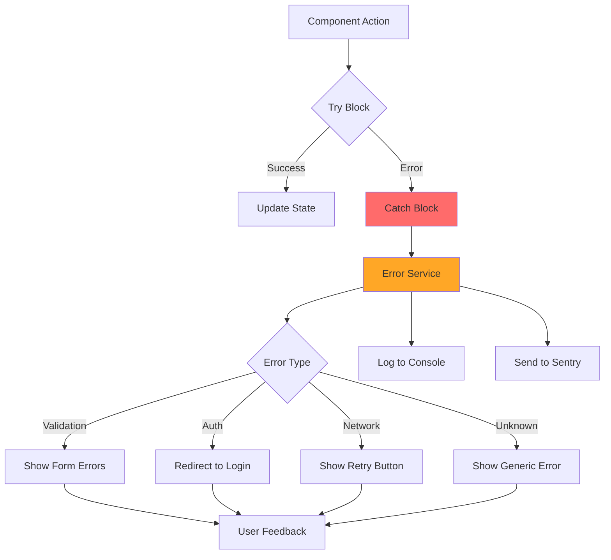

## Real-time Communication (WebSocket)

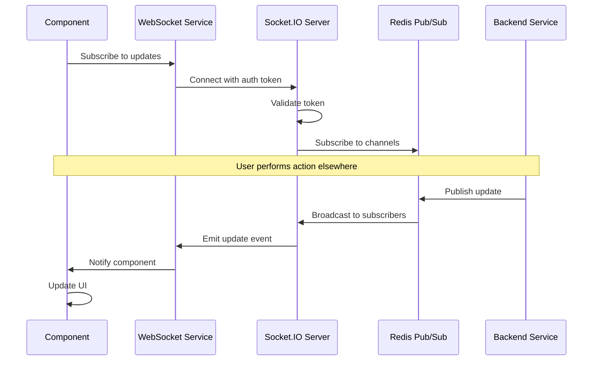

## File Upload Flow

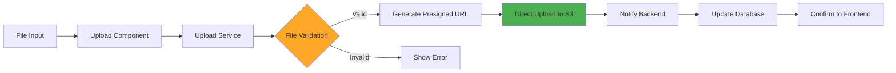

## Multi-Tenant Request Flow

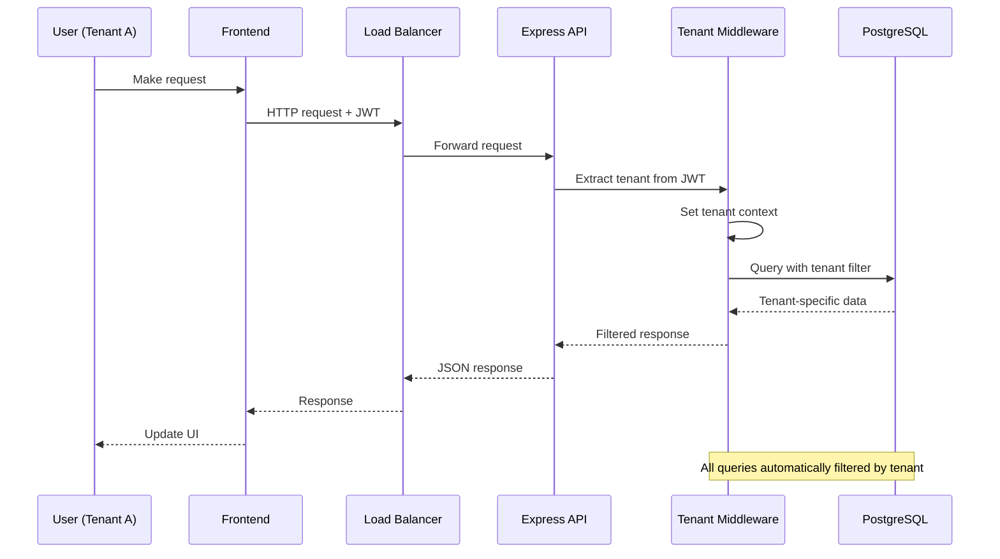

## Caching Strategy

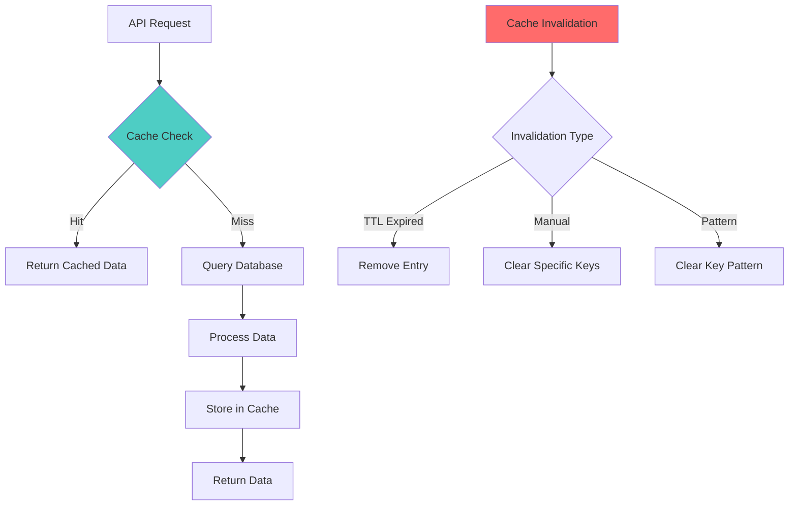

## Development Workflow

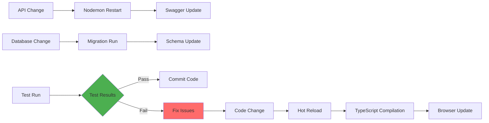

## Monitoring and Observability

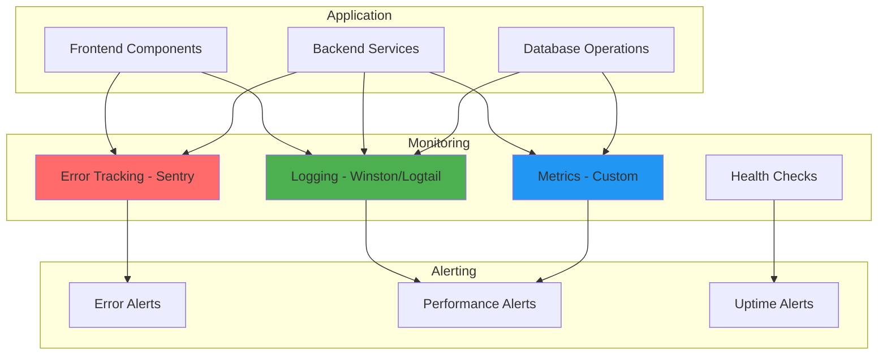

## Extension Points

### Adding New Components

1. **Create Feature Module**: Follow the feature-based organization pattern
2. **Define Interfaces**: Add shared types to `packages/shared`
3. **Implement Services**: Create service layer with repository pattern
4. **Add Routes**: Configure routing with guards and lazy loading
5. **Write Tests**: Implement comprehensive test coverage

### Custom Authentication Providers

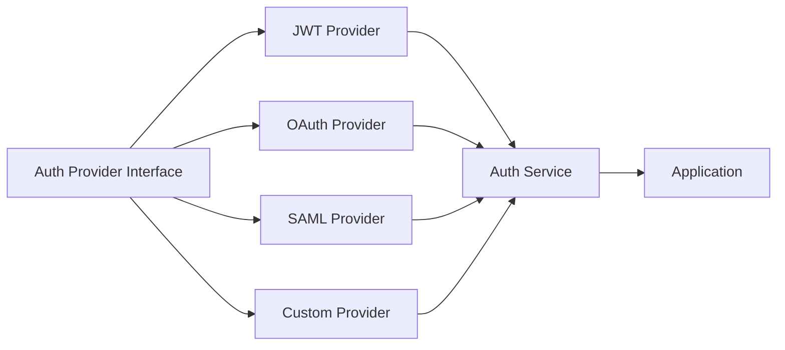

### Database Scaling

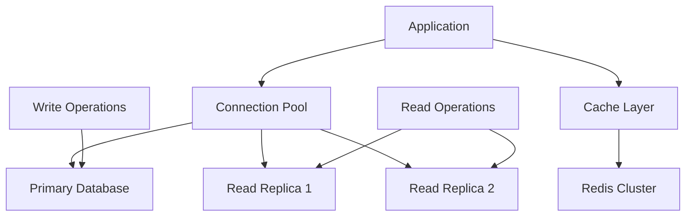

These diagrams provide a visual reference for understanding how components interact within the
NodeAngularFullStack architecture. They serve as both documentation and a guide for extending the
system while maintaining architectural consistency.
