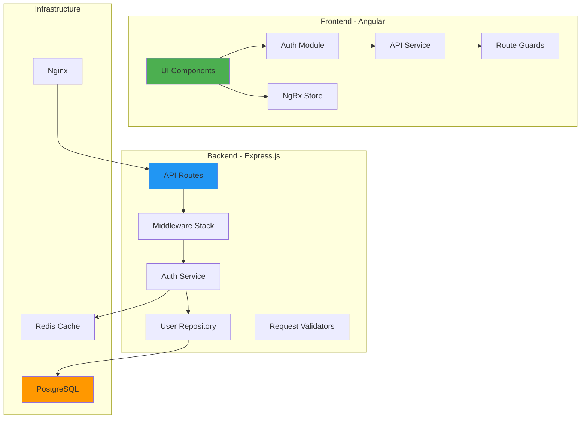

# Components

## Frontend Components

**Auth Module**
**Responsibility:** Handle authentication flows including login, registration, password reset, and session management

**Key Interfaces:**
- AuthService: JWT token management and API calls
- AuthGuard: Route protection based on authentication
- AuthInterceptor: Automatic token injection in HTTP requests

**Dependencies:** Angular Router, HttpClient, NgRx Store

**Technology Stack:** Angular 20+, RxJS, TypeScript

## Backend Services

**Auth Service**
**Responsibility:** JWT token generation, validation, user authentication, and password management

**Key Interfaces:**
- generateTokens(): Create access and refresh tokens
- validateToken(): Verify JWT signature and expiration
- hashPassword(): Bcrypt password hashing
- validatePassword(): Password verification

**Dependencies:** jsonwebtoken, bcrypt, User Repository

**Technology Stack:** Express.js, TypeScript, Passport.js

## Database Layer

**User Repository**
**Responsibility:** Abstract database operations for user entity with tenant isolation

**Key Interfaces:**
- findById(id, tenantId?): Retrieve user with optional tenant filtering
- findByEmail(email, tenantId?): Email-based user lookup
- create(userData): Create new user record
- update(id, updates): Update user information

**Dependencies:** PostgreSQL client, Database connection pool

**Technology Stack:** node-postgres, TypeScript

## Infrastructure Components

**Nginx Reverse Proxy**
**Responsibility:** Request routing, SSL termination, rate limiting, and static file serving

**Key Interfaces:**
- /api/* → Express.js backend
- /docs → Swagger UI
- /* → Angular static files

**Dependencies:** Docker network, upstream services

**Technology Stack:** Nginx 1.25+, Docker

## Component Diagram

