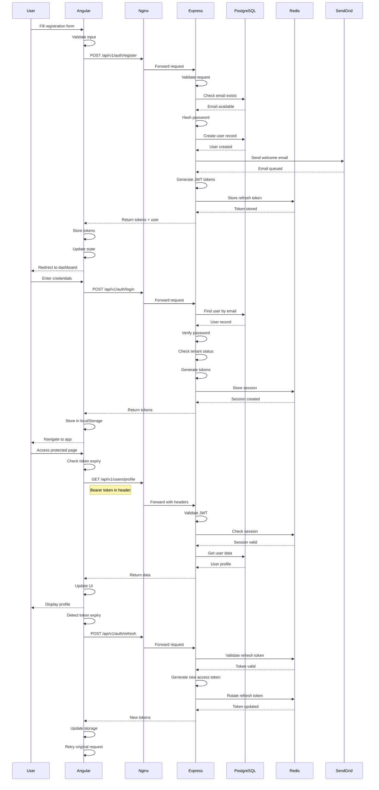

# Core Workflows

```mermaid
sequenceDiagram
    participant User
    participant Angular
    participant Nginx
    participant Express
    participant PostgreSQL
    participant Redis
    participant SendGrid

    %% User Registration Flow
    User->>Angular: Fill registration form
    Angular->>Angular: Validate input
    Angular->>Nginx: POST /api/v1/auth/register
    Nginx->>Express: Forward request
    Express->>Express: Validate request
    Express->>PostgreSQL: Check email exists
    PostgreSQL-->>Express: Email available
    Express->>Express: Hash password
    Express->>PostgreSQL: Create user record
    PostgreSQL-->>Express: User created
    Express->>SendGrid: Send welcome email
    SendGrid-->>Express: Email queued
    Express->>Express: Generate JWT tokens
    Express->>Redis: Store refresh token
    Redis-->>Express: Token stored
    Express-->>Angular: Return tokens + user
    Angular->>Angular: Store tokens
    Angular->>Angular: Update state
    Angular-->>User: Redirect to dashboard

    %% Login Flow with Multi-Tenancy
    User->>Angular: Enter credentials
    Angular->>Nginx: POST /api/v1/auth/login
    Nginx->>Express: Forward request
    Express->>PostgreSQL: Find user by email
    PostgreSQL-->>Express: User record
    Express->>Express: Verify password
    Express->>Express: Check tenant status
    Express->>Express: Generate tokens
    Express->>Redis: Store session
    Redis-->>Express: Session created
    Express-->>Angular: Return tokens
    Angular->>Angular: Store in localStorage
    Angular-->>User: Navigate to app

    %% API Request with JWT
    User->>Angular: Access protected page
    Angular->>Angular: Check token expiry
    Angular->>Nginx: GET /api/v1/users/profile
    Note right of Angular: Bearer token in header
    Nginx->>Express: Forward with headers
    Express->>Express: Validate JWT
    Express->>Redis: Check session
    Redis-->>Express: Session valid
    Express->>PostgreSQL: Get user data
    PostgreSQL-->>Express: User profile
    Express-->>Angular: Return data
    Angular->>Angular: Update UI
    Angular-->>User: Display profile

    %% Token Refresh Flow
    Angular->>Angular: Detect token expiry
    Angular->>Nginx: POST /api/v1/auth/refresh
    Nginx->>Express: Forward request
    Express->>Redis: Validate refresh token
    Redis-->>Express: Token valid
    Express->>Express: Generate new access token
    Express->>Redis: Rotate refresh token
    Redis-->>Express: Token updated
    Express-->>Angular: New tokens
    Angular->>Angular: Update storage
    Angular->>Angular: Retry original request
```
