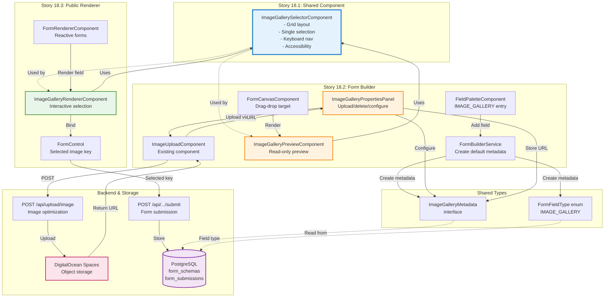
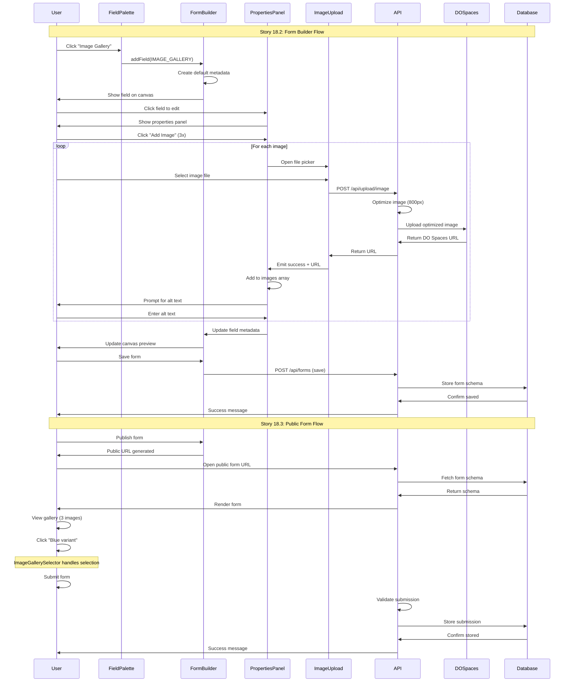

# Epic 18: Image Gallery Selector - Architecture Diagram

**Epic:** Epic 18 - Image Gallery Selector - Brownfield Enhancement **Created:** 2025-01-11
**Version:** 1.0

---

## Overview

This document provides comprehensive architecture diagrams for the IMAGE_GALLERY field type
implementation, showing component relationships, data flow, and integration points within the
existing form builder system.

---

## System Architecture Overview

```
┌─────────────────────────────────────────────────────────────────────────────┐
│                        NodeAngularFullStack Application                      │
│                                                                               │
│  ┌────────────────────────────────────────────────────────────────────────┐ │
│  │                         Frontend (Angular 20+)                          │ │
│  │                                                                          │ │
│  │  ┌──────────────────────────────────────────────────────────────────┐  │ │
│  │  │                    Form Builder (Story 18.2)                      │  │ │
│  │  │                                                                    │  │ │
│  │  │  ┌─────────────────┐     ┌──────────────────────────────────┐   │  │ │
│  │  │  │ FieldPalette    │────▶│ IMAGE_GALLERY                     │   │  │ │
│  │  │  │ Component       │     │ (pi-images icon, Input Fields)    │   │  │ │
│  │  │  └─────────────────┘     └──────────────────────────────────┘   │  │ │
│  │  │                                                                    │  │ │
│  │  │  ┌─────────────────┐     ┌──────────────────────────────────┐   │  │ │
│  │  │  │ FormCanvas      │────▶│ ImageGalleryPreviewComponent      │   │  │ │
│  │  │  │ (Preview)       │     │ (Read-only gallery preview)        │   │  │ │
│  │  │  └─────────────────┘     └──────────────────────────────────┘   │  │ │
│  │  │                                │                                  │  │ │
│  │  │                                │ Uses                             │  │ │
│  │  │                                ▼                                  │  │ │
│  │  │  ┌─────────────────┐     ┌──────────────────────────────────┐   │  │ │
│  │  │  │ Properties      │────▶│ ImageGalleryPropertiesPanel       │   │  │ │
│  │  │  │ Panel           │     │ - Upload images to DO Spaces       │   │  │ │
│  │  │  └─────────────────┘     │ - Delete/reorder images            │   │  │ │
│  │  │                          │ - Configure columns/aspect ratio   │   │  │ │
│  │  │                          └──────────────────────────────────┘   │  │ │
│  │  └──────────────────────────────────────────────────────────────────┘  │ │
│  │                                                                          │ │
│  │  ┌──────────────────────────────────────────────────────────────────┐  │ │
│  │  │                 Public Form Renderer (Story 18.3)                 │  │ │
│  │  │                                                                    │  │ │
│  │  │  ┌─────────────────┐     ┌──────────────────────────────────┐   │  │ │
│  │  │  │ FormRenderer    │────▶│ ImageGalleryRendererComponent     │   │  │ │
│  │  │  │ Component       │     │ (Interactive selection)            │   │  │ │
│  │  │  └─────────────────┘     └──────────────────────────────────┘   │  │ │
│  │  │                                │                                  │  │ │
│  │  │                                │ Uses                             │  │ │
│  │  └────────────────────────────────┼──────────────────────────────────┘  │ │
│  │                                   ▼                                     │ │
│  │  ┌──────────────────────────────────────────────────────────────────┐  │ │
│  │  │          Shared Component (Story 18.1)                            │  │ │
│  │  │                                                                    │  │ │
│  │  │  ┌────────────────────────────────────────────────────────────┐  │  │ │
│  │  │  │    ImageGallerySelectorComponent                           │  │  │ │
│  │  │  │    - Responsive grid (2-4 columns)                          │  │  │ │
│  │  │  │    - Single-selection (radio button behavior)              │  │  │ │
│  │  │  │    - Keyboard navigation (arrow keys, Space, Enter)        │  │  │ │
│  │  │  │    - WCAG AA accessibility                                 │  │  │ │
│  │  │  │    - Visual feedback (border, checkmark, scale)            │  │  │ │
│  │  │  └────────────────────────────────────────────────────────────┘  │  │ │
│  │  └──────────────────────────────────────────────────────────────────┘  │ │
│  └──────────────────────────────────────────────────────────────────────┘ │
│                                                                               │
│  ┌────────────────────────────────────────────────────────────────────────┐ │
│  │                     Shared Package (@nodeangularfullstack/shared)       │ │
│  │                                                                          │ │
│  │  ┌────────────────────────────────────────────────────────────────┐   │ │
│  │  │  FormFieldType Enum                                             │   │ │
│  │  │  - IMAGE_GALLERY = 'image_gallery'                             │   │ │
│  │  └────────────────────────────────────────────────────────────────┘   │ │
│  │                                                                          │ │
│  │  ┌────────────────────────────────────────────────────────────────┐   │ │
│  │  │  ImageGalleryMetadata Interface                                 │   │ │
│  │  │  - images: { key, url, alt }[]                                 │   │ │
│  │  │  - columns?: 2 | 3 | 4                                         │   │ │
│  │  │  - aspectRatio?: 'square' | '16:9' | 'auto'                   │   │ │
│  │  │  - maxImages?: number                                          │   │ │
│  │  └────────────────────────────────────────────────────────────────┘   │ │
│  └──────────────────────────────────────────────────────────────────────┘ │
│                                                                               │
│  ┌────────────────────────────────────────────────────────────────────────┐ │
│  │                         Backend (Express.js)                            │ │
│  │                                                                          │ │
│  │  ┌────────────────────────────────────────────────────────────────┐   │ │
│  │  │  POST /api/upload/image                                         │   │ │
│  │  │  - Receives multipart/form-data file upload                    │   │ │
│  │  │  - Optimizes image (resize to max 800px width)                 │   │ │
│  │  │  - Uploads to DigitalOcean Spaces                              │   │ │
│  │  │  - Returns DO Spaces URL                                       │   │ │
│  │  └────────────────────────────────────────────────────────────────┘   │ │
│  │                                                                          │ │
│  │  ┌────────────────────────────────────────────────────────────────┐   │ │
│  │  │  POST /api/public/forms/:shortCode/submit                       │   │ │
│  │  │  - Receives form submission with image gallery selection       │   │ │
│  │  │  - Validates field values (including image key)                │   │ │
│  │  │  - Stores submission in PostgreSQL                             │   │ │
│  │  └────────────────────────────────────────────────────────────────┘   │ │
│  └──────────────────────────────────────────────────────────────────────┘ │
│                                                                               │
│  ┌────────────────────────────────────────────────────────────────────────┐ │
│  │                    External Services                                    │ │
│  │                                                                          │ │
│  │  ┌────────────────────────────────────────────────────────────────┐   │ │
│  │  │  DigitalOcean Spaces (Object Storage)                           │   │ │
│  │  │  - Bucket: [existing-bucket-name]                              │   │ │
│  │  │  - Path: /images/image-gallery-*                               │   │ │
│  │  │  - URL: https://[bucket].[region].digitaloceanspaces.com/...   │   │ │
│  │  │  - CORS: Configured for form builder domain                    │   │ │
│  │  └────────────────────────────────────────────────────────────────┘   │ │
│  │                                                                          │ │
│  │  ┌────────────────────────────────────────────────────────────────┐   │ │
│  │  │  PostgreSQL Database                                            │   │ │
│  │  │  - forms table                                                  │   │ │
│  │  │  - form_schemas table (stores ImageGalleryMetadata in JSON)    │   │ │
│  │  │  - form_submissions table (stores selected image key)          │   │ │
│  │  └────────────────────────────────────────────────────────────────┘   │ │
│  └──────────────────────────────────────────────────────────────────────┘ │
└───────────────────────────────────────────────────────────────────────────┘
```

---

## Component Interaction Diagram



---

## Data Flow Diagrams

### 1. Image Upload Flow (Story 18.2)

```
┌───────────────────────────────────────────────────────────────────────────┐
│                          IMAGE UPLOAD FLOW                                 │
└───────────────────────────────────────────────────────────────────────────┘

User clicks "Add Image" in Properties Panel
    │
    ▼
┌─────────────────────────────────────┐
│ ImageGalleryPropertiesPanel         │
│ - Opens file picker                 │
│ - User selects image file           │
└─────────────────────────────────────┘
    │
    ▼
┌─────────────────────────────────────┐
│ ImageUploadComponent                │
│ - Validates file (type, size)       │
│ - Creates FormData                  │
└─────────────────────────────────────┘
    │
    ▼ POST /api/upload/image (multipart/form-data)
┌─────────────────────────────────────┐
│ Backend API Endpoint                │
│ - Receives file                     │
│ - Validates file                    │
│ - Optimizes image (resize 800px)   │
└─────────────────────────────────────┘
    │
    ▼
┌─────────────────────────────────────┐
│ DigitalOcean Spaces Upload          │
│ - Bucket: existing-bucket           │
│ - Path: /images/image-gallery-*     │
│ - Returns URL                       │
└─────────────────────────────────────┘
    │
    ▼ Response: { url: "https://..." }
┌─────────────────────────────────────┐
│ ImageUploadComponent                │
│ - Emits success event               │
└─────────────────────────────────────┘
    │
    ▼
┌─────────────────────────────────────┐
│ ImageGalleryPropertiesPanel         │
│ - Adds URL to images array          │
│ - Generates unique key              │
│ - Prompts for alt text              │
└─────────────────────────────────────┘
    │
    ▼
┌─────────────────────────────────────┐
│ ImageGalleryMetadata                │
│ images: [                           │
│   {                                 │
│     key: "img-123",                 │
│     url: "https://...",             │
│     alt: "User provided"            │
│   }                                 │
│ ]                                   │
└─────────────────────────────────────┘
    │
    ▼
┌─────────────────────────────────────┐
│ FormBuilderService                  │
│ - Updates field.metadata            │
│ - Emits metadata change             │
└─────────────────────────────────────┘
    │
    ▼
┌─────────────────────────────────────┐
│ Form Schema JSON                    │
│ - Stores in-memory                  │
│ - Persists to DB on form save       │
└─────────────────────────────────────┘
```

---

### 2. Form Submission Flow (Story 18.3)

```
┌───────────────────────────────────────────────────────────────────────────┐
│                        FORM SUBMISSION FLOW                                │
└───────────────────────────────────────────────────────────────────────────┘

User opens published form (public URL)
    │
    ▼
┌─────────────────────────────────────┐
│ FormRendererComponent               │
│ - Fetches form schema from backend  │
│ - Builds reactive FormGroup         │
└─────────────────────────────────────┘
    │
    ▼
┌─────────────────────────────────────┐
│ Render IMAGE_GALLERY field          │
│ - Switch case: IMAGE_GALLERY        │
└─────────────────────────────────────┘
    │
    ▼
┌─────────────────────────────────────┐
│ ImageGalleryRendererComponent       │
│ - Receives FormControl              │
│ - Receives field definition         │
└─────────────────────────────────────┘
    │
    ▼
┌─────────────────────────────────────┐
│ ImageGallerySelectorComponent       │
│ - Displays image grid               │
│ - Interactive mode enabled          │
└─────────────────────────────────────┘
    │
    │ User clicks image
    ▼
┌─────────────────────────────────────┐
│ selectionChange Event               │
│ - Emits selected image key          │
└─────────────────────────────────────┘
    │
    ▼
┌─────────────────────────────────────┐
│ ImageGalleryRendererComponent       │
│ - Handles selection                 │
│ - Updates FormControl value         │
└─────────────────────────────────────┘
    │
    ▼
┌─────────────────────────────────────┐
│ FormControl                         │
│ value: "image-gallery-123-abc"      │
│ valid: true                         │
│ touched: true                       │
└─────────────────────────────────────┘
    │
    │ User submits form
    ▼
┌─────────────────────────────────────┐
│ FormRendererComponent               │
│ - Validates FormGroup               │
│ - Builds submission payload         │
└─────────────────────────────────────┘
    │
    ▼ POST /api/public/forms/:shortCode/submit
┌─────────────────────────────────────┐
│ Submission Payload                  │
│ {                                   │
│   "userName": "John Doe",           │
│   "productVariant": "img-123",      │
│   "agreeToTerms": true              │
│ }                                   │
└─────────────────────────────────────┘
    │
    ▼
┌─────────────────────────────────────┐
│ Backend Submission Endpoint         │
│ - Validates field values            │
│ - Sanitizes data                    │
└─────────────────────────────────────┘
    │
    ▼
┌─────────────────────────────────────┐
│ PostgreSQL: form_submissions        │
│ INSERT INTO form_submissions        │
│ (form_schema_id, values, ...)       │
│ VALUES (                            │
│   'uuid',                           │
│   '{"productVariant": "img-123"}',  │
│   ...                               │
│ )                                   │
└─────────────────────────────────────┘
    │
    ▼
┌─────────────────────────────────────┐
│ Success Response                    │
│ - Returns submission ID             │
│ - Shows success message to user     │
└─────────────────────────────────────┘
```

---

### 3. Form Builder Workflow

```
┌───────────────────────────────────────────────────────────────────────────┐
│                      FORM BUILDER WORKFLOW                                 │
└───────────────────────────────────────────────────────────────────────────┘

Form Creator opens Form Builder
    │
    ▼
┌─────────────────────────────────────┐
│ FieldPaletteComponent               │
│ - Shows "Image Gallery" field       │
│ - Icon: pi-images                   │
│ - Category: Input Fields            │
└─────────────────────────────────────┘
    │
    │ Drag to canvas OR Click
    ▼
┌─────────────────────────────────────┐
│ FormBuilderService                  │
│ - Generates unique field ID         │
│ - Creates default metadata:         │
│   {                                 │
│     images: [],                     │
│     columns: 4,                     │
│     aspectRatio: 'square',          │
│     maxImages: 10                   │
│   }                                 │
└─────────────────────────────────────┘
    │
    ▼
┌─────────────────────────────────────┐
│ FormCanvasComponent                 │
│ - Renders ImageGalleryPreviewComp   │
│ - Shows "No images uploaded"        │
└─────────────────────────────────────┘
    │
    │ User clicks field to edit
    ▼
┌─────────────────────────────────────┐
│ FieldPropertiesComponent            │
│ - Switch case: IMAGE_GALLERY        │
│ - Renders ImageGalleryPropertiesP   │
└─────────────────────────────────────┘
    │
    ▼
┌─────────────────────────────────────┐
│ ImageGalleryPropertiesPanel         │
│ - Accordion: Gallery Images         │
│ - Accordion: Gallery Settings       │
└─────────────────────────────────────┘
    │
    │ User clicks "Add Image" (3 times)
    ▼
┌─────────────────────────────────────┐
│ Upload 3 images                     │
│ - Image 1: Red variant              │
│ - Image 2: Blue variant             │
│ - Image 3: Green variant            │
│ (Each uploads to DO Spaces)         │
└─────────────────────────────────────┘
    │
    ▼
┌─────────────────────────────────────┐
│ Properties Panel Shows:             │
│ ┌─────────────────────────────────┐ │
│ │ [Thumbnail] Red variant   [X]   │ │
│ │ Alt: "Red product variant"      │ │
│ │ Key: img-123                    │ │
│ ├─────────────────────────────────┤ │
│ │ [Thumbnail] Blue variant  [X]   │ │
│ │ Alt: "Blue product variant"     │ │
│ │ Key: img-456                    │ │
│ ├─────────────────────────────────┤ │
│ │ [Thumbnail] Green variant [X]   │ │
│ │ Alt: "Green product variant"    │ │
│ │ Key: img-789                    │ │
│ └─────────────────────────────────┘ │
│                                     │
│ Preview: [Shows 3-image gallery]    │
└─────────────────────────────────────┘
    │
    │ User configures settings
    ▼
┌─────────────────────────────────────┐
│ Gallery Settings:                   │
│ - Columns: 3                        │
│ - Aspect Ratio: Square              │
│ - Max Images: 10                    │
└─────────────────────────────────────┘
    │
    ▼
┌─────────────────────────────────────┐
│ FormCanvasComponent                 │
│ - Updates preview with 3 images     │
│ - Shows grid layout (3 columns)     │
│ - First image mock-selected         │
└─────────────────────────────────────┘
    │
    │ User saves form
    ▼
┌─────────────────────────────────────┐
│ FormBuilderService                  │
│ - Validates metadata (3 >= 2 ✓)    │
│ - Validates alt text (all set ✓)   │
│ - Persists to backend               │
└─────────────────────────────────────┘
    │
    ▼
┌─────────────────────────────────────┐
│ PostgreSQL: form_schemas            │
│ - Stores complete form schema       │
│ - ImageGalleryMetadata in JSON      │
└─────────────────────────────────────┘
    │
    │ User publishes form
    ▼
┌─────────────────────────────────────┐
│ Form Published                      │
│ - Short link generated              │
│ - QR code available                 │
│ - Public URL ready                  │
└─────────────────────────────────────┘
```

---

## State Management Diagram

```
┌───────────────────────────────────────────────────────────────────────────┐
│                           STATE MANAGEMENT                                 │
└───────────────────────────────────────────────────────────────────────────┘

┌─────────────────────────────────────────────────────────────────────────┐
│ FormBuilderService (Central State)                                      │
├─────────────────────────────────────────────────────────────────────────┤
│ formSchema: Signal<FormSchema>                                          │
│   ├─── fields: FormField[]                                              │
│   │      └─── field: FormField {                                        │
│   │             id: string,                                             │
│   │             type: FormFieldType.IMAGE_GALLERY,                      │
│   │             label: string,                                          │
│   │             fieldName: string,                                      │
│   │             metadata: ImageGalleryMetadata {                        │
│   │               images: [                                             │
│   │                 { key: "img-1", url: "https://...", alt: "..." },  │
│   │                 { key: "img-2", url: "https://...", alt: "..." }   │
│   │               ],                                                    │
│   │               columns: 4,                                           │
│   │               aspectRatio: 'square',                                │
│   │               maxImages: 10                                         │
│   │             }                                                        │
│   │          }                                                           │
│   └─── settings: FormSettings                                           │
└─────────────────────────────────────────────────────────────────────────┘
         │                              │                           │
         │ Read                         │ Update                    │ Persist
         ▼                              ▼                           ▼
┌──────────────────┐      ┌──────────────────────┐     ┌──────────────────┐
│ FormCanvas       │      │ ImageGalleryProp     │     │ Backend API      │
│ Component        │      │ Panel                │     │ POST /api/forms  │
│                  │      │                      │     │                  │
│ - Read schema    │      │ - Update images[]    │     │ - Save schema    │
│ - Render preview │      │ - Update columns     │     │ - Store in DB    │
└──────────────────┘      │ - Update aspectRatio │     └──────────────────┘
                          │ - Emit changes       │
                          └──────────────────────┘
```

---

## Component Communication Diagram



---

## Technology Stack Diagram

```
┌───────────────────────────────────────────────────────────────────────────┐
│                          TECHNOLOGY STACK                                  │
└───────────────────────────────────────────────────────────────────────────┘

┌─────────────────────────────────────────────────────────────────────────┐
│ Frontend Technologies                                                    │
├─────────────────────────────────────────────────────────────────────────┤
│ ┌─────────────────────────────────────────────────────────────────────┐ │
│ │ Angular 20+                                                          │ │
│ │ - Standalone components (no NgModules)                              │ │
│ │ - OnPush change detection strategy                                  │ │
│ │ - Signals for reactive state                                        │ │
│ │ - Computed properties for derived state                             │ │
│ │ - Control flow: @if, @for, @switch                                  │ │
│ └─────────────────────────────────────────────────────────────────────┘ │
│                                                                           │
│ ┌─────────────────────────────────────────────────────────────────────┐ │
│ │ PrimeNG 17+                                                          │ │
│ │ - Image module (p-image)                                            │ │
│ │ - Button module (pButton)                                           │ │
│ │ - Accordion module (p-accordion)                                    │ │
│ │ - InputText module (pInputText)                                     │ │
│ │ - Dropdown module (p-dropdown)                                      │ │
│ │ - FileUpload module (p-fileUpload)                                  │ │
│ └─────────────────────────────────────────────────────────────────────┘ │
│                                                                           │
│ ┌─────────────────────────────────────────────────────────────────────┐ │
│ │ Angular CDK                                                          │ │
│ │ - Drag-Drop module (field palette → canvas)                         │ │
│ │ - A11y module (accessibility utilities)                             │ │
│ └─────────────────────────────────────────────────────────────────────┘ │
│                                                                           │
│ ┌─────────────────────────────────────────────────────────────────────┐ │
│ │ Tailwind CSS                                                         │ │
│ │ - Utility-first styling                                             │ │
│ │ - Responsive grid classes                                           │ │
│ │ - Custom component styles                                           │ │
│ └─────────────────────────────────────────────────────────────────────┘ │
│                                                                           │
│ ┌─────────────────────────────────────────────────────────────────────┐ │
│ │ TypeScript (Strict Mode)                                             │ │
│ │ - Shared types from @nodeangularfullstack/shared                    │ │
│ │ - Interface-driven development                                      │ │
│ │ - Type safety for all components                                    │ │
│ └─────────────────────────────────────────────────────────────────────┘ │
└─────────────────────────────────────────────────────────────────────────┘

┌─────────────────────────────────────────────────────────────────────────┐
│ Backend Technologies                                                     │
├─────────────────────────────────────────────────────────────────────────┤
│ ┌─────────────────────────────────────────────────────────────────────┐ │
│ │ Express.js                                                           │ │
│ │ - RESTful API endpoints                                             │ │
│ │ - Multipart form-data handling (multer)                             │ │
│ │ - JWT authentication                                                │ │
│ └─────────────────────────────────────────────────────────────────────┘ │
│                                                                           │
│ ┌─────────────────────────────────────────────────────────────────────┐ │
│ │ Image Processing                                                     │ │
│ │ - Sharp library (image optimization)                                │ │
│ │ - Resize to max 800px width                                         │ │
│ │ - Format conversion (JPEG/PNG)                                      │ │
│ └─────────────────────────────────────────────────────────────────────┘ │
│                                                                           │
│ ┌─────────────────────────────────────────────────────────────────────┐ │
│ │ DigitalOcean Spaces SDK                                              │ │
│ │ - AWS SDK compatible API                                            │ │
│ │ - Upload/delete operations                                          │ │
│ │ - URL generation                                                    │ │
│ └─────────────────────────────────────────────────────────────────────┘ │
└─────────────────────────────────────────────────────────────────────────┘

┌─────────────────────────────────────────────────────────────────────────┐
│ Storage & Database                                                       │
├─────────────────────────────────────────────────────────────────────────┤
│ ┌─────────────────────────────────────────────────────────────────────┐ │
│ │ DigitalOcean Spaces                                                  │ │
│ │ - S3-compatible object storage                                      │ │
│ │ - CDN-enabled for fast delivery                                     │ │
│ │ - CORS configured for browser uploads                               │ │
│ │ - Bucket: [existing-bucket-name]                                    │ │
│ │ - Region: [region]                                                  │ │
│ └─────────────────────────────────────────────────────────────────────┘ │
│                                                                           │
│ ┌─────────────────────────────────────────────────────────────────────┐ │
│ │ PostgreSQL 14+                                                       │ │
│ │ - forms table                                                       │ │
│ │ - form_schemas table (JSONB metadata column)                        │ │
│ │ - form_submissions table (JSONB values column)                      │ │
│ │ - short_links table (QR codes)                                      │ │
│ └─────────────────────────────────────────────────────────────────────┘ │
└─────────────────────────────────────────────────────────────────────────┘
```

---

## Integration Points Summary

| Integration Point       | Component 1                   | Component 2                   | Data Exchange               | Story       |
| ----------------------- | ----------------------------- | ----------------------------- | --------------------------- | ----------- |
| **Field Creation**      | FieldPaletteComponent         | FormBuilderService            | Field type (IMAGE_GALLERY)  | 18.2        |
| **Metadata Management** | ImageGalleryPropertiesPanel   | FormBuilderService            | ImageGalleryMetadata object | 18.2        |
| **Image Upload**        | ImageUploadComponent          | Backend API                   | File + DO Spaces URL        | 18.2        |
| **Preview Rendering**   | ImageGalleryPreviewComponent  | ImageGallerySelectorComponent | Field + metadata            | 18.2        |
| **Form Rendering**      | ImageGalleryRendererComponent | ImageGallerySelectorComponent | Field + FormControl         | 18.3        |
| **Selection Handling**  | ImageGallerySelectorComponent | ImageGalleryRendererComponent | Selected image key          | 18.3        |
| **Form Submission**     | FormRendererComponent         | Backend API                   | Submission data (image key) | 18.3        |
| **Data Persistence**    | Backend API                   | PostgreSQL                    | Form schema + submissions   | 18.2 + 18.3 |
| **Image Storage**       | Backend API                   | DigitalOcean Spaces           | Uploaded images + URLs      | 18.2        |

---

## Critical Path Analysis

```
Story 18.1 (Foundation)
    │
    └─→ ImageGallerySelectorComponent created
            │
            ├─→ Story 18.2 (Form Builder) can proceed
            │       │
            │       ├─→ IMAGE_GALLERY enum added
            │       ├─→ ImageGalleryMetadata defined
            │       ├─→ Properties panel implemented
            │       ├─→ Preview component implemented
            │       └─→ Image upload to DO Spaces working
            │               │
            │               └─→ Story 18.3 (Public Renderer) can proceed
            │                       │
            │                       ├─→ Renderer component implemented
            │                       ├─→ FormControl integration working
            │                       ├─→ Form submission storing data
            │                       └─→ Epic 18 Complete! ✅
            │
            └─→ Story 18.3 technically blocked until 18.2 complete
                (IMAGE_GALLERY field type must exist)
```

**Sequential Dependencies:**

1. Story 18.1 MUST complete first (shared component required)
2. Story 18.2 MUST complete second (field type must be defined)
3. Story 18.3 completes last (renders published forms)

**No Parallel Execution Possible** - Each story builds on the previous.

---

## Security Architecture

```
┌───────────────────────────────────────────────────────────────────────────┐
│                        SECURITY CONSIDERATIONS                             │
└───────────────────────────────────────────────────────────────────────────┘

┌─────────────────────────────────────────────────────────────────────────┐
│ Frontend Security                                                        │
├─────────────────────────────────────────────────────────────────────────┤
│ ✓ Input Validation                                                       │
│   - File type validation (JPEG, PNG only)                               │
│   - File size validation (max 5MB)                                      │
│   - Alt text validation (required, max 200 chars)                       │
│   - Image count validation (min 2, max 20)                              │
│                                                                           │
│ ✓ XSS Prevention                                                         │
│   - Alt text sanitized before display                                   │
│   - Image URLs validated (DO Spaces domain only)                        │
│   - No user HTML allowed in metadata                                    │
│                                                                           │
│ ✓ CSRF Protection                                                        │
│   - JWT tokens for authenticated requests                               │
│   - Same-origin policy enforced                                         │
└─────────────────────────────────────────────────────────────────────────┘

┌─────────────────────────────────────────────────────────────────────────┐
│ Backend Security                                                         │
├─────────────────────────────────────────────────────────────────────────┤
│ ✓ Upload Security                                                        │
│   - File type validation (magic number check)                           │
│   - File size limit (5MB server-side enforcement)                       │
│   - Virus scanning (optional, recommended)                              │
│   - Unique filename generation (prevent overwrites)                     │
│                                                                           │
│ ✓ Authentication                                                         │
│   - JWT authentication required for form builder                        │
│   - Public forms accessible without auth (by design)                    │
│   - Form ownership validation (user can only edit own forms)            │
│                                                                           │
│ ✓ Data Sanitization                                                     │
│   - Alt text sanitized (HTML stripped)                                  │
│   - Image URLs validated (DO Spaces domain whitelist)                   │
│   - Form submission data sanitized (DOMPurify)                          │
└─────────────────────────────────────────────────────────────────────────┘

┌─────────────────────────────────────────────────────────────────────────┐
│ DigitalOcean Spaces Security                                             │
├─────────────────────────────────────────────────────────────────────────┤
│ ✓ Access Control                                                         │
│   - Private bucket with ACL                                             │
│   - Pre-signed URLs for uploads (time-limited)                          │
│   - Public read access for published images                             │
│   - Access keys stored in environment variables                         │
│                                                                           │
│ ✓ CORS Configuration                                                     │
│   - Allowed origins: form builder domain only                           │
│   - Allowed methods: GET, POST, PUT                                     │
│   - Allowed headers: Content-Type, Authorization                        │
│   - Max age: 3600 seconds                                               │
└─────────────────────────────────────────────────────────────────────────┘

┌─────────────────────────────────────────────────────────────────────────┐
│ Database Security                                                        │
├─────────────────────────────────────────────────────────────────────────┤
│ ✓ Data Protection                                                        │
│   - Parameterized queries (SQL injection prevention)                    │
│   - JSONB validation for metadata                                       │
│   - Submission data sanitized before storage                            │
│   - Image URLs validated against DO Spaces domain                       │
└─────────────────────────────────────────────────────────────────────────┘
```

---

## Performance Considerations

```
┌───────────────────────────────────────────────────────────────────────────┐
│                      PERFORMANCE OPTIMIZATION                              │
└───────────────────────────────────────────────────────────────────────────┘

┌─────────────────────────────────────────────────────────────────────────┐
│ Frontend Performance                                                     │
├─────────────────────────────────────────────────────────────────────────┤
│ ✓ Change Detection                                                       │
│   - OnPush strategy for all components                                  │
│   - Signals for reactive state (minimal re-renders)                     │
│   - Computed properties for derived data                                │
│                                                                           │
│ ✓ Image Loading                                                          │
│   - Lazy loading (loading="lazy" attribute)                             │
│   - Thumbnails from DO Spaces (already optimized)                       │
│   - Progressive loading (placeholder → full image)                      │
│                                                                           │
│ ✓ DOM Optimization                                                       │
│   - Virtual scrolling (if > 100 images, future enhancement)            │
│   - CSS Grid for layout (GPU-accelerated)                               │
│   - Animations use transform/opacity (GPU-accelerated)                  │
└─────────────────────────────────────────────────────────────────────────┘

┌─────────────────────────────────────────────────────────────────────────┐
│ Backend Performance                                                      │
├─────────────────────────────────────────────────────────────────────────┤
│ ✓ Image Processing                                                       │
│   - Sharp library (fast native bindings)                                │
│   - Resize on upload (not on-demand)                                    │
│   - Parallel processing (async/await)                                   │
│                                                                           │
│ ✓ Database Performance                                                   │
│   - JSONB indexing for form schemas                                     │
│   - Connection pooling (pg)                                             │
│   - Prepared statements for queries                                     │
└─────────────────────────────────────────────────────────────────────────┘

┌─────────────────────────────────────────────────────────────────────────┐
│ Network Performance                                                      │
├─────────────────────────────────────────────────────────────────────────┤
│ ✓ CDN Delivery                                                           │
│   - DigitalOcean Spaces CDN enabled                                     │
│   - Images served from edge locations                                   │
│   - Cache headers configured (max-age: 31536000)                        │
│                                                                           │
│ ✓ Bundle Size                                                            │
│   - Shared component pattern (no duplication)                           │
│   - Tree-shaking enabled (unused code removed)                          │
│   - Lazy loading for form renderer (not in main bundle)                │
└─────────────────────────────────────────────────────────────────────────┘

Performance Targets:
- Image upload: < 3 seconds (5MB file, average network)
- Gallery rendering: < 100ms (10 images, desktop)
- Form submission: < 500ms (excluding network latency)
- Lighthouse score: > 90 (performance, accessibility, best practices)
```

---

## Appendix: File Structure

```
apps/web/src/app/
├── shared/
│   └── components/
│       └── image-gallery-selector/
│           ├── image-gallery-selector.component.ts      [Story 18.1]
│           └── image-gallery-selector.component.spec.ts [Story 18.1]
│
├── features/
│   ├── tools/
│   │   └── components/
│   │       └── form-builder/
│   │           ├── field-palette/
│   │           │   └── field-palette.component.ts       [Modified 18.2]
│   │           │
│   │           ├── field-properties/
│   │           │   └── panels/
│   │           │       ├── image-gallery-properties-panel.component.ts      [Story 18.2]
│   │           │       └── image-gallery-properties-panel.component.spec.ts [Story 18.2]
│   │           │
│   │           └── form-canvas/
│   │               └── field-preview-renderer/
│   │                   ├── image-gallery-preview.component.ts      [Story 18.2]
│   │                   ├── image-gallery-preview.component.spec.ts [Story 18.2]
│   │                   └── field-preview-renderer.component.ts     [Modified 18.2]
│   │
│   └── public/
│       └── form-renderer/
│           ├── image-gallery-renderer.component.ts      [Story 18.3]
│           ├── image-gallery-renderer.component.spec.ts [Story 18.3]
│           └── form-renderer.component.ts               [Modified 18.3]
│
packages/shared/src/types/
└── forms.types.ts                                       [Modified 18.2]
    ├── FormFieldType.IMAGE_GALLERY
    └── ImageGalleryMetadata interface

apps/api/src/
├── controllers/
│   └── upload.controller.ts                            [Existing, reused]
├── services/
│   └── digitalocean-spaces.service.ts                  [Existing, reused]
└── validators/
    └── forms.validator.ts                              [Existing, reused]
```

---

**Document Version:** 1.0 **Last Updated:** 2025-01-11 **Epic:** Epic 18 - Image Gallery Selector
**Related Files:**

- `docs/stories/epic-18-image-gallery-selector.md`
- `docs/stories/story-18.1-shared-image-gallery-selector.md`
- `docs/stories/story-18.2-form-builder-integration.md`
- `docs/stories/story-18.3-public-form-renderer-submissions.md`
