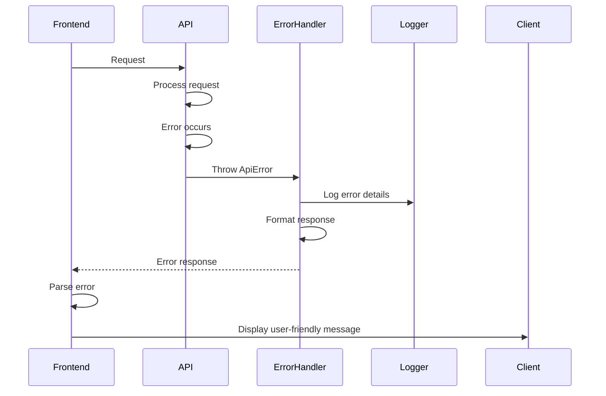

# Error Handling Strategy

## Error Flow


## Error Response Format
```typescript
interface ApiError {
  error: {
    code: string;
    message: string;
    details?: Record<string, any>;
    timestamp: string;
    requestId: string;
  };
}
```

## Frontend Error Handling
```typescript
// core/error/error.handler.ts
import { ErrorHandler, Injectable, inject } from '@angular/core';
import { ToastService } from '@shared/services/toast.service';
import { LoggerService } from '@core/services/logger.service';

@Injectable()
export class GlobalErrorHandler implements ErrorHandler {
  private toast = inject(ToastService);
  private logger = inject(LoggerService);

  handleError(error: Error): void {
    this.logger.error('Unhandled error', error);

    if (error instanceof HttpErrorResponse) {
      this.handleHttpError(error);
    } else {
      this.toast.error('An unexpected error occurred');
    }
  }

  private handleHttpError(error: HttpErrorResponse): void {
    const message = error.error?.error?.message || 'Server error occurred';
    this.toast.error(message);
  }
}
```

## Backend Error Handling
```typescript
// middleware/error.middleware.ts
export const errorHandler = (
  err: Error,
  req: Request,
  res: Response,
  next: NextFunction
) => {
  const requestId = req.id;

  logger.error({
    requestId,
    error: err.message,
    stack: err.stack,
    url: req.url,
    method: req.method,
    ip: req.ip
  });

  if (err instanceof ApiError) {
    return res.status(err.statusCode).json({
      error: {
        code: err.code,
        message: err.message,
        details: err.details,
        timestamp: new Date().toISOString(),
        requestId
      }
    });
  }

  res.status(500).json({
    error: {
      code: 'INTERNAL_ERROR',
      message: 'An unexpected error occurred',
      timestamp: new Date().toISOString(),
      requestId
    }
  });
};
```
