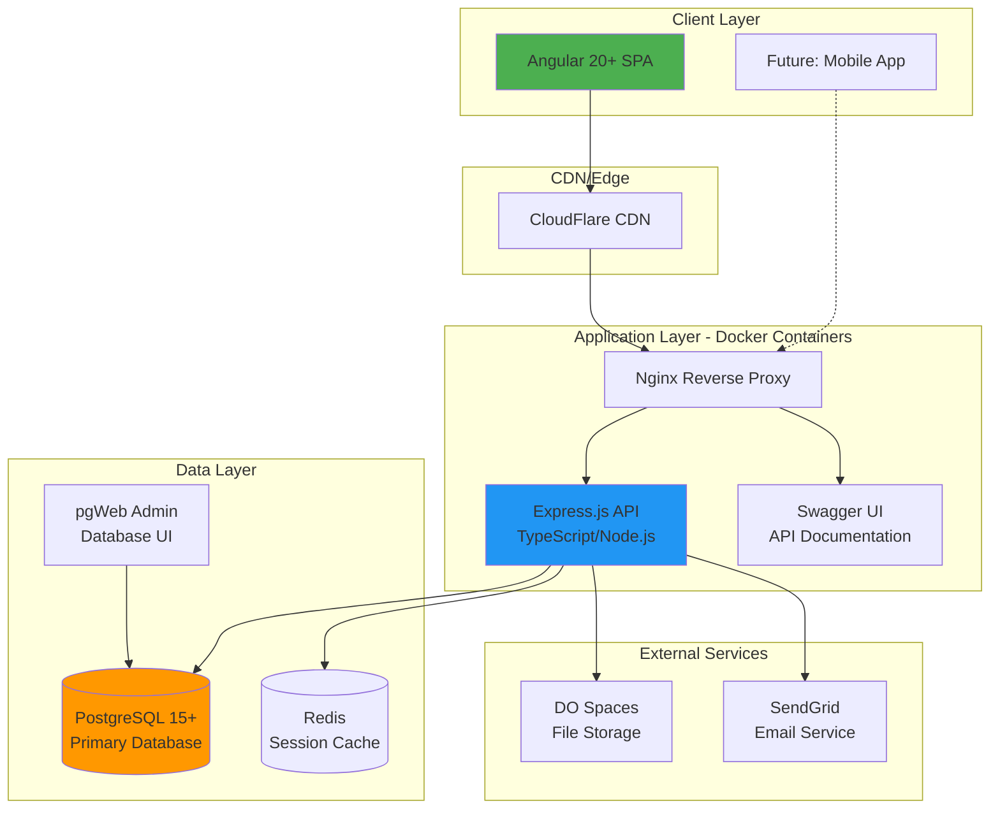

# High Level Architecture

## Technical Summary

NodeAngularFullStack implements a containerized monolithic architecture with microservice-ready boundaries, deploying Angular 20+ frontend and Express.js/TypeScript backend through Docker containers. The system integrates via RESTful APIs with JWT authentication, connecting to PostgreSQL database with optional multi-tenancy configuration. Infrastructure leverages Docker Compose for development and Digital Ocean App Platform for production deployment, utilizing environment-based configuration for flexible deployment modes. This architecture achieves PRD goals by providing immediate development productivity through pre-configured infrastructure while maintaining production-grade security, performance, and scalability standards.

## Platform and Infrastructure Choice

**Platform:** Digital Ocean App Platform
**Key Services:** App Platform (Apps), Managed Database (PostgreSQL), Spaces (Object Storage), Container Registry
**Deployment Host and Regions:** Primary: NYC3 (US East), Secondary: FRA1 (EU Central)

**Rationale:** Digital Ocean provides cost-effective managed services ideal for startups and small teams, with predictable pricing and simple deployment workflows that align with the PRD's developer experience goals.

## Repository Structure

**Structure:** Monorepo
**Monorepo Tool:** npm workspaces (native Node.js solution)
**Package Organization:** Apps-based structure with shared packages for cross-stack type definitions and utilities

## High Level Architecture Diagram

## Architectural Patterns

- **Monolithic with Service Boundaries:** Single deployable unit with clear service separations enabling future microservice extraction - _Rationale:_ Simplifies initial development while maintaining scalability path
- **Repository Pattern:** Abstract database operations behind repository interfaces - _Rationale:_ Enables testing with mocks and future database migration flexibility
- **JWT Stateless Authentication:** Token-based auth without server sessions - _Rationale:_ Enables horizontal scaling and API-first architecture
- **Component-Based UI:** Angular standalone components with OnPush change detection - _Rationale:_ Maximizes reusability and performance in large applications
- **API Gateway Pattern:** Nginx reverse proxy as single entry point - _Rationale:_ Centralized SSL termination, rate limiting, and request routing
- **Database-Per-Service Ready:** Schema design supports future service isolation - _Rationale:_ Enables gradual migration to microservices without database refactoring
- **Environment-Based Configuration:** All settings via environment variables - _Rationale:_ Supports multiple deployment environments without code changes
- **Docker-First Development:** All dependencies containerized - _Rationale:_ Ensures consistent development environments across teams
