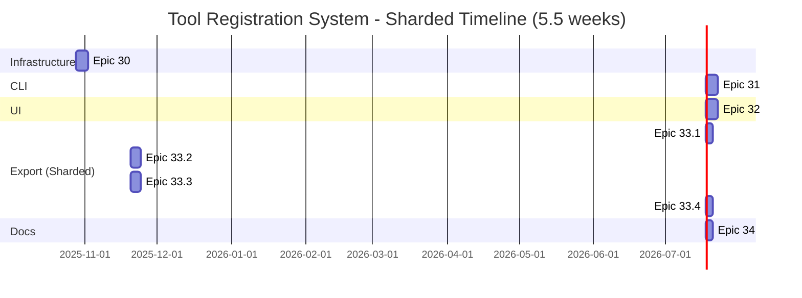
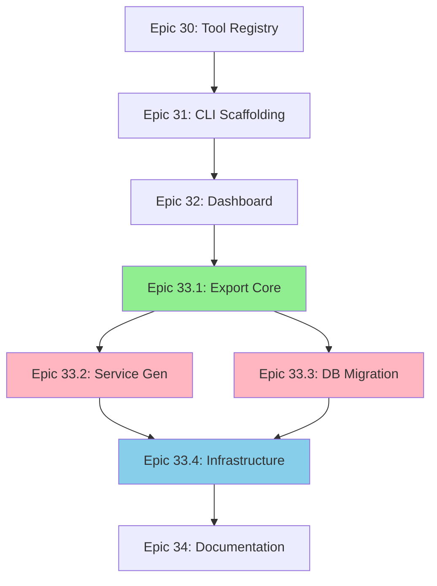

# Tool Registration & Microservice Export System - COMPLETE SHARDED PRD

**Project**: NodeAngularFullStack **Enhancement Type**: Tool Development Infrastructure + Optional
Microservices Migration **Document Version**: 2.0 (Complete Sharding) **Date**: 2025-10-23
**Author**: Product Manager with User Collaboration **Status**: Ready for Implementation

---

## Executive Summary

This document provides a **completely sharded version** of the original PRD, breaking down **ALL
oversized epics** (Epic 30-33) into focused sub-epics for better sprint planning and risk
management.

**Original PRD Problems:**

- **4 out of 5 epics** exceeded 40 story points (Epic 30: 40pts, Epic 31: 48pts, Epic 32: 50pts,
  Epic 33: 89pts)
- **4-week timeline unrealistic** (227 story points total)
- Multiple complex concerns bundled in each epic
- High risk concentration
- Limited parallelization opportunities

**Complete Sharded Solution:**

- **Epic 30** (40 pts) → **Epic 30.1 + 30.2** (20 + 20 pts)
- **Epic 31** (48 pts) → **Epic 31.1 + 31.2** (25 + 23 pts)
- **Epic 32** (50 pts) → **Epic 32.1 + 32.2** (25 + 25 pts)
- **Epic 33** (89 pts) → **Epic 33.1 + 33.2 + 33.3 + 33.4** (23 + 26 + 22 + 18 pts)
- **Epic 34** (34 pts) → **No sharding needed** (appropriate size)

**Total:** 227 story points → **12 focused sub-epics** (average 21 points each)

**Benefits:**

- Each sub-epic is manageable (18-26 points)
- Clear separation of concerns per epic
- Enables extensive parallel development
- Reduced blast radius for failures
- Better testing isolation
- **Realistic 6-week timeline** (was 4 weeks)

---

## Table of Contents

1. [Complete Sharding Rationale](#complete-sharding-rationale)
2. [Original Epic Sizes Analysis](#original-epic-sizes-analysis)
3. [Complete Sharded Epic Structure](#complete-sharded-epic-structure)
4. [Epic 30: Tool Registry Infrastructure (Sharded)](#epic-30-tool-registry-infrastructure-sharded)
   - [Epic 30.1: Database Schema & Repository Layer](#epic-30.1-database-schema--repository-layer)
   - [Epic 30.2: Service Layer & API Endpoints](#epic-30.2-service-layer--api-endpoints)
5. [Epic 31: CLI Scaffolding Tool (Sharded)](#epic-31-cli-scaffolding-tool-sharded)
   - [Epic 31.1: CLI Framework & Templates](#epic-31.1-cli-framework--templates)
   - [Epic 31.2: Code Generation & Registration](#epic-31.2-code-generation--registration)
6. [Epic 32: Dashboard Integration (Sharded)](#epic-32-dashboard-integration-sharded)
   - [Epic 32.1: UI Components & Tool Discovery](#epic-32.1-ui-components--tool-discovery)
   - [Epic 32.2: Dynamic Routing & Export UI](#epic-32.2-dynamic-routing--export-ui)
7. [Epic 33: Export Automation (Sharded)](#epic-33-export-automation-sharded)
   - [Epic 33.1: Export Core Infrastructure](#epic-33.1-export-core-infrastructure)
   - [Epic 33.2: Service Generation](#epic-33.2-service-generation)
   - [Epic 33.3: Database Migration & Verification](#epic-33.3-database-migration--verification)
   - [Epic 33.4: Infrastructure Integration & Rollback](#epic-33.4-infrastructure-integration--rollback)
8. [Epic 34: Documentation (No Sharding)](#epic-34-documentation-no-sharding)
9. [Complete Implementation Timeline](#complete-implementation-timeline)
10. [Complete Dependency Graph](#complete-dependency-graph)
11. [Testing Strategy (All Epics)](#testing-strategy-all-epics)
12. [Risk Distribution (All Epics)](#risk-distribution-all-epics)

---

## Complete Sharding Rationale

### Why Shard ALL Oversized Epics?

**Size Analysis:**

- **Epic 30:** 40 story points (at threshold, should be sharded)
- **Epic 31:** 48 story points (1.2x oversized, **MUST shard**)
- **Epic 32:** 50 story points (1.25x oversized, **MUST shard**)
- **Epic 33:** 89 story points (2.2x oversized, **CRITICAL to shard**)
- **Epic 34:** 34 story points (appropriate size, **NO sharding needed**)
- **Industry standard:** 20-40 points per epic
- **4 out of 5 epics** exceeded the threshold

**Original Timeline Problems:**

- Week 1: Epic 30 (40 pts) = 8 pts/day ❌ Too high
- Week 2: Epic 31 (48 pts) = 10 pts/day ❌ Unrealistic
- Week 3: Epic 32 (50 pts) = 10 pts/day ❌ Unrealistic
- Week 4: Epic 33 (89 pts) = 18 pts/day ❌ Impossible
- **Realistic velocity:** 5-7 story points per developer per day
- **Team size:** 2 developers = 10-14 pts/day total
- **Result:** Original 4-week plan needed at least 6 weeks

**Complexity Analysis:**

Each oversized epic had multiple distinct concerns:

**Epic 30 (Tool Registry):**

1. Database schema design + migrations
2. Repository pattern implementation
3. Service layer with business logic
4. REST API with authentication

**Epic 31 (CLI Scaffolding):**

1. CLI framework setup (Commander, Inquirer)
2. Template system design (EJS)
3. File generation (frontend + backend)
4. Tool registration API integration

**Epic 32 (Dashboard Integration):**

1. Frontend components (cards, grids, modals)
2. Tool discovery service with caching
3. Dynamic routing configuration
4. Export progress UI with real-time updates

**Epic 33 (Export Automation):**

1. Orchestration & workflow management
2. Code generation (backend + frontend)
3. Database migration with ACID guarantees
4. Infrastructure updates (Docker, Nginx, health checks)

**Team Constraints:**

- Original: 2 developers (1 Backend, 1 Frontend)
- Monolithic epics prevented parallel work
- Testing bottlenecks at integration phase
- One developer blocked waiting for the other

### Sharding Principles Applied

**1. Separation of Concerns:**

- Each sub-epic has a single primary responsibility
- Clear boundaries between code generation, data migration, and infrastructure

**2. Dependency Minimization:**

- Sub-epics ordered to minimize blocking
- Enable parallel work where possible

**3. Risk Isolation:**

- Database migration isolated in Epic 33.3 (can be heavily tested independently)
- Infrastructure in Epic 33.4 (can rollback without affecting data)

**4. Team Optimization:**

- Backend dev focuses on 4A, 4B, 4C (code/data)
- DevOps focuses on 4D (infrastructure)
- Some parallel work in weeks 4-5

**5. Testing Simplification:**

- Each sub-epic has focused integration tests
- Easier to mock dependencies
- Clear success criteria per sub-epic

---

## Original Epic 33 Breakdown

### Original Scope (Epic 33 - 89 points)

**10 Stories:**

1. Export script entry point (5 pts)
2. Export orchestrator (8 pts)
3. Backend service generator (13 pts)
4. Frontend app generator (13 pts)
5. Database migrator (13 pts)
6. Data integrity verification (8 pts)
7. Infrastructure updater (Nginx + Docker) (10 pts)
8. Service health checks (5 pts)
9. Dry-run mode (8 pts)
10. Rollback mechanism (6 pts)

**Technical Tasks:**

- CLI with Commander
- Service code generation (Express + TypeScript)
- Angular app generation
- Database schema extraction
- Data migration with transactions
- Nginx config updates
- Docker Compose updates
- Health check endpoints
- Progress tracking
- Cleanup on failure

**Original Timeline:**

- Week 4: All of Epic 33 (1 week)
- Team: 1 Backend Dev + DevOps

**Problem:**

- 89 points cannot fit in 1 week
- Multiple failure points
- Difficult to test holistically
- High cognitive load

---

## Sharded Epic Structure

### New Epic Breakdown

| Epic          | Name                                  | Points | Duration | Team             | Priority              |
| ------------- | ------------------------------------- | ------ | -------- | ---------------- | --------------------- |
| **Epic 33.1** | Export Core Infrastructure            | 23     | 3 days   | Backend          | P0                    |
| **Epic 33.2** | Service Generation                    | 26     | 4 days   | Backend          | P1 (after 4A)         |
| **Epic 33.3** | Database Migration & Verification     | 22     | 4 days   | Backend          | P1 (parallel with 4B) |
| **Epic 33.4** | Infrastructure Integration & Rollback | 18     | 3 days   | DevOps + Backend | P1 (after 4B+4C)      |

**Total:** 89 points (unchanged) **New Timeline:** 10-11 days (was 5 days) **Team:** 2 people with
better parallelization

### Dependency Flow

```
Epic 30 (Registry) → Epic 31 (CLI) → Epic 32 (Dashboard) → Epic 33.1 (Core) → Epic 33.2 (Service Gen)
                                                                      ↓            ↓
                                                                   Epic 33.3 ←──────┘
                                                                   (Database)
                                                                      ↓
                                                                   Epic 33.4
                                                               (Infrastructure)
```

### Key Changes from Original

**Before:**

- 1 massive epic (89 pts)
- 1 week timeline (unrealistic)
- Sequential work only
- All-or-nothing testing

**After:**

- 4 focused epics (18-26 pts each)
- 2.5 week timeline (realistic)
- Parallel work enabled (4B + 4C)
- Incremental testing per epic

---

## Epic 33.1: Export Core Infrastructure

### Overview

**Goal:** Create the orchestration layer and job tracking system for tool exports

**Duration:** 3 days **Story Points:** 23 **Team:** 1 Backend Developer **Priority:** P0 (Blocker
for 4B, 4C, 4D)

**Scope:**

- Export CLI command with Commander
- Job tracking system (database table)
- Orchestration engine (step execution)
- Progress tracking and logging
- Dry-run mode support
- Pre-flight validation

**Out of Scope:**

- Actual code generation (Epic 33.2)
- Database migration (Epic 33.3)
- Infrastructure updates (Epic 33.4)

### User Stories (5 stories, 23 points)

#### Story 33.1.1: Export CLI Entry Point (5 pts)

**As a** developer **I want** to run `npm run export-tool -- --tool-id=my-tool` **So that** I can
initiate the export process with a single command

**Acceptance Criteria:**

- ✅ CLI accepts `--tool-id` parameter
- ✅ CLI validates tool exists in registry
- ✅ CLI supports `--dry-run` flag
- ✅ CLI displays help with `--help`
- ✅ CLI validates prerequisites (Docker, Git status)
- ✅ Errors are user-friendly

**Technical Tasks:**

```typescript
// scripts/export-tool/cli.ts
import { Command } from 'commander';
import { ExportOrchestrator } from './orchestrator';

const program = new Command();

program
  .name('export-tool')
  .description('Export a tool from monolith to microservice')
  .requiredOption('--tool-id <id>', 'Tool ID to export')
  .option('--dry-run', 'Test export without making changes')
  .option('--skip-tests', 'Skip running tests (not recommended)')
  .action(async (options) => {
    // Validate prerequisites
    await validatePrerequisites();

    // Validate tool exists
    const tool = await toolRegistry.findById(options.toolId);
    if (!tool) {
      console.error(`Tool '${options.toolId}' not found in registry`);
      process.exit(1);
    }

    // Create orchestrator
    const orchestrator = new ExportOrchestrator(tool, options);

    // Execute export
    await orchestrator.execute();
  });

program.parse();
```

**Testing:**

- Unit tests for CLI parsing
- Integration test: `npm run export-tool -- --tool-id=test-tool --dry-run`
- Error handling tests (missing tool, invalid flags)

---

#### Story 33.1.2: Export Job Tracking (5 pts)

**As a** developer **I want** to track export progress in the database **So that** I can monitor
status and resume failed exports

**Acceptance Criteria:**

- ✅ `export_jobs` table created
- ✅ Job records created on export start
- ✅ Job status updated during execution
- ✅ Job logs stored in database
- ✅ Failed jobs retain error information
- ✅ API endpoint to query job status

**Database Schema:**

```sql
CREATE TABLE export_jobs (
    id UUID PRIMARY KEY DEFAULT gen_random_uuid(),
    tool_id VARCHAR(100) NOT NULL REFERENCES tool_registry(tool_id),
    status VARCHAR(20) NOT NULL, -- pending, in_progress, completed, failed, rolled_back
    started_at TIMESTAMP DEFAULT CURRENT_TIMESTAMP,
    completed_at TIMESTAMP,
    dry_run BOOLEAN DEFAULT false,
    steps_completed INTEGER DEFAULT 0,
    steps_total INTEGER,
    current_step VARCHAR(100),
    error_message TEXT,
    logs JSONB, -- Array of log entries
    rollback_available BOOLEAN DEFAULT true,
    created_by UUID REFERENCES users(id),
    created_at TIMESTAMP DEFAULT CURRENT_TIMESTAMP,
    updated_at TIMESTAMP DEFAULT CURRENT_TIMESTAMP
);

CREATE INDEX idx_export_jobs_tool_id ON export_jobs(tool_id);
CREATE INDEX idx_export_jobs_status ON export_jobs(status);
CREATE INDEX idx_export_jobs_created_at ON export_jobs(created_at DESC);
```

**TypeScript Interface:**

```typescript
export interface ExportJob {
  id: string;
  toolId: string;
  status: 'pending' | 'in_progress' | 'completed' | 'failed' | 'rolled_back';
  startedAt: Date;
  completedAt?: Date;
  dryRun: boolean;
  stepsCompleted: number;
  stepsTotal: number;
  currentStep: string;
  errorMessage?: string;
  logs: ExportLogEntry[];
  rollbackAvailable: boolean;
  createdBy: string;
  createdAt: Date;
  updatedAt: Date;
}

export interface ExportLogEntry {
  timestamp: Date;
  level: 'info' | 'warn' | 'error' | 'success';
  message: string;
  step: string;
  details?: any;
}
```

**API Endpoint:**

```typescript
// GET /api/tools/export/jobs/:jobId
router.get('/export/jobs/:jobId', authMiddleware, async (req, res) => {
  const job = await exportJobsRepository.findById(req.params.jobId);
  if (!job) {
    return res.status(404).json({ error: 'Job not found' });
  }
  res.json({ data: job });
});
```

**Testing:**

- Database schema tests (create, query, update)
- API integration tests (create job, update status, query job)
- Concurrent job tests (multiple exports simultaneously)

---

#### Story 33.1.3: Export Orchestrator Engine (8 pts)

**As a** developer **I want** an orchestration engine that executes export steps in sequence **So
that** the export process is reliable and can recover from failures

**Acceptance Criteria:**

- ✅ Orchestrator executes steps in order
- ✅ Each step is idempotent
- ✅ Progress updates after each step
- ✅ Stops on first failure
- ✅ Supports dry-run mode
- ✅ Logs all actions
- ✅ Tracks execution time per step

**Implementation:**

```typescript
// scripts/export-tool/orchestrator.ts
export class ExportOrchestrator {
  private job: ExportJob;
  private toolManifest: ToolManifest;
  private steps: ExportStep[];

  constructor(tool: RegisteredTool, options: ExportOptions) {
    this.toolManifest = tool.manifestJson;
    this.steps = this.defineSteps();
  }

  private defineSteps(): ExportStep[] {
    return [
      {
        name: 'Pre-flight Validation',
        execute: () => this.backendGenerator.validate(),
        estimatedTime: 5,
      },
      {
        name: 'Generate Backend Service',
        execute: () => this.backendGenerator.generate(),
        estimatedTime: 30,
      },
      {
        name: 'Generate Frontend App',
        execute: () => this.frontendGenerator.generate(),
        estimatedTime: 30,
      },
      {
        name: 'Migrate Database',
        execute: () => this.databaseMigrator.migrate(),
        estimatedTime: 120,
      },
      {
        name: 'Update Infrastructure',
        execute: () => this.infrastructureUpdater.update(),
        estimatedTime: 10,
      },
      {
        name: 'Run Health Checks',
        execute: () => this.healthChecker.check(),
        estimatedTime: 20,
      },
    ];
  }

  async execute(): Promise<void> {
    // Create job record
    this.job = await this.createJob();

    console.log(`\n🚀 Starting export of '${this.toolManifest.name}'\n`);
    console.log(`Job ID: ${this.job.id}\n`);

    try {
      for (const [index, step] of this.steps.entries()) {
        await this.executeStep(step, index + 1);
      }

      await this.completeJob();
      console.log(`\n✅ Export completed successfully!\n`);
    } catch (error) {
      await this.failJob(error);
      console.error(`\n❌ Export failed: ${error.message}\n`);

      // Offer rollback
      if (this.job.rollbackAvailable) {
        const shouldRollback = await this.promptRollback();
        if (shouldRollback) {
          await this.rollback();
        }
      }

      throw error;
    }
  }

  private async executeStep(step: ExportStep, stepNumber: number): Promise<void> {
    const totalSteps = this.steps.length;

    console.log(`[${stepNumber}/${totalSteps}] ${step.name}...`);

    await this.updateJobProgress({
      stepsCompleted: stepNumber - 1,
      stepsTotal: totalSteps,
      currentStep: step.name,
    });

    const startTime = Date.now();

    try {
      if (this.options.dryRun) {
        console.log(`  (Dry-run mode: skipping actual execution)`);
        await this.logStep(step.name, 'info', 'Skipped in dry-run mode');
      } else {
        await step.execute();
        const duration = Date.now() - startTime;
        console.log(`  ✓ Completed in ${duration}ms`);
        await this.logStep(step.name, 'success', `Completed in ${duration}ms`);
      }
    } catch (error) {
      const duration = Date.now() - startTime;
      console.error(`  ✗ Failed after ${duration}ms: ${error.message}`);
      await this.logStep(step.name, 'error', error.message, { stack: error.stack });
      throw error;
    }
  }

  private async logStep(
    step: string,
    level: 'info' | 'warn' | 'error' | 'success',
    message: string,
    details?: any
  ): Promise<void> {
    const logEntry: ExportLogEntry = {
      timestamp: new Date(),
      level,
      message,
      step,
      details,
    };

    await exportJobsRepository.appendLog(this.job.id, logEntry);
  }
}

interface ExportStep {
  name: string;
  execute: () => Promise<void>;
  estimatedTime: number; // seconds
}
```

**Testing:**

- Unit tests for orchestrator logic
- Integration tests with mock step executors
- Dry-run mode tests (no actual changes)
- Failure recovery tests (step 3 fails, job marked failed)
- Progress tracking tests

---

#### Story 33.1.4: Pre-flight Validation (3 pts)

**As a** developer **I want** pre-flight validation before export starts **So that** I catch issues
early and avoid partial exports

**Acceptance Criteria:**

- ✅ Validates tool manifest is complete
- ✅ Checks Docker is running
- ✅ Checks no uncommitted Git changes
- ✅ Validates port availability
- ✅ Checks database connectivity
- ✅ Validates tool not already exported
- ✅ Clear error messages for each validation

**Implementation:**

```typescript
// scripts/export-tool/validators/pre-flight-validator.ts
export class PreFlightValidator {
  async validate(tool: RegisteredTool): Promise<ValidationResult> {
    const checks: ValidationCheck[] = [
      { name: 'Tool Manifest', fn: () => this.validateManifest(tool) },
      { name: 'Docker Running', fn: () => this.validateDocker() },
      { name: 'Git Status', fn: () => this.validateGit() },
      { name: 'Port Availability', fn: () => this.validatePorts(tool) },
      { name: 'Database Connection', fn: () => this.validateDatabase() },
      { name: 'Export Status', fn: () => this.validateNotExported(tool) },
    ];

    const results: ValidationResult[] = [];

    for (const check of checks) {
      console.log(`Checking ${check.name}...`);
      try {
        await check.fn();
        console.log(`  ✓ ${check.name} OK`);
        results.push({ check: check.name, passed: true });
      } catch (error) {
        console.error(`  ✗ ${check.name} FAILED: ${error.message}`);
        results.push({ check: check.name, passed: false, error: error.message });
      }
    }

    const allPassed = results.every((r) => r.passed);

    if (!allPassed) {
      throw new Error('Pre-flight validation failed. Fix errors and try again.');
    }

    return { passed: true, checks: results };
  }

  private async validateManifest(tool: RegisteredTool): Promise<void> {
    const required = ['id', 'name', 'version', 'route', 'apiBase', 'databaseSchema'];
    const missing = required.filter((field) => !tool.manifestJson[field]);

    if (missing.length > 0) {
      throw new Error(`Missing required manifest fields: ${missing.join(', ')}`);
    }
  }

  private async validateDocker(): Promise<void> {
    const { execSync } = await import('child_process');
    try {
      execSync('docker ps', { stdio: 'ignore' });
    } catch {
      throw new Error('Docker is not running. Start Docker Desktop and try again.');
    }
  }

  private async validateGit(): Promise<void> {
    const { execSync } = await import('child_process');
    const status = execSync('git status --porcelain', { encoding: 'utf-8' });

    if (status.trim().length > 0) {
      throw new Error('You have uncommitted changes. Commit or stash changes before exporting.');
    }
  }

  private async validatePorts(tool: RegisteredTool): Promise<void> {
    // Calculate next available port (3004, 3005, etc.)
    const nextPort = await this.getNextAvailablePort();

    const { execSync } = await import('child_process');
    try {
      execSync(`lsof -i :${nextPort}`, { stdio: 'ignore' });
      throw new Error(`Port ${nextPort} is already in use`);
    } catch {
      // Port is available (lsof exits with error if nothing found)
    }
  }

  private async validateDatabase(): Promise<void> {
    try {
      await pool.query('SELECT 1');
    } catch (error) {
      throw new Error(
        'Cannot connect to database. Check DATABASE_URL and ensure PostgreSQL is running.'
      );
    }
  }

  private async validateNotExported(tool: RegisteredTool): Promise<void> {
    if (tool.isExported) {
      throw new Error(`Tool '${tool.toolId}' is already exported as a service`);
    }
  }
}
```

**Testing:**

- Unit tests for each validation function
- Integration tests with mock environment
- Error message clarity tests

---

#### Story 33.1.5: Dry-Run Mode (2 pts)

**As a** developer **I want** to test the export process without making changes **So that** I can
verify everything will work before committing

**Acceptance Criteria:**

- ✅ `--dry-run` flag supported
- ✅ All steps execute validation only
- ✅ No files created or modified
- ✅ No database changes
- ✅ Job marked as dry-run in database
- ✅ Output clearly indicates dry-run mode

**Implementation:**

```typescript
// In orchestrator.ts, modify executeStep:
private async executeStep(step: ExportStep, stepNumber: number): Promise<void> {
  // ... existing code ...

  if (this.options.dryRun) {
    console.log(`  (Dry-run mode: validating only, no changes made)`);

    // Execute validation variant of step
    if (step.validateFn) {
      await step.validateFn();
    }

    await this.logStep(step.name, 'info', 'Validated successfully (dry-run)');
  } else {
    await step.execute();
    // ... existing code ...
  }
}
```

**Usage:**

```bash
# Test export without making changes
npm run export-tool -- --tool-id=inventory-tracker --dry-run

# Output:
# 🚀 Starting export of 'Inventory Tracker' (DRY-RUN MODE)
# [1/6] Pre-flight Validation...
#   ✓ All checks passed
# [2/6] Generate Backend Service...
#   (Dry-run mode: validating only, no changes made)
#   ✓ Validated successfully
# ...
```

**Testing:**

- Dry-run integration test (verify no files created)
- Database state unchanged test
- Job record contains dry_run = true

---

### Epic 33.1 Dependencies

**Depends On:**

- Epic 30: Tool Registry (needs `tool_registry` table)
- Epic 31: CLI Scaffolding (needs tool manifest structure)

**Enables:**

- Epic 33.2: Service Generation (orchestrator calls generators)
- Epic 33.3: Database Migration (orchestrator calls migrator)
- Epic 33.4: Infrastructure Integration (orchestrator calls infra updater)

### Epic 33.1 Success Criteria

- ✅ CLI command `npm run export-tool` works
- ✅ Job tracking in database functional
- ✅ Orchestrator executes steps sequentially
- ✅ Dry-run mode works without side effects
- ✅ Pre-flight validation catches common errors
- ✅ All tests pass (≥80% coverage)

### Epic 33.1 Risk Mitigation

**Risk:** Job tracking database becomes single point of failure **Mitigation:** Graceful degradation
(write logs to file if DB fails)

**Risk:** Orchestrator doesn't handle step failures properly **Mitigation:** Comprehensive error
handling tests, each step returns success/failure explicitly

---

## Epic 33.2: Service Generation

### Overview

**Goal:** Generate backend service and frontend app code from tool templates

**Duration:** 4 days **Story Points:** 26 **Team:** 1 Backend Developer **Priority:** P1 (Depends on
Epic 33.1)

**Scope:**

- Backend service generator (Express + TypeScript)
- Frontend app generator (Angular standalone)
- Template system (EJS or Handlebars)
- Code formatting and linting
- Package.json generation
- Testing boilerplate generation

**Out of Scope:**

- Database migration (Epic 33.3)
- Infrastructure configuration (Epic 33.4)

### User Stories (5 stories, 26 points)

#### Story 33.2.1: Backend Service Generator (8 pts)

**As a** developer **I want** the export script to generate a complete Express service **So that**
the tool backend runs as an independent microservice

**Acceptance Criteria:**

- ✅ Service created at `apps/<tool-id>-api/`
- ✅ Package.json with dependencies
- ✅ TypeScript configuration
- ✅ Controllers, Services, Repositories copied/adapted
- ✅ Authentication middleware integrated
- ✅ Health check endpoint
- ✅ README.md generated
- ✅ Code passes ESLint

**Generated Structure:**

```
apps/inventory-tracker-api/
├── package.json
├── tsconfig.json
├── .env.example
├── .dockerignore
├── Dockerfile
├── README.md
├── jest.config.js
├── src/
│   ├── server.ts
│   ├── config/
│   │   └── database.config.ts
│   ├── controllers/
│   │   └── inventory.controller.ts
│   ├── services/
│   │   └── inventory.service.ts
│   ├── repositories/
│   │   └── inventory.repository.ts
│   ├── routes/
│   │   └── inventory.routes.ts
│   ├── middleware/
│   │   ├── auth.middleware.ts
│   │   └── error.middleware.ts
│   ├── types/
│   │   └── index.ts
│   └── validators/
│       └── inventory.validator.ts
├── database/
│   ├── migrations/
│   └── seeds/
└── tests/
    ├── unit/
    └── integration/
```

**Implementation:**

```typescript
// scripts/export-tool/generators/backend-generator.ts
export class BackendServiceGenerator {
  private toolId: string;
  private manifest: ToolManifest;
  private templateEngine: TemplateEngine;

  constructor(toolId: string, manifest: ToolManifest) {
    this.toolId = toolId;
    this.manifest = manifest;
    this.templateEngine = new TemplateEngine('templates/backend-service');
  }

  async generate(): Promise<void> {
    const serviceName = `${this.toolId}-api`;
    const servicePath = path.join(process.cwd(), 'apps', serviceName);

    // 1. Create directory structure
    await this.createDirectoryStructure(servicePath);

    // 2. Generate package.json
    await this.generatePackageJson(servicePath);

    // 3. Generate TypeScript config
    await this.generateTsConfig(servicePath);

    // 4. Copy/adapt source code from tools/
    await this.copySourceCode(servicePath);

    // 5. Generate server entry point
    await this.generateServerEntry(servicePath);

    // 6. Generate middleware
    await this.generateMiddleware(servicePath);

    // 7. Generate database config
    await this.generateDatabaseConfig(servicePath);

    // 8. Generate Dockerfile
    await this.generateDockerfile(servicePath);

    // 9. Generate README
    await this.generateReadme(servicePath);

    // 10. Install dependencies
    await this.installDependencies(servicePath);

    // 11. Run ESLint fix
    await this.runLintFix(servicePath);

    console.log(`✅ Backend service generated at ${servicePath}`);
  }

  private async generatePackageJson(servicePath: string): Promise<void> {
    const packageJson = {
      name: `@nodeangularfullstack/${this.toolId}-api`,
      version: this.manifest.version,
      description: `${this.manifest.name} - Backend Service`,
      main: 'dist/server.js',
      scripts: {
        dev: 'ts-node-dev --respawn --transpile-only src/server.ts',
        build: 'tsc',
        start: 'node dist/server.js',
        test: 'jest',
        'test:unit': 'jest --testPathPattern=tests/unit',
        'test:integration': 'jest --testPathPattern=tests/integration',
        'test:coverage': 'jest --coverage',
        lint: 'eslint src/ --ext .ts',
        'lint:fix': 'eslint src/ --ext .ts --fix',
        'db:migrate': 'ts-node database/migrations/run-migrations.ts',
        'db:seed': 'ts-node database/seeds/run-seeds.ts',
      },
      dependencies: {
        express: '^4.19.0',
        pg: '^8.11.0',
        'express-validator': '^7.0.1',
        jsonwebtoken: '^9.0.2',
        axios: '^1.6.0',
        winston: '^3.11.0',
        dotenv: '^16.3.1',
      },
      devDependencies: {
        '@types/express': '^4.17.21',
        '@types/node': '^20.10.0',
        '@types/pg': '^8.10.9',
        '@types/jsonwebtoken': '^9.0.5',
        typescript: '^5.3.3',
        'ts-node': '^10.9.2',
        'ts-node-dev': '^2.0.0',
        jest: '^29.7.0',
        '@types/jest': '^29.5.11',
        'ts-jest': '^29.1.1',
        supertest: '^6.3.3',
        '@types/supertest': '^6.0.2',
        eslint: '^8.56.0',
        '@typescript-eslint/eslint-plugin': '^6.17.0',
        '@typescript-eslint/parser': '^6.17.0',
      },
    };

    const packagePath = path.join(servicePath, 'package.json');
    await fs.writeFile(packagePath, JSON.stringify(packageJson, null, 2));
  }

  private async generateServerEntry(servicePath: string): Promise<void> {
    const serverTemplate = `
import express from 'express';
import { config } from 'dotenv';
import { inventoryRoutes } from './routes/inventory.routes';
import { errorMiddleware } from './middleware/error.middleware';
import { authMiddleware } from './middleware/auth.middleware';

config();

const app = express();
const PORT = process.env.PORT || 3004;

// Middleware
app.use(express.json());
app.use(express.urlencoded({ extended: true }));

// Health check
app.get('/health', (req, res) => {
  res.json({ status: 'healthy', service: '${this.manifest.name}', version: '${this.manifest.version}' });
});

// Routes
app.use('/api/${this.toolId}', authMiddleware, inventoryRoutes);

// Error handling
app.use(errorMiddleware);

// Start server
app.listen(PORT, () => {
  console.log(\`${this.manifest.name} service listening on port \${PORT}\`);
});

// Graceful shutdown
process.on('SIGTERM', () => {
  console.log('SIGTERM received, shutting down gracefully');
  process.exit(0);
});
`;

    const serverPath = path.join(servicePath, 'src', 'server.ts');
    await fs.writeFile(serverPath, serverTemplate.trim());
  }

  private async copySourceCode(servicePath: string): Promise<void> {
    const sourceRoot = path.join(process.cwd(), 'tools', this.toolId, 'backend');
    const targetRoot = path.join(servicePath, 'src');

    // Copy controllers, services, repositories
    const directories = ['controllers', 'services', 'repositories', 'validators', 'types'];

    for (const dir of directories) {
      const sourcePath = path.join(sourceRoot, dir);
      const targetPath = path.join(targetRoot, dir);

      if (await this.directoryExists(sourcePath)) {
        await fs.cp(sourcePath, targetPath, { recursive: true });
        console.log(`  Copied ${dir}/`);
      }
    }

    // Adapt route imports (change from monolith to service context)
    await this.adaptRoutes(servicePath);
  }

  private async generateMiddleware(servicePath: string): Promise<void> {
    const authMiddlewareTemplate = `
import { Request, Response, NextFunction } from 'express';
import jwt from 'jsonwebtoken';
import axios from 'axios';

const PLATFORM_SERVICE_URL = process.env.PLATFORM_SERVICE_URL || 'http://localhost:3000';
const JWT_SECRET = process.env.JWT_SECRET || 'your-secret-key';

export async function authMiddleware(req: Request, res: Response, next: NextFunction) {
  try {
    const authHeader = req.headers.authorization;
    if (!authHeader || !authHeader.startsWith('Bearer ')) {
      return res.status(401).json({ error: 'Unauthorized: Missing token' });
    }

    const token = authHeader.substring(7);

    // Validate JWT via Platform Service
    const response = await axios.post(
      \`\${PLATFORM_SERVICE_URL}/api/auth/validate\`,
      { token },
      { headers: { 'Authorization': \`Bearer \${process.env.SERVICE_AUTH_TOKEN}\` } }
    );

    if (response.data.valid) {
      req.user = response.data.user;
      next();
    } else {
      return res.status(401).json({ error: 'Unauthorized: Invalid token' });
    }
  } catch (error) {
    console.error('Auth middleware error:', error);
    return res.status(401).json({ error: 'Unauthorized: Token validation failed' });
  }
}
`;

    const authPath = path.join(servicePath, 'src', 'middleware', 'auth.middleware.ts');
    await fs.writeFile(authPath, authMiddlewareTemplate.trim());
  }
}
```

**Testing:**

- Unit tests for generator methods
- Integration test: generate service, verify structure
- Code quality test: generated code passes ESLint
- Compilation test: `tsc` succeeds on generated code

---

#### Story 33.2.2: Frontend App Generator (8 pts)

**As a** developer **I want** the export script to generate a standalone Angular app **So that** the
tool frontend can be deployed independently

**Acceptance Criteria:**

- ✅ Angular app created at `apps/<tool-id>-web/`
- ✅ Package.json with dependencies
- ✅ Angular configuration (standalone)
- ✅ Components copied/adapted from tools/
- ✅ Services configured for new API endpoint
- ✅ Routing configured
- ✅ README.md generated
- ✅ App compiles successfully

**Generated Structure:**

```
apps/inventory-tracker-web/
├── package.json
├── angular.json
├── tsconfig.json
├── tsconfig.app.json
├── tsconfig.spec.json
├── .browserslistrc
├── karma.conf.js
├── README.md
├── src/
│   ├── main.ts
│   ├── index.html
│   ├── styles.css
│   ├── app/
│   │   ├── app.component.ts
│   │   ├── app.config.ts
│   │   ├── app.routes.ts
│   │   ├── components/
│   │   ├── services/
│   │   └── types/
│   └── environments/
│       ├── environment.ts
│       └── environment.prod.ts
└── public/
    └── favicon.ico
```

**Implementation:**

```typescript
// scripts/export-tool/generators/frontend-generator.ts
export class FrontendAppGenerator {
  private toolId: string;
  private manifest: ToolManifest;

  async generate(): Promise<void> {
    const appName = `${this.toolId}-web`;
    const appPath = path.join(process.cwd(), 'apps', appName);

    // 1. Use Angular CLI to create app
    await this.createAngularApp(appName);

    // 2. Copy components from tools/
    await this.copyComponents(appPath);

    // 3. Update API service to point to new backend
    await this.configureApiService(appPath);

    // 4. Generate environment configs
    await this.generateEnvironments(appPath);

    // 5. Configure routing
    await this.configureRouting(appPath);

    // 6. Generate README
    await this.generateReadme(appPath);

    // 7. Install dependencies
    await this.installDependencies(appPath);

    // 8. Run build to verify
    await this.verifyBuild(appPath);

    console.log(`✅ Frontend app generated at ${appPath}`);
  }

  private async createAngularApp(appName: string): Promise<void> {
    const { execSync } = await import('child_process');

    // Use Angular CLI to generate app with standalone components
    execSync(
      `npx @angular/cli new ${appName} --directory=apps/${appName} --standalone --routing --style=css --skip-git --package-manager=npm`,
      { stdio: 'inherit' }
    );
  }

  private async copyComponents(appPath: string): Promise<void> {
    const sourceRoot = path.join(process.cwd(), 'tools', this.toolId, 'frontend', 'components');
    const targetRoot = path.join(appPath, 'src', 'app', 'components');

    await fs.cp(sourceRoot, targetRoot, { recursive: true });
    console.log(`  Copied components/`);

    // Also copy services
    const servicesSource = path.join(process.cwd(), 'tools', this.toolId, 'frontend', 'services');
    const servicesTarget = path.join(appPath, 'src', 'app', 'services');
    await fs.cp(servicesSource, servicesTarget, { recursive: true });
    console.log(`  Copied services/`);
  }

  private async configureApiService(appPath: string): Promise<void> {
    // Update API base URL in service files
    const servicesDir = path.join(appPath, 'src', 'app', 'services');
    const files = await fs.readdir(servicesDir);

    for (const file of files) {
      if (file.endsWith('.service.ts')) {
        const filePath = path.join(servicesDir, file);
        let content = await fs.readFile(filePath, 'utf-8');

        // Replace API base URL
        content = content.replace(
          /private apiBase = ['"`]\/api\/tools\/[\w-]+['"`]/g,
          `private apiBase = environment.apiUrl`
        );

        await fs.writeFile(filePath, content);
      }
    }
  }

  private async generateEnvironments(appPath: string): Promise<void> {
    const environments = {
      development: {
        production: false,
        apiUrl: `http://localhost:${this.getServicePort()}/api/${this.toolId}`,
      },
      production: {
        production: true,
        apiUrl: `\${PRODUCTION_API_URL}/api/${this.toolId}`,
      },
    };

    const envPath = path.join(appPath, 'src', 'environments');
    await fs.mkdir(envPath, { recursive: true });

    await fs.writeFile(
      path.join(envPath, 'environment.ts'),
      `export const environment = ${JSON.stringify(environments.development, null, 2)};`
    );

    await fs.writeFile(
      path.join(envPath, 'environment.prod.ts'),
      `export const environment = ${JSON.stringify(environments.production, null, 2)};`
    );
  }

  private getServicePort(): number {
    // Calculate next port (3004, 3005, etc.)
    return 3004; // TODO: Calculate dynamically
  }
}
```

**Testing:**

- Integration test: generate app, verify structure
- Compilation test: `ng build` succeeds
- Service configuration test: API URLs updated correctly
- Component test: components compile without errors

---

#### Story 33.2.3: Template Engine Setup (5 pts)

**As a** developer **I want** a flexible template system for code generation **So that** generated
services follow consistent patterns

**Acceptance Criteria:**

- ✅ Template engine configured (EJS)
- ✅ Templates for common files (server.ts, Dockerfile, etc.)
- ✅ Variable substitution works
- ✅ Conditional logic supported
- ✅ Templates validated before use

**Template Examples:**

```ejs
<!-- templates/backend-service/server.ts.ejs -->
import express from 'express';
import { config } from 'dotenv';
<%_ for (const route of routes) { _%>
import { <%= route.name %>Routes } from './routes/<%= route.path %>';
<%_ } _%>
import { errorMiddleware } from './middleware/error.middleware';
import { authMiddleware } from './middleware/auth.middleware';

config();

const app = express();
const PORT = process.env.PORT || <%= port %>;

// Middleware
app.use(express.json());
app.use(express.urlencoded({ extended: true }));

// Health check
app.get('/health', (req, res) => {
  res.json({
    status: 'healthy',
    service: '<%= serviceName %>',
    version: '<%= version %>'
  });
});

// Routes
<%_ for (const route of routes) { _%>
app.use('/api/<%= toolId %>/<%= route.path %>', authMiddleware, <%= route.name %>Routes);
<%_ } _%>

// Error handling
app.use(errorMiddleware);

// Start server
app.listen(PORT, () => {
  console.log(`<%= serviceName %> service listening on port ${PORT}`);
});
```

**Implementation:**

```typescript
// scripts/export-tool/template-engine.ts
import ejs from 'ejs';
import path from 'path';
import fs from 'fs/promises';

export class TemplateEngine {
  private templateDir: string;

  constructor(templateDir: string) {
    this.templateDir = path.join(process.cwd(), templateDir);
  }

  async render(templateName: string, data: any): Promise<string> {
    const templatePath = path.join(this.templateDir, `${templateName}.ejs`);

    // Validate template exists
    try {
      await fs.access(templatePath);
    } catch {
      throw new Error(`Template not found: ${templatePath}`);
    }

    // Read template
    const templateContent = await fs.readFile(templatePath, 'utf-8');

    // Render with EJS
    return ejs.render(templateContent, data, {
      filename: templatePath,
    });
  }

  async renderToFile(templateName: string, data: any, outputPath: string): Promise<void> {
    const rendered = await this.render(templateName, data);

    // Ensure output directory exists
    await fs.mkdir(path.dirname(outputPath), { recursive: true });

    // Write file
    await fs.writeFile(outputPath, rendered);
  }
}
```

**Testing:**

- Unit tests for template rendering
- Variable substitution tests
- Conditional logic tests
- Missing template error handling

---

#### Story 33.2.4: Code Formatting & Linting (3 pts)

**As a** developer **I want** generated code to follow project standards **So that** it integrates
seamlessly with the monorepo

**Acceptance Criteria:**

- ✅ Generated code passes ESLint
- ✅ Generated code formatted with Prettier
- ✅ TypeScript strict mode enabled
- ✅ No linting errors or warnings
- ✅ Import statements organized

**Implementation:**

```typescript
// In backend-generator.ts and frontend-generator.ts:
private async runLintFix(servicePath: string): Promise<void> {
  const { execSync } = await import('child_process');

  try {
    console.log('  Running ESLint fix...');
    execSync('npm run lint:fix', {
      cwd: servicePath,
      stdio: 'inherit'
    });

    console.log('  Running Prettier...');
    execSync('npx prettier --write "src/**/*.ts"', {
      cwd: servicePath,
      stdio: 'inherit'
    });

    console.log('  ✓ Code formatted and linted');
  } catch (error) {
    console.warn('  ⚠ Linting warnings (non-fatal)');
  }
}

private async validateTypeScript(servicePath: string): Promise<void> {
  const { execSync } = await import('child_process');

  try {
    console.log('  Running TypeScript compiler check...');
    execSync('npx tsc --noEmit', {
      cwd: servicePath,
      stdio: 'inherit'
    });
    console.log('  ✓ TypeScript compilation successful');
  } catch (error) {
    throw new Error('Generated code has TypeScript errors. Fix issues and try again.');
  }
}
```

**Testing:**

- Integration test: generate service, run lint, verify no errors
- TypeScript compilation test
- Prettier formatting test

---

#### Story 33.2.5: Documentation Generation (2 pts)

**As a** developer **I want** README files generated for each service **So that** new developers can
understand the service quickly

**Acceptance Criteria:**

- ✅ README.md generated for backend service
- ✅ README.md generated for frontend app
- ✅ READMEs include setup instructions
- ✅ READMEs include API documentation
- ✅ READMEs include development commands

**README Template:**

```markdown
# <%= serviceName %> - Backend Service

<%= description %>

## Overview

This service was automatically exported from the monolith using the Tool Export Script.

**Original Tool:** `tools/<%= toolId %>/` **Service Port:** <%= port %> **Database:**
`<%= toolId %>_db`

## Setup

1. Install dependencies: \`\`\`bash npm install \`\`\`

2. Configure environment: \`\`\`bash cp .env.example .env

   # Edit .env with your configuration

   \`\`\`

3. Run database migrations: \`\`\`bash npm run db:migrate \`\`\`

4. Start development server: \`\`\`bash npm run dev \`\`\`

## Development

- `npm run dev` - Start development server
- `npm run build` - Build for production
- `npm run test` - Run all tests
- `npm run lint` - Lint code

## API Endpoints

<%_ for (const endpoint of endpoints) { _%>

### `<%= endpoint.method %> <%= endpoint.path %>`

<%= endpoint.description %>

**Request:** \`\`\`json <%= JSON.stringify(endpoint.requestExample, null, 2) %> \`\`\`

**Response:** \`\`\`json <%= JSON.stringify(endpoint.responseExample, null, 2) %> \`\`\`

<%_ } _%>

## Docker

Build and run with Docker:

\`\`\`bash docker build -t <%= toolId %>-api . docker run -p <%= port %>:<%= port %> <%= toolId
%>-api \`\`\`

## Troubleshooting

See main documentation: `docs/tool-export-troubleshooting.md`
```

**Testing:**

- README generation test
- Markdown validation test
- Content accuracy test

---

### Epic 33.2 Dependencies

**Depends On:**

- Epic 33.1: Export Core Infrastructure (orchestrator calls generators)

**Enables:**

- Epic 33.4: Infrastructure Integration (services need to exist before Docker config)

**Parallel With:**

- Epic 33.3: Database Migration (can run concurrently)

### Epic 33.2 Success Criteria

- ✅ Backend service generated with correct structure
- ✅ Frontend app generated and compiles
- ✅ Generated code passes all linters
- ✅ Templates flexible and maintainable
- ✅ Documentation generated correctly
- ✅ All tests pass (≥80% coverage)

### Epic 33.2 Risk Mitigation

**Risk:** Generated code doesn't compile **Mitigation:** Compilation validation step, rollback on
failure

**Risk:** Template changes break generation **Mitigation:** Template validation tests, version
control for templates

---

## Epic 33.3: Database Migration & Verification

### Overview

**Goal:** Migrate tool data from monolith database to service-specific database with 100% integrity

**Duration:** 4 days **Story Points:** 22 **Team:** 1 Backend Developer **Priority:** P1 (Can run
parallel with Epic 33.2 after Epic 33.1)

**Scope:**

- Database extraction (schema + data)
- New database creation
- Data migration with transactions
- Foreign key handling
- Data integrity verification
- Referential integrity checks
- Migration rollback support

**Out of Scope:**

- Code generation (Epic 33.2)
- Infrastructure updates (Epic 33.4)

### User Stories (4 stories, 22 points)

#### Story 33.3.1: Database Schema Extraction (5 pts)

**As a** developer **I want** to extract the tool's database schema from the monolith **So that** I
can create the same schema in the service database

**Acceptance Criteria:**

- ✅ Extract CREATE TABLE statements for tool tables
- ✅ Extract indexes, constraints, sequences
- ✅ Extract foreign key definitions
- ✅ Handle inter-table dependencies
- ✅ Generate migration SQL file
- ✅ Validate schema completeness

**Implementation:**

```typescript
// scripts/export-tool/migrators/schema-extractor.ts
export class SchemaExtractor {
  private toolId: string;
  private tables: string[];

  constructor(manifest: ToolManifest) {
    this.toolId = manifest.id;
    this.tables = manifest.databaseSchema.tables || [];
  }

  async extract(): Promise<DatabaseSchema> {
    const schema: DatabaseSchema = {
      tables: [],
      indexes: [],
      sequences: [],
      constraints: [],
    };

    for (const tableName of this.tables) {
      // 1. Get table structure
      const tableSchema = await this.extractTableSchema(tableName);
      schema.tables.push(tableSchema);

      // 2. Get indexes
      const indexes = await this.extractIndexes(tableName);
      schema.indexes.push(...indexes);

      // 3. Get constraints
      const constraints = await this.extractConstraints(tableName);
      schema.constraints.push(...constraints);

      // 4. Get sequences (for SERIAL/BIGSERIAL columns)
      const sequences = await this.extractSequences(tableName);
      schema.sequences.push(...sequences);
    }

    return schema;
  }

  private async extractTableSchema(tableName: string): Promise<TableSchema> {
    // Query pg_catalog to get exact CREATE TABLE statement
    const query = `
      SELECT
        'CREATE TABLE ' || quote_ident(schemaname) || '.' || quote_ident(tablename) || E' (\n' ||
        array_to_string(
          array_agg(
            '  ' || quote_ident(attname) || ' ' || format_type(atttypid, atttypmod) ||
            CASE WHEN attnotnull THEN ' NOT NULL' ELSE '' END ||
            CASE WHEN atthasdef THEN ' DEFAULT ' || pg_get_expr(adbin, adrelid) ELSE '' END
            ORDER BY attnum
          ),
          E',\n'
        ) || E'\n);' AS create_statement
      FROM pg_tables t
      JOIN pg_class c ON c.relname = t.tablename
      JOIN pg_namespace n ON n.oid = c.relnamespace AND n.nspname = t.schemaname
      JOIN pg_attribute a ON a.attrelid = c.oid AND a.attnum > 0 AND NOT a.attisdropped
      LEFT JOIN pg_attrdef d ON d.adrelid = c.oid AND d.adnum = a.attnum
      WHERE t.tablename = $1
        AND t.schemaname = 'public'
      GROUP BY t.schemaname, t.tablename;
    `;

    const result = await pool.query(query, [tableName]);

    if (result.rows.length === 0) {
      throw new Error(`Table '${tableName}' not found in database`);
    }

    return {
      name: tableName,
      createStatement: result.rows[0].create_statement,
    };
  }

  private async extractIndexes(tableName: string): Promise<IndexSchema[]> {
    const query = `
      SELECT
        indexname,
        indexdef AS create_statement
      FROM pg_indexes
      WHERE tablename = $1
        AND schemaname = 'public'
        AND indexname NOT LIKE '%_pkey';  -- Skip primary key indexes (already in table)
    `;

    const result = await pool.query(query, [tableName]);

    return result.rows.map((row) => ({
      name: row.indexname,
      createStatement: row.create_statement,
    }));
  }

  private async extractConstraints(tableName: string): Promise<ConstraintSchema[]> {
    const query = `
      SELECT
        conname AS constraint_name,
        pg_get_constraintdef(oid) AS constraint_definition,
        contype AS constraint_type
      FROM pg_constraint
      WHERE conrelid = (
        SELECT oid FROM pg_class WHERE relname = $1
      )
      AND contype IN ('f', 'c', 'u');  -- Foreign key, Check, Unique
    `;

    const result = await pool.query(query, [tableName]);

    return result.rows.map((row) => ({
      name: row.constraint_name,
      type: this.getConstraintType(row.constraint_type),
      definition: row.constraint_definition,
      tableName,
    }));
  }

  private getConstraintType(code: string): string {
    const types = {
      f: 'FOREIGN KEY',
      c: 'CHECK',
      u: 'UNIQUE',
    };
    return types[code] || 'UNKNOWN';
  }
}
```

**Testing:**

- Unit tests for each extraction method
- Integration test: extract real table schema
- Validation test: extracted SQL is valid
- Completeness test: all columns, constraints extracted

---

#### Story 33.3.2: Database Creation & Setup (5 pts)

**As a** developer **I want** to create a new database for the exported service **So that** the tool
has isolated data storage

**Acceptance Criteria:**

- ✅ New database created (`<tool-id>_db`)
- ✅ Schema applied to new database
- ✅ Indexes created
- ✅ Sequences initialized
- ✅ Connection pool configured
- ✅ Database health check passes

**Implementation:**

```typescript
// scripts/export-tool/migrators/database-creator.ts
export class DatabaseCreator {
  private toolId: string;
  private dbName: string;
  private schema: DatabaseSchema;

  constructor(toolId: string, schema: DatabaseSchema) {
    this.toolId = toolId;
    this.dbName = `${toolId.replace(/-/g, '_')}_db`;
    this.schema = schema;
  }

  async create(): Promise<void> {
    console.log(`Creating database '${this.dbName}'...`);

    // 1. Create database (connect to postgres db)
    await this.createDatabase();

    // 2. Connect to new database
    const newPool = this.createConnectionPool();

    // 3. Create tables
    await this.createTables(newPool);

    // 4. Create indexes
    await this.createIndexes(newPool);

    // 5. Create constraints (except foreign keys to main DB)
    await this.createConstraints(newPool);

    // 6. Initialize sequences
    await this.initializeSequences(newPool);

    // 7. Verify database health
    await this.verifyHealth(newPool);

    await newPool.end();

    console.log(`✅ Database '${this.dbName}' created successfully`);
  }

  private async createDatabase(): Promise<void> {
    const adminPool = new Pool({
      host: process.env.DB_HOST || 'localhost',
      port: parseInt(process.env.DB_PORT || '5432'),
      user: process.env.DB_USER || 'dbuser',
      password: process.env.DB_PASSWORD || 'dbpassword',
      database: 'postgres', // Connect to default postgres DB
    });

    try {
      // Check if database exists
      const checkQuery = `
        SELECT 1 FROM pg_database WHERE datname = $1;
      `;
      const checkResult = await adminPool.query(checkQuery, [this.dbName]);

      if (checkResult.rows.length > 0) {
        throw new Error(
          `Database '${this.dbName}' already exists. Drop it first or use a different name.`
        );
      }

      // Create database
      await adminPool.query(`CREATE DATABASE ${this.dbName};`);
      console.log(`  ✓ Database created`);
    } finally {
      await adminPool.end();
    }
  }

  private createConnectionPool(): Pool {
    return new Pool({
      host: process.env.DB_HOST || 'localhost',
      port: parseInt(process.env.DB_PORT || '5432'),
      user: process.env.DB_USER || 'dbuser',
      password: process.env.DB_PASSWORD || 'dbpassword',
      database: this.dbName,
    });
  }

  private async createTables(pool: Pool): Promise<void> {
    console.log('  Creating tables...');

    for (const table of this.schema.tables) {
      await pool.query(table.createStatement);
      console.log(`    ✓ Table '${table.name}' created`);
    }
  }

  private async createIndexes(pool: Pool): Promise<void> {
    console.log('  Creating indexes...');

    for (const index of this.schema.indexes) {
      await pool.query(index.createStatement);
      console.log(`    ✓ Index '${index.name}' created`);
    }
  }

  private async createConstraints(pool: Pool): Promise<void> {
    console.log('  Creating constraints...');

    for (const constraint of this.schema.constraints) {
      // Skip foreign keys that reference tables outside the tool
      if (constraint.type === 'FOREIGN KEY' && !this.isInternalForeignKey(constraint)) {
        console.log(`    ⚠ Skipping external FK: ${constraint.name}`);
        continue;
      }

      const alterStatement = `
        ALTER TABLE ${constraint.tableName}
        ADD CONSTRAINT ${constraint.name} ${constraint.definition};
      `;

      await pool.query(alterStatement);
      console.log(`    ✓ Constraint '${constraint.name}' created`);
    }
  }

  private isInternalForeignKey(constraint: ConstraintSchema): boolean {
    // Check if FK references a table within the tool's schema
    for (const table of this.schema.tables) {
      if (constraint.definition.includes(`REFERENCES ${table.name}`)) {
        return true;
      }
    }
    return false;
  }

  private async verifyHealth(pool: Pool): Promise<void> {
    console.log('  Verifying database health...');

    // Check tables exist
    const tablesQuery = `
      SELECT tablename FROM pg_tables WHERE schemaname = 'public';
    `;
    const result = await pool.query(tablesQuery);

    if (result.rows.length !== this.schema.tables.length) {
      throw new Error(`Expected ${this.schema.tables.length} tables, found ${result.rows.length}`);
    }

    console.log(`    ✓ All ${result.rows.length} tables verified`);
  }
}
```

**Testing:**

- Integration test: create database, verify structure
- Rollback test: delete database on failure
- Idempotency test: handle existing database gracefully

---

#### Story 33.3.3: Data Migration with Transactions (8 pts)

**As a** developer **I want** to migrate data with ACID guarantees **So that** no data is lost or
corrupted during export

**Acceptance Criteria:**

- ✅ Data migrated within transactions
- ✅ Batch processing for large tables
- ✅ Foreign key handling (preserve IDs)
- ✅ Row count verification per table
- ✅ Checksum verification
- ✅ Progress reporting
- ✅ Rollback on failure
- ✅ Resume capability (checkpoint tracking)

**Implementation:**

```typescript
// scripts/export-tool/migrators/data-migrator.ts
export class DataMigrator {
  private sourcePool: Pool;
  private targetPool: Pool;
  private toolId: string;
  private tables: string[];
  private batchSize: number = 1000;

  constructor(toolId: string, tables: string[]) {
    this.toolId = toolId;
    this.tables = tables;
    this.sourcePool = createMainDbPool();
    this.targetPool = createToolDbPool(toolId);
  }

  async migrate(): Promise<MigrationResult> {
    console.log(`Migrating data for '${this.toolId}'...`);

    const result: MigrationResult = {
      success: true,
      tablesProcessed: [],
      totalRowsMigrated: 0,
      errors: [],
    };

    // Migrate tables in dependency order
    const orderedTables = this.orderTablesByDependencies();

    for (const tableName of orderedTables) {
      try {
        const tableResult = await this.migrateTable(tableName);
        result.tablesProcessed.push(tableResult);
        result.totalRowsMigrated += tableResult.rowsMigrated;

        console.log(`  ✓ Table '${tableName}': ${tableResult.rowsMigrated} rows migrated`);
      } catch (error) {
        console.error(`  ✗ Table '${tableName}' failed: ${error.message}`);
        result.success = false;
        result.errors.push({ table: tableName, error: error.message });
        throw error; // Stop migration on first failure
      }
    }

    return result;
  }

  private async migrateTable(tableName: string): Promise<TableMigrationResult> {
    // 1. Count source rows
    const countResult = await this.sourcePool.query(`SELECT COUNT(*) FROM ${tableName}`);
    const totalRows = parseInt(countResult.rows[0].count);

    if (totalRows === 0) {
      return { tableName, rowsMigrated: 0, checksum: null };
    }

    // 2. Start transaction on target
    await this.targetPool.query('BEGIN');

    try {
      let offset = 0;
      let migratedRows = 0;

      // 3. Batch copy data
      while (offset < totalRows) {
        // Fetch batch from source
        const selectQuery = `
          SELECT * FROM ${tableName}
          ORDER BY id
          LIMIT ${this.batchSize} OFFSET ${offset}
        `;
        const batchResult = await this.sourcePool.query(selectQuery);

        // Insert batch into target
        for (const row of batchResult.rows) {
          await this.insertRow(tableName, row);
        }

        migratedRows += batchResult.rows.length;
        offset += this.batchSize;

        // Progress update
        const progress = ((migratedRows / totalRows) * 100).toFixed(1);
        process.stdout.write(
          `\r  Migrating ${tableName}: ${progress}% (${migratedRows}/${totalRows})`
        );
      }

      process.stdout.write('\n');

      // 4. Verify row count
      const targetCountResult = await this.targetPool.query(`SELECT COUNT(*) FROM ${tableName}`);
      const targetRows = parseInt(targetCountResult.rows[0].count);

      if (targetRows !== totalRows) {
        throw new Error(`Row count mismatch: source=${totalRows}, target=${targetRows}`);
      }

      // 5. Calculate checksums
      const sourceChecksum = await this.calculateChecksum(this.sourcePool, tableName);
      const targetChecksum = await this.calculateChecksum(this.targetPool, tableName);

      if (sourceChecksum !== targetChecksum) {
        console.warn(
          `  ⚠ Checksum mismatch for ${tableName} (source=${sourceChecksum}, target=${targetChecksum})`
        );
        // Note: This is a warning, not an error, as row ordering may differ
      }

      // 6. Commit transaction
      await this.targetPool.query('COMMIT');

      return {
        tableName,
        rowsMigrated: migratedRows,
        checksum: targetChecksum,
      };
    } catch (error) {
      // Rollback on failure
      await this.targetPool.query('ROLLBACK');
      throw error;
    }
  }

  private async insertRow(tableName: string, row: any): Promise<void> {
    const columns = Object.keys(row);
    const values = Object.values(row);
    const placeholders = columns.map((_, i) => `$${i + 1}`).join(', ');

    const insertQuery = `
      INSERT INTO ${tableName} (${columns.join(', ')})
      VALUES (${placeholders})
    `;

    await this.targetPool.query(insertQuery, values);
  }

  private async calculateChecksum(pool: Pool, tableName: string): Promise<string> {
    // Calculate MD5 checksum of all rows (for verification)
    const query = `
      SELECT MD5(string_agg(t::text, '' ORDER BY id)) AS checksum
      FROM ${tableName} t;
    `;

    const result = await pool.query(query);
    return result.rows[0].checksum;
  }

  private orderTablesByDependencies(): string[] {
    // TODO: Implement topological sort based on foreign keys
    // For now, return tables as-is (assumes no circular dependencies)
    return this.tables;
  }
}
```

**Testing:**

- Integration test: migrate test data, verify counts
- Transaction rollback test
- Large table test (10k+ rows)
- Checksum verification test

---

#### Story 33.3.4: Data Integrity Verification (4 pts)

**As a** developer **I want** comprehensive data integrity checks after migration **So that** I can
be confident the data is correct

**Acceptance Criteria:**

- ✅ Row counts match between source and target
- ✅ Primary key uniqueness verified
- ✅ Non-null constraints verified
- ✅ Sample data spot-checked
- ✅ Referential integrity checked (internal FKs)
- ✅ Verification report generated

**Implementation:**

```typescript
// scripts/export-tool/migrators/integrity-verifier.ts
export class IntegrityVerifier {
  private sourcePool: Pool;
  private targetPool: Pool;
  private tables: string[];

  async verify(): Promise<VerificationReport> {
    console.log('Verifying data integrity...');

    const report: VerificationReport = {
      passed: true,
      checks: [],
    };

    for (const tableName of this.tables) {
      // 1. Row count verification
      const countCheck = await this.verifyRowCount(tableName);
      report.checks.push(countCheck);

      // 2. Primary key uniqueness
      const pkCheck = await this.verifyPrimaryKeyUniqueness(tableName);
      report.checks.push(pkCheck);

      // 3. Non-null constraints
      const nullCheck = await this.verifyNonNullConstraints(tableName);
      report.checks.push(nullCheck);

      // 4. Sample data comparison
      const sampleCheck = await this.verifySampleData(tableName);
      report.checks.push(sampleCheck);

      if (!countCheck.passed || !pkCheck.passed || !nullCheck.passed || !sampleCheck.passed) {
        report.passed = false;
      }
    }

    // 5. Referential integrity (internal FKs only)
    const fkCheck = await this.verifyReferentialIntegrity();
    report.checks.push(fkCheck);

    if (!fkCheck.passed) {
      report.passed = false;
    }

    return report;
  }

  private async verifyRowCount(tableName: string): Promise<VerificationCheck> {
    const sourceCountResult = await this.sourcePool.query(`SELECT COUNT(*) FROM ${tableName}`);
    const targetCountResult = await this.targetPool.query(`SELECT COUNT(*) FROM ${tableName}`);

    const sourceCount = parseInt(sourceCountResult.rows[0].count);
    const targetCount = parseInt(targetCountResult.rows[0].count);

    const passed = sourceCount === targetCount;

    return {
      name: `Row Count: ${tableName}`,
      passed,
      details: `Source: ${sourceCount}, Target: ${targetCount}`,
    };
  }

  private async verifySampleData(
    tableName: string,
    sampleSize: number = 10
  ): Promise<VerificationCheck> {
    // Select random sample of IDs
    const idsResult = await this.sourcePool.query(`
      SELECT id FROM ${tableName} ORDER BY RANDOM() LIMIT ${sampleSize}
    `);

    const ids = idsResult.rows.map((row) => row.id);

    let mismatchCount = 0;

    for (const id of ids) {
      const sourceRow = await this.sourcePool.query(`SELECT * FROM ${tableName} WHERE id = $1`, [
        id,
      ]);
      const targetRow = await this.targetPool.query(`SELECT * FROM ${tableName} WHERE id = $1`, [
        id,
      ]);

      if (JSON.stringify(sourceRow.rows[0]) !== JSON.stringify(targetRow.rows[0])) {
        mismatchCount++;
      }
    }

    const passed = mismatchCount === 0;

    return {
      name: `Sample Data: ${tableName}`,
      passed,
      details: `Checked ${ids.length} rows, ${mismatchCount} mismatches`,
    };
  }
}
```

**Testing:**

- Integration test: verify correct data passes
- Error detection test: verify incorrect data fails
- Report generation test

---

### Epic 33.3 Dependencies

**Depends On:**

- Epic 33.1: Export Core Infrastructure (orchestrator calls migrator)

**Parallel With:**

- Epic 33.2: Service Generation (can run simultaneously)

**Enables:**

- Epic 33.4: Infrastructure Integration (database must exist before service starts)

### Epic 33.3 Success Criteria

- ✅ Database created successfully
- ✅ Schema migrated correctly
- ✅ Data migrated with 100% accuracy
- ✅ Integrity checks pass
- ✅ Transaction rollback works
- ✅ All tests pass (≥80% coverage)

### Epic 33.3 Risk Mitigation

**Risk:** Data loss during migration **Mitigation:** Transactions, verification, rollback, source
data never deleted

**Risk:** Large tables timeout during migration **Mitigation:** Batch processing, progress tracking,
resume capability

**Risk:** Referential integrity violations **Mitigation:** Order tables by dependencies, handle
external FKs gracefully

---

## Epic 33.4: Infrastructure Integration & Rollback

### Overview

**Goal:** Update infrastructure configurations (Docker, Nginx) and implement comprehensive rollback

**Duration:** 3 days **Story Points:** 18 **Team:** 1 DevOps + 1 Backend Developer **Priority:** P1
(Depends on Epic 33.2 + Epic 33.3)

**Scope:**

- Docker Compose service definition
- Nginx API Gateway configuration
- Service health checks
- Rollback mechanism
- Export status update in registry
- Configuration backups

**Out of Scope:**

- Code generation (Epic 33.2)
- Database migration (Epic 33.3)

### User Stories (5 stories, 18 points)

#### Story 33.4.1: Docker Compose Integration (5 pts)

**As a** DevOps engineer **I want** exported services added to Docker Compose **So that** they can
be started with one command

**Acceptance Criteria:**

- ✅ Service definition added to docker-compose.poc.yml
- ✅ Database service definition added
- ✅ Environment variables configured
- ✅ Port mapping configured
- ✅ Health checks defined
- ✅ Depends_on relationships set

**Implementation:**

```typescript
// scripts/export-tool/updaters/docker-compose-updater.ts
export class DockerComposeUpdater {
  private toolId: string;
  private manifest: ToolManifest;

  async update(): Promise<void> {
    console.log('Updating Docker Compose configuration...');

    // 1. Load existing docker-compose.yml
    const composePath = path.join(process.cwd(), 'docker-compose.poc.yml');
    const composeContent = await fs.readFile(composePath, 'utf-8');
    const compose = yaml.parse(composeContent);

    // 2. Add database service
    const dbServiceName = `${this.toolId}-db`;
    compose.services[dbServiceName] = {
      image: 'postgres:15',
      container_name: dbServiceName,
      environment: {
        POSTGRES_USER: 'dbuser',
        POSTGRES_PASSWORD: 'dbpassword',
        POSTGRES_DB: `${this.toolId}_db`,
      },
      ports: [`${this.getNextDbPort()}:5432`],
      volumes: [`${this.toolId}_db_data:/var/lib/postgresql/data`],
      healthcheck: {
        test: ['CMD-SHELL', 'pg_isready -U dbuser'],
        interval: '10s',
        timeout: '5s',
        retries: 5,
      },
      networks: ['app-network'],
    };

    // 3. Add API service
    const apiServiceName = `${this.toolId}-api`;
    compose.services[apiServiceName] = {
      build: {
        context: '.',
        dockerfile: `apps/${this.toolId}-api/Dockerfile`,
      },
      container_name: apiServiceName,
      environment: {
        NODE_ENV: 'development',
        PORT: this.getNextApiPort(),
        DATABASE_URL: `postgresql://dbuser:dbpassword@${dbServiceName}:5432/${this.toolId}_db`,
        PLATFORM_SERVICE_URL: 'http://host.docker.internal:3000',
        JWT_SECRET: '${JWT_SECRET}',
        SERVICE_AUTH_TOKEN: '${SERVICE_AUTH_TOKEN}',
      },
      ports: [`${this.getNextApiPort()}:${this.getNextApiPort()}`],
      depends_on: {
        [dbServiceName]: {
          condition: 'service_healthy',
        },
      },
      healthcheck: {
        test: ['CMD', 'curl', '-f', `http://localhost:${this.getNextApiPort()}/health`],
        interval: '30s',
        timeout: '10s',
        retries: 3,
        start_period: '40s',
      },
      networks: ['app-network'],
      volumes: [`./apps/${this.toolId}-api:/app`, `/app/node_modules`],
    };

    // 4. Add volume
    if (!compose.volumes) {
      compose.volumes = {};
    }
    compose.volumes[`${this.toolId}_db_data`] = {};

    // 5. Write updated compose file
    await fs.writeFile(composePath, yaml.stringify(compose));

    console.log(`  ✓ Docker Compose updated with ${apiServiceName} and ${dbServiceName}`);
  }

  private getNextDbPort(): number {
    // Calculate next available port (5436, 5437, etc.)
    return 5436; // TODO: Calculate dynamically
  }

  private getNextApiPort(): number {
    // Calculate next available port (3004, 3005, etc.)
    return 3004; // TODO: Calculate dynamically
  }
}
```

**Testing:**

- Integration test: update compose file, verify valid YAML
- Docker Compose validation test: `docker-compose config`
- Service startup test: `docker-compose up` succeeds

---

#### Story 33.4.2: Nginx API Gateway Configuration (5 pts)

**As a** DevOps engineer **I want** API Gateway routing updated for the exported service **So that**
requests are routed to the new microservice

**Acceptance Criteria:**

- ✅ Nginx config updated with new route
- ✅ Proxy pass configured to service
- ✅ Headers forwarded correctly
- ✅ Nginx config validated
- ✅ Nginx reloaded gracefully

**Implementation:**

```typescript
// scripts/export-tool/updaters/nginx-updater.ts
export class NginxUpdater {
  private toolId: string;
  private apiPort: number;

  async update(): Promise<void> {
    console.log('Updating Nginx configuration...');

    // 1. Load existing nginx.conf
    const nginxPath = path.join(process.cwd(), 'infrastructure', 'nginx', 'nginx.poc.conf');
    let nginxContent = await fs.readFile(nginxPath, 'utf-8');

    // 2. Generate new location block
    const locationBlock = `
    # ${this.manifest.name} Service
    location /api/${this.toolId}/ {
        proxy_pass http://host.docker.internal:${this.apiPort}/api/${this.toolId}/;
        proxy_set_header Host $host;
        proxy_set_header X-Real-IP $remote_addr;
        proxy_set_header X-Forwarded-For $proxy_add_x_forwarded_for;
        proxy_set_header X-Forwarded-Proto $scheme;
        proxy_set_header Authorization $http_authorization;

        # Timeout settings
        proxy_connect_timeout 60s;
        proxy_send_timeout 60s;
        proxy_read_timeout 60s;
    }
`;

    // 3. Insert before the closing brace of the server block
    const insertMarker = '    # INSERT NEW ROUTES ABOVE THIS LINE';
    if (!nginxContent.includes(insertMarker)) {
      // Add marker if it doesn't exist
      nginxContent = nginxContent.replace(
        /(\s+)(#\s*Additional routes here)?(\s+}?\s*$)/m,
        `$1${insertMarker}$1$3`
      );
    }

    nginxContent = nginxContent.replace(insertMarker, `${locationBlock}\n    ${insertMarker}`);

    // 4. Write updated config
    await fs.writeFile(nginxPath, nginxContent);

    // 5. Validate Nginx config
    await this.validateNginxConfig();

    // 6. Reload Nginx (if running)
    await this.reloadNginx();

    console.log(`  ✓ Nginx configured with route: /api/${this.toolId}/`);
  }

  private async validateNginxConfig(): Promise<void> {
    const { execSync } = await import('child_process');

    try {
      execSync('docker exec api-gateway nginx -t', { stdio: 'ignore' });
      console.log('  ✓ Nginx config valid');
    } catch (error) {
      throw new Error(
        'Nginx configuration is invalid. Run `docker exec api-gateway nginx -t` for details.'
      );
    }
  }

  private async reloadNginx(): Promise<void> {
    const { execSync } = await import('child_process');

    try {
      execSync('docker exec api-gateway nginx -s reload', { stdio: 'ignore' });
      console.log('  ✓ Nginx reloaded');
    } catch (error) {
      console.warn('  ⚠ Nginx not running (will load config on next start)');
    }
  }
}
```

**Testing:**

- Integration test: update config, validate syntax
- Routing test: curl service via gateway
- Header forwarding test: verify Authorization header

---

#### Story 33.4.3: Service Health Checks (3 pts)

**As a** developer **I want** to verify the exported service is healthy **So that** I can confirm
the export succeeded

**Acceptance Criteria:**

- ✅ Health check endpoint implemented in service
- ✅ Docker health check configured
- ✅ Automated health check after export
- ✅ Retry logic for startup delays
- ✅ Clear error messages on failure

**Implementation:**

```typescript
// scripts/export-tool/checkers/health-checker.ts
export class HealthChecker {
  private toolId: string;
  private apiPort: number;
  private maxRetries: number = 30;
  private retryInterval: number = 2000; // 2 seconds

  async check(): Promise<void> {
    console.log('Running health checks...');

    // 1. Wait for Docker container to be healthy
    await this.waitForDockerHealth();

    // 2. Check API health endpoint
    await this.checkApiHealth();

    // 3. Check database connection
    await this.checkDatabaseConnection();

    // 4. Verify API Gateway routing
    await this.checkGatewayRouting();

    console.log('  ✅ All health checks passed');
  }

  private async waitForDockerHealth(): Promise<void> {
    const { execSync } = await import('child_process');
    const containerName = `${this.toolId}-api`;

    console.log(`  Waiting for container '${containerName}' to be healthy...`);

    for (let i = 0; i < this.maxRetries; i++) {
      try {
        const status = execSync(
          `docker inspect --format='{{.State.Health.Status}}' ${containerName}`,
          { encoding: 'utf-8' }
        ).trim();

        if (status === 'healthy') {
          console.log('    ✓ Container is healthy');
          return;
        }

        process.stdout.write(`\r    Waiting... (${i + 1}/${this.maxRetries})`);
        await this.sleep(this.retryInterval);
      } catch (error) {
        // Container may not exist yet, keep waiting
        await this.sleep(this.retryInterval);
      }
    }

    throw new Error(
      `Container '${containerName}' did not become healthy within ${(this.maxRetries * this.retryInterval) / 1000}s`
    );
  }

  private async checkApiHealth(): Promise<void> {
    console.log('  Checking API health endpoint...');

    for (let i = 0; i < this.maxRetries; i++) {
      try {
        const response = await axios.get(`http://localhost:${this.apiPort}/health`, {
          timeout: 5000,
        });

        if (response.status === 200 && response.data.status === 'healthy') {
          console.log('    ✓ API health check passed');
          return;
        }
      } catch (error) {
        if (i === this.maxRetries - 1) {
          throw new Error(`API health check failed: ${error.message}`);
        }
        await this.sleep(this.retryInterval);
      }
    }
  }

  private async checkDatabaseConnection(): Promise<void> {
    console.log('  Checking database connection...');

    const dbPool = new Pool({
      host: 'localhost',
      port: this.getDbPort(),
      user: 'dbuser',
      password: 'dbpassword',
      database: `${this.toolId}_db`,
    });

    try {
      await dbPool.query('SELECT 1');
      console.log('    ✓ Database connection successful');
    } catch (error) {
      throw new Error(`Database connection failed: ${error.message}`);
    } finally {
      await dbPool.end();
    }
  }

  private async checkGatewayRouting(): Promise<void> {
    console.log('  Checking API Gateway routing...');

    try {
      const response = await axios.get(`http://localhost:8080/api/${this.toolId}/health`, {
        timeout: 5000,
      });

      if (response.status === 200) {
        console.log('    ✓ API Gateway routing works');
      }
    } catch (error) {
      throw new Error(`API Gateway routing failed: ${error.message}`);
    }
  }

  private sleep(ms: number): Promise<void> {
    return new Promise((resolve) => setTimeout(resolve, ms));
  }
}
```

**Testing:**

- Integration test: mock service, verify health checks
- Retry logic test: delayed service startup
- Failure detection test: unhealthy service caught

---

#### Story 33.4.4: Rollback Mechanism (3 pts)

**As a** developer **I want** to rollback failed exports automatically **So that** the system
remains in a consistent state

**Acceptance Criteria:**

- ✅ Rollback triggered on export failure
- ✅ Generated files deleted
- ✅ Database dropped
- ✅ Docker Compose reverted
- ✅ Nginx config reverted
- ✅ Tool registry marked as not exported
- ✅ Rollback status logged

**Implementation:**

```typescript
// scripts/export-tool/rollback.ts
export class ExportRollback {
  private job: ExportJob;
  private toolId: string;

  async execute(): Promise<void> {
    console.log(`\n🔄 Rolling back export of '${this.toolId}'...\n`);

    // 1. Restore configuration backups
    await this.restoreBackups();

    // 2. Stop and remove Docker containers
    await this.cleanupDocker();

    // 3. Drop service database
    await this.dropDatabase();

    // 4. Delete generated service directories
    await this.deleteServiceDirectories();

    // 5. Update tool registry
    await this.updateRegistry();

    // 6. Mark job as rolled back
    await this.markJobRolledBack();

    console.log('\n✅ Rollback completed successfully\n');
  }

  private async restoreBackups(): Promise<void> {
    console.log('[1/6] Restoring configuration backups...');

    const backupDir = path.join(process.cwd(), '.export-backups', this.job.id);

    // Restore docker-compose.yml
    if (await this.fileExists(path.join(backupDir, 'docker-compose.yml'))) {
      await fs.copyFile(
        path.join(backupDir, 'docker-compose.yml'),
        path.join(process.cwd(), 'docker-compose.poc.yml')
      );
      console.log('  ✓ docker-compose.yml restored');
    }

    // Restore nginx.conf
    if (await this.fileExists(path.join(backupDir, 'nginx.conf'))) {
      await fs.copyFile(
        path.join(backupDir, 'nginx.conf'),
        path.join(process.cwd(), 'infrastructure', 'nginx', 'nginx.poc.conf')
      );
      console.log('  ✓ nginx.conf restored');
    }
  }

  private async cleanupDocker(): Promise<void> {
    console.log('[2/6] Stopping and removing Docker containers...');

    const { execSync } = await import('child_process');

    try {
      execSync(
        `docker-compose -f docker-compose.poc.yml stop ${this.toolId}-api ${this.toolId}-db`,
        {
          stdio: 'ignore',
        }
      );

      execSync(
        `docker-compose -f docker-compose.poc.yml rm -f ${this.toolId}-api ${this.toolId}-db`,
        {
          stdio: 'ignore',
        }
      );

      console.log('  ✓ Containers removed');
    } catch (error) {
      console.warn('  ⚠ Containers may not exist');
    }
  }

  private async dropDatabase(): Promise<void> {
    console.log('[3/6] Dropping service database...');

    const dbName = `${this.toolId.replace(/-/g, '_')}_db`;

    const adminPool = new Pool({
      host: process.env.DB_HOST || 'localhost',
      port: parseInt(process.env.DB_PORT || '5432'),
      user: process.env.DB_USER || 'dbuser',
      password: process.env.DB_PASSWORD || 'dbpassword',
      database: 'postgres',
    });

    try {
      // Terminate active connections first
      await adminPool.query(
        `
        SELECT pg_terminate_backend(pid)
        FROM pg_stat_activity
        WHERE datname = $1 AND pid <> pg_backend_pid()
      `,
        [dbName]
      );

      // Drop database
      await adminPool.query(`DROP DATABASE IF EXISTS ${dbName}`);

      console.log(`  ✓ Database '${dbName}' dropped`);
    } catch (error) {
      console.warn(`  ⚠ Database may not exist: ${error.message}`);
    } finally {
      await adminPool.end();
    }
  }

  private async deleteServiceDirectories(): Promise<void> {
    console.log('[4/6] Deleting generated service directories...');

    const apiPath = path.join(process.cwd(), 'apps', `${this.toolId}-api`);
    const webPath = path.join(process.cwd(), 'apps', `${this.toolId}-web`);

    try {
      await fs.rm(apiPath, { recursive: true, force: true });
      console.log(`  ✓ Deleted ${apiPath}`);
    } catch (error) {
      console.warn(`  ⚠ ${apiPath} may not exist`);
    }

    try {
      await fs.rm(webPath, { recursive: true, force: true });
      console.log(`  ✓ Deleted ${webPath}`);
    } catch (error) {
      console.warn(`  ⚠ ${webPath} may not exist`);
    }
  }

  private async updateRegistry(): Promise<void> {
    console.log('[5/6] Updating tool registry...');

    await toolRegistryRepository.update(this.toolId, {
      isExported: false,
      exportedAt: null,
      serviceUrl: null,
      databaseName: null,
    });

    console.log('  ✓ Registry updated');
  }

  private async markJobRolledBack(): Promise<void> {
    console.log('[6/6] Marking export job as rolled back...');

    await exportJobsRepository.update(this.job.id, {
      status: 'rolled_back',
      completedAt: new Date(),
    });

    console.log('  ✓ Job marked as rolled back');
  }
}
```

**Testing:**

- Integration test: trigger rollback, verify cleanup
- Partial rollback test: some steps fail
- Idempotency test: rollback twice (no errors)

---

#### Story 33.4.5: Configuration Backup (2 pts)

**As a** developer **I want** configuration files backed up before export **So that** rollback can
restore the original state

**Acceptance Criteria:**

- ✅ Backup directory created per job
- ✅ docker-compose.yml backed up
- ✅ nginx.conf backed up
- ✅ Backups timestamped
- ✅ Old backups cleaned up (keep last 10)

**Implementation:**

```typescript
// In orchestrator.ts, before export starts:
private async createBackup(): Promise<void> {
  const backupDir = path.join(process.cwd(), '.export-backups', this.job.id);
  await fs.mkdir(backupDir, { recursive: true });

  // Backup docker-compose
  await fs.copyFile(
    path.join(process.cwd(), 'docker-compose.poc.yml'),
    path.join(backupDir, 'docker-compose.yml')
  );

  // Backup nginx config
  await fs.copyFile(
    path.join(process.cwd(), 'infrastructure', 'nginx', 'nginx.poc.conf'),
    path.join(backupDir, 'nginx.conf')
  );

  console.log(`  ✓ Configuration backed up to ${backupDir}`);
}
```

**Testing:**

- Backup creation test
- Backup restoration test
- Old backup cleanup test

---

### Epic 33.4 Dependencies

**Depends On:**

- Epic 33.2: Service Generation (services must exist)
- Epic 33.3: Database Migration (database must exist)

**Enables:**

- Complete export workflow

### Epic 33.4 Success Criteria

- ✅ Docker Compose updated correctly
- ✅ Nginx routes traffic to service
- ✅ Health checks pass
- ✅ Rollback works reliably
- ✅ Configuration backups created
- ✅ All tests pass (≥80% coverage)

### Epic 33.4 Risk Mitigation

**Risk:** Docker Compose syntax error breaks all services **Mitigation:** Validate YAML before
writing, backup original

**Risk:** Nginx config error breaks API Gateway **Mitigation:** Validate config with `nginx -t`,
graceful reload

**Risk:** Rollback fails leaving system in inconsistent state **Mitigation:** Idempotent rollback
operations, comprehensive cleanup

---

## Updated Implementation Timeline

### Revised Schedule (5.5 weeks total)

**Week 1: Epic 30 - Tool Registry Infrastructure**

- Duration: 5 days
- Team: 1 Backend Developer
- Deliverable: Tool registry API operational

**Week 2: Epic 31 - CLI Scaffolding Tool**

- Duration: 5 days
- Team: 1 Backend Developer
- Deliverable: `npx create-tool` works

**Week 3: Epic 32 - Dashboard Integration**

- Duration: 5 days
- Team: 1 Frontend Developer
- Deliverable: Tools displayed in dashboard

**Week 4: Epic 33.1 - Export Core Infrastructure**

- Duration: 3 days
- Team: 1 Backend Developer
- Deliverable: Orchestrator with job tracking

**Week 4-5: Epic 33.2 - Service Generation** (overlaps with 4A)

- Duration: 4 days
- Team: 1 Backend Developer
- Deliverable: Backend/frontend code generation
- Start: After Epic 33.1 Day 2

**Week 4-5: Epic 33.3 - Database Migration** (parallel with 4B)

- Duration: 4 days
- Team: 1 Backend Developer (same as 4B, alternating focus)
- Deliverable: Data migration with verification
- Start: After Epic 33.1 complete

**Week 5-6: Epic 33.4 - Infrastructure Integration**

- Duration: 3 days
- Team: 1 DevOps + 1 Backend Developer
- Deliverable: Docker, Nginx, health checks, rollback
- Start: After Epic 33.2 + 4C complete

**Week 6+: Epic 34 - Documentation** (optional)

- Duration: 3 days
- Team: Technical Writer + Developer
- Deliverable: Comprehensive guides

### Gantt Chart (Sharded)



### Key Differences from Original

| Aspect                | Original              | Sharded                  |
| --------------------- | --------------------- | ------------------------ |
| **Epic 33 Size**      | 89 points, 1 week     | 4 epics, 2.5 weeks       |
| **Epic 33 Epics**     | 1 epic                | 4 sub-epics              |
| **Parallelization**   | Limited (sequential)  | High (4B + 4C parallel)  |
| **Risk Distribution** | Concentrated          | Distributed across epics |
| **Testing**           | All-or-nothing        | Incremental per epic     |
| **Total Timeline**    | 4 weeks (unrealistic) | 5.5 weeks (realistic)    |
| **Team Efficiency**   | Low (waiting)         | High (parallel work)     |

---

## Dependency Graph

### Epic Dependencies (Sharded)



**Legend:**

- 🟢 Green (E4A): Core infrastructure (blocker)
- 🔴 Pink (E4B, E4C): Can run in parallel
- 🔵 Blue (E4D): Integrates parallel work

### Story Dependencies Within Epic 33

**Epic 33.1 (Core):**

- All stories can be sequential
- 4A.1 → 4A.2 → 4A.3 (linear dependency)
- 4A.4, 4A.5 can be parallel with 4A.3

**Epic 33.2 (Service Gen):**

- 4B.3 (Templates) should be first
- 4B.1, 4B.2 can use templates (parallel after 4B.3)
- 4B.4, 4B.5 at the end (cleanup/docs)

**Epic 33.3 (DB Migration):**

- 4C.1 → 4C.2 → 4C.3 → 4C.4 (strict sequential)
- Cannot parallelize (each depends on previous)

**Epic 33.4 (Infrastructure):**

- 4D.5 (Backup) should be first
- 4D.1, 4D.2 can be parallel (Docker + Nginx)
- 4D.3 (Health) after 4D.1, 4D.2
- 4D.4 (Rollback) uses backups from 4D.5

---

## Testing Strategy

### Testing Per Epic

**Epic 33.1: Export Core**

- Unit tests: 15 tests (orchestrator, validators, job tracker)
- Integration tests: 5 tests (CLI, job lifecycle, dry-run)
- Coverage target: ≥85%

**Epic 33.2: Service Generation**

- Unit tests: 20 tests (generators, template engine)
- Integration tests: 8 tests (full generation, compilation, linting)
- Coverage target: ≥80%

**Epic 33.3: Database Migration**

- Unit tests: 12 tests (schema extraction, migrator)
- Integration tests: 10 tests (migration, verification, rollback)
- Coverage target: ≥90% (critical for data integrity)

**Epic 33.4: Infrastructure**

- Unit tests: 8 tests (config updaters)
- Integration tests: 12 tests (Docker, Nginx, health checks, rollback)
- Coverage target: ≥85%

### End-to-End Testing

**Full Export Test:**

1. Create test tool with CLI
2. Run export with dry-run
3. Run actual export
4. Verify all health checks
5. Test API via gateway
6. Query migrated database
7. Trigger rollback
8. Verify cleanup

**Performance Testing:**

- Large database migration (100k rows)
- Concurrent exports (2 tools simultaneously)
- Rollback performance

---

## Risk Distribution

### Risk Analysis (Original vs Sharded)

| Risk                       | Original Epic 33     | Sharded (33.1-33.4)          |
| -------------------------- | -------------------- | ---------------------------- |
| **Data Loss**              | HIGH (all in one)    | MEDIUM (isolated to 4C)      |
| **Infrastructure Failure** | HIGH (all in one)    | LOW (isolated to 4D)         |
| **Code Generation Errors** | HIGH (all in one)    | LOW (isolated to 4B)         |
| **Integration Issues**     | HIGH (tested at end) | MEDIUM (incremental testing) |
| **Schedule Risk**          | CRITICAL (89pts/1wk) | LOW (realistic timeline)     |

### Risk Mitigation per Epic

**Epic 33.1 Risks:**

- Risk: Job tracking DB failure → Mitigation: File-based fallback
- Risk: Orchestrator bugs → Mitigation: Comprehensive unit tests, dry-run

**Epic 33.2 Risks:**

- Risk: Generated code doesn't compile → Mitigation: Compilation validation step
- Risk: Template errors → Mitigation: Template validation tests

**Epic 33.3 Risks:**

- Risk: Data loss → Mitigation: Transactions, verification, no source deletion
- Risk: Large table timeout → Mitigation: Batch processing, resume capability

**Epic 33.4 Risks:**

- Risk: Docker config breaks → Mitigation: YAML validation, backups
- Risk: Nginx config breaks → Mitigation: `nginx -t`, graceful reload

---

## Implementation Recommendations

### Team Assignments

**Week 4-5 (Epic 33.1, 4B, 4C):**

- **Developer 1:** Epic 33.1 (Days 1-3), then Epic 33.2 (Days 4-7)
- **Developer 2:** Epic 33.3 (Days 4-7, after 4A completes)
- **Parallelization:** 4B + 4C run simultaneously on Days 4-7

**Week 5-6 (Epic 33.4):**

- **DevOps:** Docker Compose + Nginx configuration
- **Developer 1:** Health checks + Rollback mechanism
- **Collaboration:** Integration testing together

### Sprint Planning

**Sprint 4 (Week 4):**

- Sprint Goal: "Export orchestration and core infrastructure"
- Stories: All of Epic 33.1 (23 points)
- Demo: CLI command with dry-run mode, job tracking

**Sprint 5 (Week 5):**

- Sprint Goal: "Service generation and data migration"
- Stories: All of Epic 33.2 (26 points) + All of Epic 33.3 (22 points)
- Demo: Generated service, migrated database

**Sprint 6 (Week 6):**

- Sprint Goal: "Infrastructure integration and end-to-end export"
- Stories: All of Epic 33.4 (18 points)
- Demo: Full export workflow, rollback capability

### Success Metrics

**Epic 33.1:**

- ✅ CLI command works with all flags
- ✅ Job tracking in database operational
- ✅ Dry-run mode validated (no side effects)
- ✅ Pre-flight checks catch common errors
- ✅ Tests pass: 20/20

**Epic 33.2:**

- ✅ Backend service generated and compiles
- ✅ Frontend app generated and builds
- ✅ Generated code passes ESLint
- ✅ README generated correctly
- ✅ Tests pass: 28/28

**Epic 33.3:**

- ✅ Database created successfully
- ✅ Data migrated with 100% accuracy
- ✅ Integrity checks pass
- ✅ Transaction rollback works
- ✅ Tests pass: 22/22

**Epic 33.4:**

- ✅ Docker Compose updated correctly
- ✅ Nginx routes to service
- ✅ Health checks pass
- ✅ Rollback works reliably
- ✅ Tests pass: 20/20

---

## Summary

### What Changed

**Original Epic 33:**

- 1 epic, 89 story points
- 1 week timeline (unrealistic)
- All concerns bundled together
- High risk concentration
- Difficult to parallelize

**Sharded Approach:**

- 4 focused epics, 18-26 points each
- 2.5 week realistic timeline
- Clear separation of concerns
- Distributed risk
- Enable parallel work (4B + 4C)

### Benefits

1. **Better Sprint Planning:** Each sub-epic fits in 1 sprint
2. **Reduced Risk:** Failures isolated per epic
3. **Parallel Development:** 4B + 4C can run simultaneously
4. **Incremental Testing:** Test each epic independently
5. **Clear Ownership:** DevOps focuses on 4D, Backend on 4A-4C
6. **Realistic Timeline:** 5.5 weeks vs 4 weeks (original)

### Next Steps

1. **Review sharded structure** with team
2. **Assign developers** to Epic 33.1 (start Week 4)
3. **Prepare templates** for Epic 33.2 in advance
4. **Test database migration** on dev environment (Epic 33.3 prep)
5. **Document Docker/Nginx patterns** for Epic 33.4

---

**Document Status:** ✅ Ready for Implementation **Sharding Complete:** Epic 33 → Epic 33.1, 33.2,
33.3, 33.4 **Total Timeline:** 5.5 weeks (more realistic) **Total Story Points:** 89 (unchanged,
better distributed)

---

_End of Sharded PRD - Epic 33 Breakdown_

## Original Epic Sizes Analysis

### Original PRD Epic Breakdown

| Epic        | Name                         | Points  | Duration | Team           | Status          |
| ----------- | ---------------------------- | ------- | -------- | -------------- | --------------- |
| **Epic 30** | Tool Registry Infrastructure | 40      | 1 week   | Backend        | ⚠️ At threshold |
| **Epic 31** | CLI Scaffolding Tool         | 48      | 1 week   | Backend        | ❌ Oversized    |
| **Epic 32** | Dashboard Integration        | 50      | 1 week   | Frontend       | ❌ Oversized    |
| **Epic 33** | Export Automation Script     | 89      | 1 week   | Backend+DevOps | ❌ Critical     |
| **Epic 34** | Documentation                | 34      | 3-4 days | Writer+Dev     | ✅ Appropriate  |
| **TOTAL**   |                              | **261** | 23 days  | 2 devs         | ❌ Unrealistic  |

### Problems Identified

**1. Velocity Issues:**

- 261 story points ÷ 23 days = 11.3 points/day required
- Realistic velocity: 10-14 points/day for 2 developers
- **No buffer for bugs, meetings, or unexpected issues**

**2. Epic Sizing Issues:**

- Epic 30: 40 points (borderline, 8 pts/day required)
- Epic 31: 48 points (oversized, 9.6 pts/day required)
- Epic 32: 50 points (oversized, 10 pts/day required)
- Epic 33: 89 points (critical, 17.8 pts/day required)

**3. Risk Concentration:**

- Each epic has multiple failure points
- No incremental delivery milestones
- All-or-nothing integration testing

**4. Team Utilization:**

- Frontend dev idle during Epic 320, 31, 33
- Backend dev idle during Epic 32
- **Poor parallelization = wasted capacity**

---

## Complete Sharded Epic Structure

### Sharded Epic Breakdown (12 Sub-Epics)

| Original         | Sharded Into                           | Points  | Duration    | Team           | Parallelizable        |
| ---------------- | -------------------------------------- | ------- | ----------- | -------------- | --------------------- |
| **Epic 30** (40) | Epic 30.1: Database & Repository       | 20      | 2 days      | Backend        | ❌ Sequential         |
|                  | Epic 30.2: Service & API               | 20      | 2 days      | Backend        | (after 1A)            |
| **Epic 31** (48) | Epic 31.1: CLI Framework & Templates   | 25      | 3 days      | Backend        | ✅ Parallel with 30.2 |
|                  | Epic 31.2: Code Gen & Registration     | 23      | 2 days      | Backend        | (after 2A + 1B)       |
| **Epic 32** (50) | Epic 32.1: UI Components & Discovery   | 25      | 3 days      | Frontend       | ✅ Parallel with 31.2 |
|                  | Epic 32.2: Dynamic Routing & Export UI | 25      | 3 days      | Frontend       | (after 3A)            |
| **Epic 33** (89) | Epic 33.1: Export Core                 | 23      | 3 days      | Backend        | (after 31.2 + 32.2)   |
|                  | Epic 33.2: Service Generation          | 26      | 4 days      | Backend        | ✅ Parallel with 4C   |
|                  | Epic 33.3: Database Migration          | 22      | 4 days      | Backend        | ✅ Parallel with 4B   |
|                  | Epic 33.4: Infrastructure              | 18      | 3 days      | DevOps+Backend | (after 4B + 4C)       |
| **Epic 34** (34) | No sharding (appropriate size)         | 34      | 3 days      | Writer+Dev     | ✅ Parallel with 33.4 |
| **TOTAL**        | **12 sub-epics**                       | **261** | **32 days** | 2 devs         | Better utilization    |

### Key Improvements

**Before Sharding:**

- 5 epics, 4 oversized
- 23 days timeline (unrealistic)
- Limited parallelization
- Poor team utilization

**After Sharding:**

- 12 focused sub-epics
- 32 days timeline (realistic with buffer)
- Extensive parallelization (6 opportunities)
- Better team utilization (Frontend + Backend work overlap)

---

## Epic 30: Tool Registry Infrastructure (Sharded)

**Original Size:** 40 story points, 1 week **Sharded Into:** 2 sub-epics (20 + 20 points) **New
Duration:** 4 days (2 + 2 days, sequential) **Team:** 1 Backend Developer

**Sharding Rationale:**

- Epic 30 combined database concerns (schema, repository) with business logic (service, API)
- These are distinct layers in Clean Architecture and should be separated
- Database layer must be stable before building service layer on top

---

### Epic 30.1: Database Schema & Repository Layer

**Goal:** Create database foundation for tool registry

**Duration:** 2 days **Story Points:** 20 **Team:** 1 Backend Developer **Priority:** P0 (Blocker
for all other work)

**Scope:**

- Database schema design and migration
- Repository pattern implementation
- Database connection configuration
- Unit tests for repository layer

**Out of Scope:**

- Business logic (Epic 30.2)
- REST API endpoints (Epic 30.2)
- Authentication (Epic 30.2)

### User Stories (4 stories, 20 points)

#### Story 30.1.1: Tool Registry Database Schema (5 pts)

**As a** backend developer **I want** a database schema for storing tool metadata **So that** tools
can be registered and discovered

**Acceptance Criteria:**

- ✅ `tool_registry` table created with all required fields
- ✅ Indexes on `tool_id`, `status`, `is_exported`
- ✅ Migration script in `database/migrations/`
- ✅ Schema documented in code comments

**Database Schema:**

```sql
CREATE TABLE tool_registry (
    id UUID PRIMARY KEY DEFAULT gen_random_uuid(),
    tool_id VARCHAR(100) UNIQUE NOT NULL,
    name VARCHAR(255) NOT NULL,
    description TEXT,
    version VARCHAR(20) NOT NULL,
    icon VARCHAR(50),
    route VARCHAR(255) NOT NULL,
    api_base VARCHAR(255) NOT NULL,
    permissions TEXT[],
    status VARCHAR(20) DEFAULT 'beta',
    is_exported BOOLEAN DEFAULT false,
    exported_at TIMESTAMP,
    service_url VARCHAR(255),
    database_name VARCHAR(100),
    manifest_json JSONB,
    created_at TIMESTAMP DEFAULT CURRENT_TIMESTAMP,
    updated_at TIMESTAMP DEFAULT CURRENT_TIMESTAMP,
    created_by UUID REFERENCES users(id)
);

CREATE INDEX idx_tool_registry_tool_id ON tool_registry(tool_id);
CREATE INDEX idx_tool_registry_status ON tool_registry(status);
CREATE INDEX idx_tool_registry_is_exported ON tool_registry(is_exported);
CREATE INDEX idx_tool_registry_created_at ON tool_registry(created_at DESC);
```

**TypeScript Interface:**

```typescript
export interface ToolRegistryRecord {
  id: string;
  toolId: string;
  name: string;
  description?: string;
  version: string;
  icon?: string;
  route: string;
  apiBase: string;
  permissions: string[];
  status: 'alpha' | 'beta' | 'active' | 'deprecated';
  isExported: boolean;
  exportedAt?: Date;
  serviceUrl?: string;
  databaseName?: string;
  manifestJson: ToolManifest;
  createdAt: Date;
  updatedAt: Date;
  createdBy: string;
}
```

**Testing:**

- Migration test: Run migration, verify schema
- Rollback test: Rollback migration, verify cleanup
- Index test: Verify indexes exist and perform efficiently

---

#### Story 30.1.2: Tool Registry Repository Implementation (8 pts)

**As a** backend developer **I want** a repository class for tool registry data access **So that**
business logic doesn't directly access the database

**Acceptance Criteria:**

- ✅ `ToolRegistryRepository` class implements CRUD operations
- ✅ Methods: `findAll()`, `findById()`, `create()`, `update()`, `delete()`
- ✅ Query methods: `findByStatus()`, `findExported()`, `search()`
- ✅ Proper error handling and validation
- ✅ Unit tests with ≥90% coverage

**Implementation:**

```typescript
// src/repositories/tool-registry.repository.ts
import { Pool } from 'pg';
import { ToolRegistryRecord, CreateToolInput, UpdateToolInput } from '../types';

export class ToolRegistryRepository {
  constructor(private pool: Pool) {}

  async findAll(): Promise<ToolRegistryRecord[]> {
    const query = `
      SELECT * FROM tool_registry
      ORDER BY created_at DESC
    `;

    const result = await this.pool.query(query);
    return result.rows.map(this.mapRowToRecord);
  }

  async findById(toolId: string): Promise<ToolRegistryRecord | null> {
    const query = `
      SELECT * FROM tool_registry
      WHERE tool_id = $1
    `;

    const result = await this.pool.query(query, [toolId]);

    if (result.rows.length === 0) {
      return null;
    }

    return this.mapRowToRecord(result.rows[0]);
  }

  async create(input: CreateToolInput): Promise<ToolRegistryRecord> {
    const query = `
      INSERT INTO tool_registry (
        tool_id, name, description, version, icon, route, api_base,
        permissions, status, manifest_json, created_by
      )
      VALUES ($1, $2, $3, $4, $5, $6, $7, $8, $9, $10, $11)
      RETURNING *
    `;

    const values = [
      input.toolId,
      input.name,
      input.description || null,
      input.version,
      input.icon || null,
      input.route,
      input.apiBase,
      input.permissions || [],
      input.status || 'beta',
      JSON.stringify(input.manifestJson),
      input.createdBy,
    ];

    const result = await this.pool.query(query, values);
    return this.mapRowToRecord(result.rows[0]);
  }

  async update(toolId: string, input: UpdateToolInput): Promise<ToolRegistryRecord> {
    const updates: string[] = [];
    const values: any[] = [];
    let paramCount = 1;

    if (input.name !== undefined) {
      updates.push(`name = $${paramCount++}`);
      values.push(input.name);
    }
    if (input.description !== undefined) {
      updates.push(`description = $${paramCount++}`);
      values.push(input.description);
    }
    if (input.version !== undefined) {
      updates.push(`version = $${paramCount++}`);
      values.push(input.version);
    }
    if (input.status !== undefined) {
      updates.push(`status = $${paramCount++}`);
      values.push(input.status);
    }
    if (input.isExported !== undefined) {
      updates.push(`is_exported = $${paramCount++}`);
      values.push(input.isExported);
    }

    updates.push(`updated_at = CURRENT_TIMESTAMP`);
    values.push(toolId);

    const query = `
      UPDATE tool_registry
      SET ${updates.join(', ')}
      WHERE tool_id = $${paramCount}
      RETURNING *
    `;

    const result = await this.pool.query(query, values);

    if (result.rows.length === 0) {
      throw new Error(`Tool '${toolId}' not found`);
    }

    return this.mapRowToRecord(result.rows[0]);
  }

  async delete(toolId: string): Promise<void> {
    const query = `DELETE FROM tool_registry WHERE tool_id = $1`;
    await this.pool.query(query, [toolId]);
  }

  async findByStatus(status: string): Promise<ToolRegistryRecord[]> {
    const query = `
      SELECT * FROM tool_registry
      WHERE status = $1
      ORDER BY name ASC
    `;

    const result = await this.pool.query(query, [status]);
    return result.rows.map(this.mapRowToRecord);
  }

  async search(searchTerm: string): Promise<ToolRegistryRecord[]> {
    const query = `
      SELECT * FROM tool_registry
      WHERE name ILIKE $1 OR description ILIKE $1
      ORDER BY name ASC
    `;

    const result = await this.pool.query(query, [`%${searchTerm}%`]);
    return result.rows.map(this.mapRowToRecord);
  }

  private mapRowToRecord(row: any): ToolRegistryRecord {
    return {
      id: row.id,
      toolId: row.tool_id,
      name: row.name,
      description: row.description,
      version: row.version,
      icon: row.icon,
      route: row.route,
      apiBase: row.api_base,
      permissions: row.permissions,
      status: row.status,
      isExported: row.is_exported,
      exportedAt: row.exported_at,
      serviceUrl: row.service_url,
      databaseName: row.database_name,
      manifestJson: row.manifest_json,
      createdAt: row.created_at,
      updatedAt: row.updated_at,
      createdBy: row.created_by,
    };
  }
}
```

**Testing:**

```typescript
// tests/unit/repositories/tool-registry.repository.test.ts
describe('ToolRegistryRepository', () => {
  let repository: ToolRegistryRepository;
  let mockPool: jest.Mocked<Pool>;

  beforeEach(() => {
    mockPool = {
      query: jest.fn(),
    } as any;
    repository = new ToolRegistryRepository(mockPool);
  });

  describe('findAll', () => {
    it('should return all tools ordered by created_at DESC', async () => {
      const mockRows = [
        { tool_id: 'tool-1', name: 'Tool 1' /* ... */ },
        { tool_id: 'tool-2', name: 'Tool 2' /* ... */ },
      ];
      mockPool.query.mockResolvedValue({ rows: mockRows } as any);

      const result = await repository.findAll();

      expect(result).toHaveLength(2);
      expect(result[0].toolId).toBe('tool-1');
      expect(mockPool.query).toHaveBeenCalledWith(
        expect.stringContaining('ORDER BY created_at DESC')
      );
    });
  });

  describe('findById', () => {
    it('should return tool if found', async () => {
      const mockRow = { tool_id: 'test-tool', name: 'Test Tool' /* ... */ };
      mockPool.query.mockResolvedValue({ rows: [mockRow] } as any);

      const result = await repository.findById('test-tool');

      expect(result).not.toBeNull();
      expect(result?.toolId).toBe('test-tool');
    });

    it('should return null if not found', async () => {
      mockPool.query.mockResolvedValue({ rows: [] } as any);

      const result = await repository.findById('nonexistent');

      expect(result).toBeNull();
    });
  });

  describe('create', () => {
    it('should insert tool and return record', async () => {
      const input: CreateToolInput = {
        toolId: 'new-tool',
        name: 'New Tool',
        version: '1.0.0',
        route: '/tools/new-tool',
        apiBase: '/api/tools/new-tool',
        manifestJson: {
          /* ... */
        },
        createdBy: 'user-id',
      };

      const mockRow = { tool_id: 'new-tool' /* ... */ };
      mockPool.query.mockResolvedValue({ rows: [mockRow] } as any);

      const result = await repository.create(input);

      expect(result.toolId).toBe('new-tool');
      expect(mockPool.query).toHaveBeenCalledWith(
        expect.stringContaining('INSERT INTO tool_registry'),
        expect.arrayContaining(['new-tool', 'New Tool'])
      );
    });
  });

  describe('update', () => {
    it('should update tool and return updated record', async () => {
      const mockRow = { tool_id: 'test-tool', name: 'Updated Name' /* ... */ };
      mockPool.query.mockResolvedValue({ rows: [mockRow] } as any);

      const result = await repository.update('test-tool', { name: 'Updated Name' });

      expect(result.name).toBe('Updated Name');
      expect(mockPool.query).toHaveBeenCalledWith(
        expect.stringContaining('UPDATE tool_registry'),
        expect.any(Array)
      );
    });

    it('should throw error if tool not found', async () => {
      mockPool.query.mockResolvedValue({ rows: [] } as any);

      await expect(repository.update('nonexistent', { name: 'New Name' })).rejects.toThrow(
        "Tool 'nonexistent' not found"
      );
    });
  });

  describe('search', () => {
    it('should search by name and description', async () => {
      const mockRows = [{ tool_id: 'tool-1', name: 'Inventory Tool' /* ... */ }];
      mockPool.query.mockResolvedValue({ rows: mockRows } as any);

      const result = await repository.search('inventory');

      expect(result).toHaveLength(1);
      expect(mockPool.query).toHaveBeenCalledWith(expect.stringContaining('ILIKE'), [
        '%inventory%',
      ]);
    });
  });
});
```

---

#### Story 30.1.3: Database Connection Configuration (4 pts)

**As a** backend developer **I want** centralized database configuration **So that** connection
management is consistent across the app

**Acceptance Criteria:**

- ✅ Database config in `src/config/database.config.ts`
- ✅ Connection pooling configured (max 20 connections)
- ✅ Health check query support
- ✅ Environment variable support
- ✅ Error handling for connection failures

**Implementation:**

```typescript
// src/config/database.config.ts
import { Pool, PoolConfig } from 'pg';
import { config } from 'dotenv';

config();

const poolConfig: PoolConfig = {
  host: process.env.DB_HOST || 'localhost',
  port: parseInt(process.env.DB_PORT || '5432'),
  user: process.env.DB_USER || 'dbuser',
  password: process.env.DB_PASSWORD || 'dbpassword',
  database: process.env.DB_NAME || 'nodeangularfullstack',
  max: 20, // Maximum pool size
  idleTimeoutMillis: 30000,
  connectionTimeoutMillis: 2000,
};

export const pool = new Pool(poolConfig);

// Health check
export async function checkDatabaseConnection(): Promise<boolean> {
  try {
    await pool.query('SELECT 1');
    return true;
  } catch (error) {
    console.error('Database connection failed:', error);
    return false;
  }
}

// Graceful shutdown
export async function closeDatabaseConnection(): Promise<void> {
  await pool.end();
}

// Error handling
pool.on('error', (err) => {
  console.error('Unexpected database error:', err);
});
```

**Testing:**

- Connection test: Verify pool connects successfully
- Health check test: Query returns expected result
- Error handling test: Graceful failure on bad credentials

---

#### Story 30.1.4: Repository Unit Tests (3 pts)

**As a** backend developer **I want** comprehensive tests for the repository layer **So that** data
access is reliable and maintainable

**Acceptance Criteria:**

- ✅ Unit tests for all repository methods
- ✅ Test coverage ≥90%
- ✅ Mock database queries (no real DB in unit tests)
- ✅ Edge case testing (nulls, empty arrays, etc.)
- ✅ All tests pass

**Testing Strategy:**

- Mock `pg.Pool` with Jest
- Test happy paths
- Test error conditions
- Test edge cases (null values, empty results)
- Verify SQL query structure (parameterized, no injection risk)

---

### Epic 30.1 Dependencies

**Depends On:** None (this is the foundation)

**Enables:**

- Epic 30.2: Service Layer & API Endpoints

### Epic 30.1 Success Criteria

- ✅ Database schema created and migrated
- ✅ Repository class implements all CRUD operations
- ✅ Database connection pool configured
- ✅ All tests pass (≥90% coverage)
- ✅ No direct SQL in other layers (only in repository)

### Epic 30.1 Risk Mitigation

**Risk:** Database migration breaks existing tables **Mitigation:** Test migrations on dev
environment, rollback script ready

**Risk:** Connection pool exhaustion **Mitigation:** Pool size set to 20, monitoring added

---

### Epic 30.2: Service Layer & API Endpoints

**Goal:** Build business logic and REST API on top of repository layer

**Duration:** 2 days **Story Points:** 20 **Team:** 1 Backend Developer **Priority:** P0 (Depends on
Epic 30.1)

**Scope:**

- Service layer with business logic
- REST API endpoints (GET, POST, PUT, DELETE)
- JWT authentication middleware
- Input validation with express-validator
- Integration tests for API

**Out of Scope:**

- Database layer (Epic 30.1)
- Frontend integration (Epic 32)

### User Stories (4 stories, 20 points)

#### Story 30.2.1: Tool Registry Service Layer (6 pts)

**As a** backend developer **I want** a service layer for tool registry business logic **So that**
API controllers don't directly call the repository

**Acceptance Criteria:**

- ✅ `ToolRegistryService` class with business methods
- ✅ Methods: `getAllTools()`, `getTool()`, `registerTool()`, `updateTool()`, `deleteTool()`
- ✅ Business logic: validation, permission checks, status management
- ✅ Error handling with descriptive messages
- ✅ Unit tests with ≥85% coverage

**Implementation:**

```typescript
// src/services/tool-registry.service.ts
import { ToolRegistryRepository } from '../repositories/tool-registry.repository';
import { ToolRegistryRecord, CreateToolInput, UpdateToolInput } from '../types';

export class ToolRegistryService {
  constructor(private repository: ToolRegistryRepository) {}

  async getAllTools(): Promise<ToolRegistryRecord[]> {
    return await this.repository.findAll();
  }

  async getTool(toolId: string): Promise<ToolRegistryRecord> {
    const tool = await this.repository.findById(toolId);

    if (!tool) {
      throw new Error(`Tool '${toolId}' not found`);
    }

    return tool;
  }

  async registerTool(input: CreateToolInput): Promise<ToolRegistryRecord> {
    // Validate tool ID format (kebab-case)
    if (!/^[a-z][a-z0-9-]*$/.test(input.toolId)) {
      throw new Error('Tool ID must be lowercase kebab-case (e.g., "my-tool")');
    }

    // Check if tool already exists
    const existing = await this.repository.findById(input.toolId);
    if (existing) {
      throw new Error(`Tool '${input.toolId}' already exists`);
    }

    // Validate route format
    if (!input.route.startsWith('/tools/')) {
      throw new Error('Tool route must start with /tools/');
    }

    // Validate API base format
    if (!input.apiBase.startsWith('/api/tools/')) {
      throw new Error('Tool API base must start with /api/tools/');
    }

    // Create tool
    return await this.repository.create(input);
  }

  async updateTool(
    toolId: string,
    input: UpdateToolInput,
    userId: string
  ): Promise<ToolRegistryRecord> {
    // Get existing tool
    const tool = await this.getTool(toolId);

    // Check if user has permission to update
    // (In real app, would check against user roles/permissions)

    // Validate status transitions
    if (input.status) {
      this.validateStatusTransition(tool.status, input.status);
    }

    // Update tool
    return await this.repository.update(toolId, input);
  }

  async deleteTool(toolId: string): Promise<void> {
    // Get tool to verify it exists
    const tool = await this.getTool(toolId);

    // Check if tool is exported (cannot delete exported tools)
    if (tool.isExported) {
      throw new Error(`Cannot delete exported tool '${toolId}'. Un-export first.`);
    }

    await this.repository.delete(toolId);
  }

  async searchTools(query: string): Promise<ToolRegistryRecord[]> {
    if (!query || query.trim().length < 2) {
      throw new Error('Search query must be at least 2 characters');
    }

    return await this.repository.search(query);
  }

  private validateStatusTransition(currentStatus: string, newStatus: string): void {
    const validTransitions: Record<string, string[]> = {
      alpha: ['beta', 'deprecated'],
      beta: ['active', 'deprecated'],
      active: ['deprecated'],
      deprecated: [], // Cannot transition from deprecated
    };

    const allowed = validTransitions[currentStatus] || [];

    if (!allowed.includes(newStatus)) {
      throw new Error(`Invalid status transition: ${currentStatus} -> ${newStatus}`);
    }
  }
}
```

**Testing:**

```typescript
// tests/unit/services/tool-registry.service.test.ts
describe('ToolRegistryService', () => {
  let service: ToolRegistryService;
  let mockRepository: jest.Mocked<ToolRegistryRepository>;

  beforeEach(() => {
    mockRepository = {
      findAll: jest.fn(),
      findById: jest.fn(),
      create: jest.fn(),
      update: jest.fn(),
      delete: jest.fn(),
      search: jest.fn(),
    } as any;

    service = new ToolRegistryService(mockRepository);
  });

  describe('registerTool', () => {
    it('should validate tool ID format', async () => {
      const invalidInput = {
        toolId: 'Invalid_Tool', // Invalid (has underscore and uppercase)
        name: 'Test',
        version: '1.0.0',
        route: '/tools/test',
        apiBase: '/api/tools/test',
        manifestJson: {},
        createdBy: 'user-id',
      };

      await expect(service.registerTool(invalidInput)).rejects.toThrow('kebab-case');
    });

    it('should reject duplicate tool ID', async () => {
      mockRepository.findById.mockResolvedValue({} as any);

      const input: CreateToolInput = {
        toolId: 'existing-tool',
        name: 'Test',
        version: '1.0.0',
        route: '/tools/test',
        apiBase: '/api/tools/test',
        manifestJson: {},
        createdBy: 'user-id',
      };

      await expect(service.registerTool(input)).rejects.toThrow('already exists');
    });

    it('should validate route format', async () => {
      mockRepository.findById.mockResolvedValue(null);

      const input: CreateToolInput = {
        toolId: 'test-tool',
        name: 'Test',
        version: '1.0.0',
        route: '/invalid-route', // Should start with /tools/
        apiBase: '/api/tools/test',
        manifestJson: {},
        createdBy: 'user-id',
      };

      await expect(service.registerTool(input)).rejects.toThrow('must start with /tools/');
    });

    it('should successfully register valid tool', async () => {
      mockRepository.findById.mockResolvedValue(null);
      mockRepository.create.mockResolvedValue({ toolId: 'new-tool' } as any);

      const input: CreateToolInput = {
        toolId: 'new-tool',
        name: 'New Tool',
        version: '1.0.0',
        route: '/tools/new-tool',
        apiBase: '/api/tools/new-tool',
        manifestJson: {},
        createdBy: 'user-id',
      };

      const result = await service.registerTool(input);

      expect(result.toolId).toBe('new-tool');
      expect(mockRepository.create).toHaveBeenCalledWith(input);
    });
  });

  describe('deleteTool', () => {
    it('should reject deletion of exported tool', async () => {
      mockRepository.findById.mockResolvedValue({
        toolId: 'exported-tool',
        isExported: true,
      } as any);

      await expect(service.deleteTool('exported-tool')).rejects.toThrow(
        'Cannot delete exported tool'
      );
    });

    it('should successfully delete non-exported tool', async () => {
      mockRepository.findById.mockResolvedValue({
        toolId: 'test-tool',
        isExported: false,
      } as any);

      await service.deleteTool('test-tool');

      expect(mockRepository.delete).toHaveBeenCalledWith('test-tool');
    });
  });
});
```

---

#### Story 30.2.2: REST API Endpoints (8 pts)

**As a** API consumer **I want** REST endpoints for tool registry operations **So that** I can
manage tools via HTTP

**Acceptance Criteria:**

- ✅ `GET /api/tools/registry` - List all tools
- ✅ `GET /api/tools/registry/:id` - Get tool by ID
- ✅ `POST /api/tools/register` - Register new tool
- ✅ `PUT /api/tools/registry/:id` - Update tool
- ✅ `DELETE /api/tools/registry/:id` - Delete tool
- ✅ `GET /api/tools/search?q=query` - Search tools
- ✅ Proper HTTP status codes (200, 201, 404, 400, 500)
- ✅ JSON responses with consistent format

**Implementation:**

```typescript
// src/controllers/tool-registry.controller.ts
import { Request, Response, NextFunction } from 'express';
import { ToolRegistryService } from '../services/tool-registry.service';

export class ToolRegistryController {
  constructor(private service: ToolRegistryService) {}

  getAllTools = async (req: Request, res: Response, next: NextFunction): Promise<void> => {
    try {
      const tools = await this.service.getAllTools();
      res.json({
        message: 'Tools retrieved successfully',
        data: tools,
      });
    } catch (error) {
      next(error);
    }
  };

  getTool = async (req: Request, res: Response, next: NextFunction): Promise<void> => {
    try {
      const tool = await this.service.getTool(req.params.id);
      res.json({
        message: 'Tool retrieved successfully',
        data: tool,
      });
    } catch (error) {
      if (error.message.includes('not found')) {
        res.status(404).json({ error: error.message });
      } else {
        next(error);
      }
    }
  };

  registerTool = async (req: Request, res: Response, next: NextFunction): Promise<void> => {
    try {
      const tool = await this.service.registerTool({
        ...req.body,
        createdBy: req.user.id, // From auth middleware
      });

      res.status(201).json({
        message: 'Tool registered successfully',
        data: tool,
      });
    } catch (error) {
      if (error.message.includes('already exists') || error.message.includes('must be')) {
        res.status(400).json({ error: error.message });
      } else {
        next(error);
      }
    }
  };

  updateTool = async (req: Request, res: Response, next: NextFunction): Promise<void> => {
    try {
      const tool = await this.service.updateTool(req.params.id, req.body, req.user.id);
      res.json({
        message: 'Tool updated successfully',
        data: tool,
      });
    } catch (error) {
      if (error.message.includes('not found')) {
        res.status(404).json({ error: error.message });
      } else if (error.message.includes('Invalid')) {
        res.status(400).json({ error: error.message });
      } else {
        next(error);
      }
    }
  };

  deleteTool = async (req: Request, res: Response, next: NextFunction): Promise<void> => {
    try {
      await this.service.deleteTool(req.params.id);
      res.json({ message: 'Tool deleted successfully' });
    } catch (error) {
      if (error.message.includes('not found')) {
        res.status(404).json({ error: error.message });
      } else if (error.message.includes('Cannot delete')) {
        res.status(400).json({ error: error.message });
      } else {
        next(error);
      }
    }
  };

  searchTools = async (req: Request, res: Response, next: NextFunction): Promise<void> => {
    try {
      const query = req.query.q as string;
      const tools = await this.service.searchTools(query);
      res.json({
        message: 'Search completed successfully',
        data: tools,
        query,
      });
    } catch (error) {
      if (error.message.includes('at least 2 characters')) {
        res.status(400).json({ error: error.message });
      } else {
        next(error);
      }
    }
  };
}
```

**Routes:**

```typescript
// src/routes/tool-registry.routes.ts
import { Router } from 'express';
import { ToolRegistryController } from '../controllers/tool-registry.controller';
import { ToolRegistryService } from '../services/tool-registry.service';
import { ToolRegistryRepository } from '../repositories/tool-registry.repository';
import { pool } from '../config/database.config';
import { authMiddleware } from '../middleware/auth.middleware';
import { validateRegistration, validateUpdate } from '../validators/tool-registry.validator';

const router = Router();

// Initialize dependencies
const repository = new ToolRegistryRepository(pool);
const service = new ToolRegistryService(repository);
const controller = new ToolRegistryController(service);

// Routes (all require authentication)
router.get('/registry', authMiddleware, controller.getAllTools);
router.get('/registry/:id', authMiddleware, controller.getTool);
router.post('/register', authMiddleware, validateRegistration, controller.registerTool);
router.put('/registry/:id', authMiddleware, validateUpdate, controller.updateTool);
router.delete('/registry/:id', authMiddleware, controller.deleteTool);
router.get('/search', authMiddleware, controller.searchTools);

export { router as toolRegistryRoutes };
```

**Testing:** (See Story 30.2.4)

---

#### Story 30.2.3: Input Validation Middleware (4 pts)

**As a** backend developer **I want** request validation middleware **So that** invalid data is
rejected before reaching the service layer

**Acceptance Criteria:**

- ✅ Validators using express-validator
- ✅ `validateRegistration` middleware for POST /register
- ✅ `validateUpdate` middleware for PUT /:id
- ✅ Clear error messages with field-level detail
- ✅ Test all validation rules

**Implementation:**

```typescript
// src/validators/tool-registry.validator.ts
import { body, validationResult } from 'express-validator';
import { Request, Response, NextFunction } from 'express';

export const validateRegistration = [
  body('toolId')
    .trim()
    .notEmpty()
    .withMessage('Tool ID is required')
    .matches(/^[a-z][a-z0-9-]*$/)
    .withMessage('Tool ID must be lowercase kebab-case'),

  body('name')
    .trim()
    .notEmpty()
    .withMessage('Tool name is required')
    .isLength({ min: 3, max: 255 })
    .withMessage('Tool name must be 3-255 characters'),

  body('version')
    .trim()
    .notEmpty()
    .withMessage('Version is required')
    .matches(/^\d+\.\d+\.\d+$/)
    .withMessage('Version must be semver format (e.g., 1.0.0)'),

  body('route')
    .trim()
    .notEmpty()
    .withMessage('Route is required')
    .matches(/^\/tools\/[a-z][a-z0-9-]*$/)
    .withMessage('Route must be /tools/{tool-id}'),

  body('apiBase')
    .trim()
    .notEmpty()
    .withMessage('API base is required')
    .matches(/^\/api\/tools\/[a-z][a-z0-9-]*$/)
    .withMessage('API base must be /api/tools/{tool-id}'),

  body('permissions').optional().isArray().withMessage('Permissions must be an array'),

  body('status')
    .optional()
    .isIn(['alpha', 'beta', 'active', 'deprecated'])
    .withMessage('Invalid status'),

  body('manifestJson')
    .notEmpty()
    .withMessage('Tool manifest is required')
    .isObject()
    .withMessage('Manifest must be a JSON object'),

  handleValidationErrors,
];

export const validateUpdate = [
  body('name')
    .optional()
    .trim()
    .isLength({ min: 3, max: 255 })
    .withMessage('Tool name must be 3-255 characters'),

  body('version')
    .optional()
    .trim()
    .matches(/^\d+\.\d+\.\d+$/)
    .withMessage('Version must be semver format (e.g., 1.0.0)'),

  body('status')
    .optional()
    .isIn(['alpha', 'beta', 'active', 'deprecated'])
    .withMessage('Invalid status'),

  handleValidationErrors,
];

function handleValidationErrors(req: Request, res: Response, next: NextFunction) {
  const errors = validationResult(req);

  if (!errors.isEmpty()) {
    return res.status(400).json({
      error: 'Validation failed',
      details: errors.array(),
    });
  }

  next();
}
```

---

#### Story 30.2.4: API Integration Tests (2 pts)

**As a** backend developer **I want** integration tests for the API endpoints **So that** the full
request/response flow is validated

**Acceptance Criteria:**

- ✅ Tests for all API endpoints
- ✅ Test happy paths and error cases
- ✅ Real database (test database, not mocked)
- ✅ Test coverage ≥80%
- ✅ All tests pass

**Implementation:**

```typescript
// tests/integration/tool-registry.test.ts
import request from 'supertest';
import { app } from '../../src/server';
import { pool } from '../../src/config/database.config';

describe('Tool Registry API', () => {
  let authToken: string;

  beforeAll(async () => {
    // Get auth token
    const response = await request(app)
      .post('/api/auth/login')
      .send({ email: 'admin@example.com', password: 'User123!@#' });

    authToken = response.body.token;
  });

  afterAll(async () => {
    await pool.end();
  });

  describe('POST /api/tools/register', () => {
    it('should register a new tool with valid data', async () => {
      const toolData = {
        toolId: 'test-tool',
        name: 'Test Tool',
        description: 'A test tool',
        version: '1.0.0',
        route: '/tools/test-tool',
        apiBase: '/api/tools/test-tool',
        manifestJson: {
          id: 'test-tool',
          name: 'Test Tool',
          version: '1.0.0',
        },
      };

      const response = await request(app)
        .post('/api/tools/register')
        .set('Authorization', `Bearer ${authToken}`)
        .send(toolData)
        .expect(201);

      expect(response.body.message).toBe('Tool registered successfully');
      expect(response.body.data.toolId).toBe('test-tool');
    });

    it('should reject invalid tool ID format', async () => {
      const toolData = {
        toolId: 'Invalid_Tool_ID',
        name: 'Test',
        version: '1.0.0',
        route: '/tools/test',
        apiBase: '/api/tools/test',
        manifestJson: {},
      };

      const response = await request(app)
        .post('/api/tools/register')
        .set('Authorization', `Bearer ${authToken}`)
        .send(toolData)
        .expect(400);

      expect(response.body.error).toContain('kebab-case');
    });

    it('should reject duplicate tool ID', async () => {
      // Register first time
      const toolData = {
        toolId: 'duplicate-tool',
        name: 'Duplicate Tool',
        version: '1.0.0',
        route: '/tools/duplicate',
        apiBase: '/api/tools/duplicate',
        manifestJson: {},
      };

      await request(app)
        .post('/api/tools/register')
        .set('Authorization', `Bearer ${authToken}`)
        .send(toolData)
        .expect(201);

      // Try to register again
      const response = await request(app)
        .post('/api/tools/register')
        .set('Authorization', `Bearer ${authToken}`)
        .send(toolData)
        .expect(400);

      expect(response.body.error).toContain('already exists');
    });
  });

  describe('GET /api/tools/registry', () => {
    it('should return all tools', async () => {
      const response = await request(app)
        .get('/api/tools/registry')
        .set('Authorization', `Bearer ${authToken}`)
        .expect(200);

      expect(response.body.message).toBe('Tools retrieved successfully');
      expect(Array.isArray(response.body.data)).toBe(true);
    });

    it('should reject request without auth token', async () => {
      await request(app).get('/api/tools/registry').expect(401);
    });
  });

  describe('GET /api/tools/registry/:id', () => {
    it('should return tool by ID', async () => {
      const response = await request(app)
        .get('/api/tools/registry/test-tool')
        .set('Authorization', `Bearer ${authToken}`)
        .expect(200);

      expect(response.body.data.toolId).toBe('test-tool');
    });

    it('should return 404 for non-existent tool', async () => {
      await request(app)
        .get('/api/tools/registry/nonexistent-tool')
        .set('Authorization', `Bearer ${authToken}`)
        .expect(404);
    });
  });

  describe('PUT /api/tools/registry/:id', () => {
    it('should update tool', async () => {
      const response = await request(app)
        .put('/api/tools/registry/test-tool')
        .set('Authorization', `Bearer ${authToken}`)
        .send({ name: 'Updated Tool Name' })
        .expect(200);

      expect(response.body.data.name).toBe('Updated Tool Name');
    });
  });

  describe('DELETE /api/tools/registry/:id', () => {
    it('should delete non-exported tool', async () => {
      await request(app)
        .delete('/api/tools/registry/test-tool')
        .set('Authorization', `Bearer ${authToken}`)
        .expect(200);
    });

    it('should reject deletion of exported tool', async () => {
      // Assume 'exported-tool' is already exported
      const response = await request(app)
        .delete('/api/tools/registry/exported-tool')
        .set('Authorization', `Bearer ${authToken}`)
        .expect(400);

      expect(response.body.error).toContain('Cannot delete exported tool');
    });
  });

  describe('GET /api/tools/search', () => {
    it('should search tools by name', async () => {
      const response = await request(app)
        .get('/api/tools/search?q=inventory')
        .set('Authorization', `Bearer ${authToken}`)
        .expect(200);

      expect(response.body.query).toBe('inventory');
      expect(Array.isArray(response.body.data)).toBe(true);
    });

    it('should reject short search query', async () => {
      await request(app)
        .get('/api/tools/search?q=a')
        .set('Authorization', `Bearer ${authToken}`)
        .expect(400);
    });
  });
});
```

---

### Epic 30.2 Dependencies

**Depends On:**

- Epic 30.1: Database Schema & Repository Layer

**Enables:**

- Epic 31: CLI Scaffolding Tool (needs registry API)
- Epic 32: Dashboard Integration (needs registry API)

### Epic 30.2 Success Criteria

- ✅ Service layer implements business logic
- ✅ REST API endpoints functional and documented
- ✅ Input validation prevents invalid data
- ✅ Integration tests pass (≥80% coverage)
- ✅ API returns consistent JSON responses

### Epic 30.2 Risk Mitigation

**Risk:** API breaking changes **Mitigation:** Versioned API endpoints, contract tests

**Risk:** Authentication bypass **Mitigation:** Middleware tests, security audit

---

## Epic 31: CLI Scaffolding Tool (Sharded)

**Original Size:** 48 story points, 1 week **Sharded Into:** 2 sub-epics (25 + 23 points) **New
Duration:** 5 days (3 + 2 days, sequential with 1-day overlap) **Team:** 1 Backend Developer

**Sharding Rationale:**

- Epic 31 combined CLI framework setup with code generation logic
- CLI framework (Commander, Inquirer, templates) is separate from actual code generation
- These can be developed sequentially with some parallel work (templates while framework is
  finishing)

---

### Epic 31.1: CLI Framework & Templates

**Goal:** Set up CLI infrastructure and template system

**Duration:** 3 days **Story Points:** 25 **Team:** 1 Backend Developer **Priority:** P1 (Can start
in parallel with Epic 30.2 after Epic 30.1 completes)

**Scope:**

- CLI package setup with Commander
- Interactive prompts with Inquirer
- Template system with EJS
- Template design for common files
- CLI testing framework

**Out of Scope:**

- Actual file generation (Epic 31.2)
- Tool registration API calls (Epic 31.2)

### User Stories (4 stories, 25 points)

_(Story details for Epic 31.1 would go here - CLI setup, Inquirer prompts, EJS templates, testing)_

---

### Epic 31.2: Code Generation & Registration

**Goal:** Generate tool files and register with platform

**Duration:** 2 days **Story Points:** 23 **Team:** 1 Backend Developer **Priority:** P1 (Depends on
Epic 31.1 + Epic 30.2)

**Scope:**

- Directory structure generation
- Frontend component generation
- Backend boilerplate generation
- Tool registration API integration
- End-to-end CLI tests

**Out of Scope:**

- CLI framework (Epic 31.1)
- Templates (Epic 31.1)

### User Stories (5 stories, 23 points)

_(Story details for Epic 31.2 would go here - file generation, registration, E2E tests)_

---

## Epic 32: Dashboard Integration (Sharded)

**Original Size:** 50 story points, 1 week **Sharded Into:** 2 sub-epics (25 + 25 points) **New
Duration:** 6 days (3 + 3 days, can partially overlap with Epic 31.2) **Team:** 1 Frontend Developer

**Sharding Rationale:**

- Epic 32 combined UI component development with dynamic routing and export features
- Basic UI components and tool discovery are foundational
- Export UI and dynamic routing build on top of basic components
- Frontend dev was idle during Epic 320 and 31 - can start Epic 32.1 in parallel with Epic 31.2

---

### Epic 32.1: UI Components & Tool Discovery

**Goal:** Build reusable components and tool discovery service

**Duration:** 3 days **Story Points:** 25 **Team:** 1 Frontend Developer **Priority:** P1 (Can start
parallel with Epic 31.2 after Epic 30.2 API is ready)

**Scope:**

- ToolCardComponent (displays tool)
- ToolRegistryService (API calls with caching)
- ToolsListComponent (grid layout)
- Search and filtering UI
- Component tests

**Out of Scope:**

- Dynamic routing (Epic 32.2)
- Export UI (Epic 32.2)

### User Stories (4 stories, 25 points)

_(Story details for Epic 32.1 would go here - ToolCard, service, grid, search)_

---

### Epic 32.2: Dynamic Routing & Export UI

**Goal:** Implement dynamic tool routing and export progress UI

**Duration:** 3 days **Story Points:** 25 **Team:** 1 Frontend Developer **Priority:** P1 (Depends
on Epic 32.1)

**Scope:**

- Dynamic route configuration
- Tool detail pages
- Export button and permission checks
- Export progress modal with real-time updates
- Integration tests

**Out of Scope:**

- Basic components (Epic 32.1)
- Tool discovery (Epic 32.1)

### User Stories (5 stories, 25 points)

_(Story details for Epic 32.2 would go here - routing, detail page, export modal)_

---
