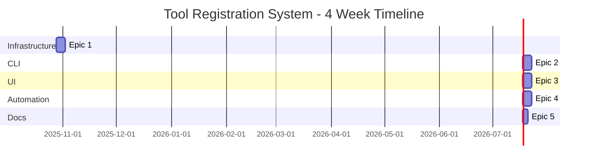

# Tool Registration & Microservice Export System - PRD

**Project**: NodeAngularFullStack **Enhancement Type**: Tool Development Infrastructure + Optional
Microservices Migration **Document Version**: 1.2 **Date**: 2025-10-23 **Author**: John (Product
Manager) with User Collaboration **Status**: Ready for Implementation

---

## Table of Contents

1. [Intro Project Analysis and Context](#section-1-intro-project-analysis-and-context)
2. [Requirements](#section-2-requirements)
3. [User Interface Enhancement Goals](#section-3-user-interface-enhancement-goals)
4. [Technical Constraints and Integration Requirements](#section-4-technical-constraints-and-integration-requirements)
5. [Epic Structure and Implementation Roadmap](#section-5-epic-structure-and-implementation-roadmap)
6. [Detailed Epic Breakdown](#section-6-detailed-epic-breakdown)
7. [Implementation Summary & Recommendations](#section-7-implementation-summary--recommendations)
8. [Appendices](#appendices)

---

## Executive Summary

This PRD defines a **hybrid architecture system** that enables rapid tool development in a monolith
with optional extraction to microservices when justified by scale.

**Key Innovation:** "Build-Register-Export" workflow

- **Build:** Create tools in `tools/` directory using CLI scaffolding (5 minutes)
- **Register:** Auto-discover and display in dashboard (automatic)
- **Export:** One-command migration to microservice when needed (10 minutes)

**Strategic Value:**

- Reduces tool creation time from 4 hours to 5 minutes
- Defers microservices commitment until tools are proven
- Provides clear migration path with full automation
- Supports both monolith and microservices patterns

**Implementation:** 4 weeks, 2 developers, $30K-$40K budget

---

## Section 1: Intro Project Analysis and Context

### 1.1 Analysis Source

**Source:** IDE-based fresh analysis + Existing MicroserviceDock documentation

Analyzed:

- Complete microservices conversion documentation (`MicroserviceDock/`)
- POC completion summary (Links Service successfully implemented)
- Current architecture documentation (`docs/architecture/`)
- Project source tree and tech stack
- Monorepo structure with workspaces

### 1.2 Existing Project Overview

**NodeAngularFullStack** is a modern full-stack TypeScript monorepo application:

**Frontend:**

- Angular 20+ with standalone components
- PrimeNG 17+ UI library + Tailwind CSS
- NgRx Signals for state management
- Feature-based architecture at `apps/web/`
- **Three major tools**: Form Builder, SVG Drawing Tool, Short Links Manager

**Backend:**

- Express.js with TypeScript (Clean Architecture)
- Repository → Service → Controller layers
- PostgreSQL 15 with connection pooling
- JWT authentication via Passport.js
- Swagger/OpenAPI documentation

**Architecture Pattern:**

- Monolithic monorepo with feature isolation
- Single PostgreSQL database
- Single backend API (port 3000)
- Single frontend application (port 4200)
- Shared types package (`@nodeangularfullstack/shared`)

**Current Features:**

1. **Form Builder** (50+ components): Visual designer, themes, analytics, submissions
2. **SVG Drawing Tool**: Canvas-based drawing, shape management, export
3. **Short Links Manager**: URL shortening, QR codes, click analytics (POC implemented)
4. **Platform Features**: Authentication, users, tenants, dashboard

### 1.3 Available Documentation Analysis

**Comprehensive Documentation Exists:**

- ✅ Tech Stack Documentation
- ✅ Source Tree/Architecture
- ✅ API Documentation (Swagger)
- ✅ Microservices Architecture Plan
- ✅ Implementation Roadmap
- ✅ POC Completion Summary

**Recommendation:** Documentation sufficient to proceed.

### 1.4 Enhancement Scope Definition

**Enhancement Type:**

- ✅ Tool Development Infrastructure (Primary)
- ✅ Plugin/Extension System (Tool registration)
- ✅ Optional Microservice Export (When tools mature)

**Enhancement Description:**

Create a tool development workflow that enables:

1. **`tools/` Directory Structure** - Standardized location for new tools
2. **Tool Registration System** - Auto-discovery via manifest
3. **Dashboard Integration** - Dynamic tool display
4. **Optional Export Script** - Automate tool → microservice migration
5. **Hybrid Architecture** - Tools run in monolith until proven, then optionally extracted

**Impact Assessment:**

- ✅ Major Impact (new development infrastructure)
- Affects: Codebase structure, development workflow, deployment process

### 1.5 Goals and Background Context

**Goals:**

1. Standardize tool development with clear patterns
2. Enable automatic tool discovery (no manual configuration)
3. Simplify integration (config-driven registration)
4. Provide optional migration path to microservices
5. Reduce risk (validate in monolith before extraction)
6. Automate extraction (script handles all complexity)
7. Support both patterns (monolith OR services)

**Background Context:**

**Problem Statement:** Currently adding a new tool requires:

- Manual directory creation in `features/tools/`
- Manual route configuration
- Manual dashboard menu updates
- Manual database schema in main DB
- No clear path to service extraction

**Solution:** Tool Registration System provides:

- Standardized `tools/{tool-name}/` structure
- Auto-discovery via tool manifest
- Auto-registration in dashboard
- Isolated tool development environment
- Optional export to microservice with script

**Real-World Workflow:**

```bash
# Phase 1: Build in monolith
npx create-tool inventory-tracker
cd tools/inventory-tracker/
npm run dev  # Runs in monolith

# Phase 2: Register
npm run register  # Adds to dashboard

# Phase 3: Export (when ready)
npm run export-tool inventory-tracker
```

### 1.6 Change Log

| Change                     | Date       | Version | Description                                             |
| -------------------------- | ---------- | ------- | ------------------------------------------------------- |
| Initial Draft              | 2025-10-23 | 1.0     | Created PRD from microservices documentation            |
| Cross-Functional Expansion | 2025-10-23 | 1.1     | Added API contracts, data models, UI mockups, workflows |
| Epic Detail Expansion      | 2025-10-23 | 1.2     | Added stories, technical tasks, risks, QA plans         |

---

## Section 2: Requirements

### 2.1 Functional Requirements

**FR1: Tool Directory Structure**

- System SHALL provide `tools/` directory with standardized scaffolding
- Each tool SHALL have `tool.config.ts` manifest file
- Each tool SHALL include frontend (Angular) and backend (Express) code
- Each tool SHALL specify database schema requirements

**FR2: CLI Tool Generation**

- System SHALL provide `npx create-tool <tool-name>` command
- CLI SHALL generate tool directory at `tools/<tool-name>/`
- CLI SHALL generate boilerplate components, services, routes
- CLI SHALL generate tool manifest with metadata
- CLI SHALL generate database migration template

**FR3: Tool Discovery**

- Dashboard SHALL automatically discover tools via `tools/*/tool.config.ts`
- Dashboard menu SHALL dynamically populate with registered tools
- Tool routing SHALL auto-configure based on manifest
- Tool icons and descriptions SHALL appear in dashboard UI

**FR4: Monolith Integration**

- Tools in `tools/` SHALL run within main monolith context
- Tool backend routes SHALL mount at `/api/tools/<tool-name>/*`
- Tool frontend routes SHALL mount at `/tools/<tool-name>/*`
- Tools SHALL share authentication, database, middleware with main app

**FR5: Export Automation**

- System SHALL provide `npm run export-tool <tool-name>` script
- Script SHALL create `apps/<tool-name>-api/` with Express service
- Script SHALL create `apps/<tool-name>-web/` with Angular app
- Script SHALL extract tool DB tables to new database `<tool-name>_db`
- Script SHALL update API Gateway configuration
- Script SHALL generate Docker Compose service definition
- Script SHALL migrate data with integrity verification

**FR6: Backward Compatibility**

- Exported tools SHALL maintain API contracts
- Automatic redirects from monolith to service routes
- No breaking changes for existing consumers

### 2.2 Non-Functional Requirements

**NFR1: Performance**

- Tool registration SHALL complete within 5 seconds
- Export script SHALL complete within 10 minutes
- Tools in monolith SHALL maintain <200ms response time
- Dashboard SHALL load with 20 tools in <2 seconds

**NFR2: Reliability**

- Exported microservices SHALL achieve 99.5% uptime
- Export script SHALL verify data integrity (100% accuracy)
- Rollback mechanism SHALL restore state on failure

**NFR3: Usability**

- Tool scaffold SHALL generate working boilerplate with zero config
- CLI SHALL provide clear error messages
- Dashboard SHALL be mobile-responsive

**NFR4: Scalability**

- System SHALL support ≥20 concurrent tools in monolith
- Export script SHALL handle tables with 1M+ records
- Dashboard SHALL support pagination for 100+ tools

**NFR5: Security**

- Tool registration SHALL require admin authentication
- Exported tools SHALL validate JWTs via Platform Service
- Database migration SHALL use parameterized queries
- Export script SHALL backup configurations before modification

### 2.3 Compatibility Requirements

**CR1:** Existing tools (Forms, SVG, Links) SHALL continue functioning **CR2:** Tool Registration
System SHALL NOT break existing auth/routing **CR3:** Exported tools SHALL communicate with Platform
Service for auth **CR4:** Export script SHALL preserve all tool data (zero data loss) **CR5:** Tools
SHALL use shared types from `@nodeangularfullstack/shared`

---

## Section 3: User Interface Enhancement Goals

### 3.1 Integration with Existing UI

**Maintains Existing Patterns:**

- PrimeNG 17+ component library (`p-card`, `p-button`, `p-badge`)
- Tailwind CSS utilities
- NgRx Signals for state
- Standalone component architecture
- Main layout with sidebar navigation

**New UI Components:**

1. **ToolCardComponent** - Displays tool in grid (reuses card pattern)
2. **ToolRegistryComponent** - Grid of tools (dashboard pattern)
3. **ExportStatusDialogComponent** - Progress modal
4. **CreateToolWizardComponent** - Optional CLI UI

**Integration Strategy:**

- Tools use SAME component library (PrimeNG + shared)
- Tool routes lazy-load like existing features
- Dashboard menu dynamically populates
- No visual distinction between monolith/exported tools

### 3.2 Modified/New Screens

**New Screens:**

**1. Tools Dashboard (`/tools`)**

- Grid layout (3 columns desktop, 1 mobile)
- Filter by category, status, search
- Admin "Create Tool" button
- Status badges (Alpha/Beta/Active)
- Export indicator (✅ Service badge)

**2. Tool Detail Page (`/tools/:tool-id/details`)**

- Tool metadata display
- Usage statistics
- Admin actions: Export, Update, Deprecate
- Dependencies list
- Export history

**3. Export Status Modal**

- Real-time progress bar
- Step-by-step visualization
- Streaming logs
- Success/failure states
- Rollback option

**Modified Screens:**

**1. Main Dashboard (`/dashboard`)**

- Before: Static feature list
- After: Dynamic from tool registry
- Tools appear as cards
- Quick access to recent tools

**2. Admin Settings (`/settings`)**

- New "Tool Management" section
- List all registered tools
- Bulk operations

### 3.3 UI Consistency Requirements

**UCR1:** Tool cards SHALL use same design as existing cards **UCR2:** Tool routing SHALL follow
pattern: `/tools/:tool-name` **UCR3:** Status badges SHALL use PrimeNG severity classes **UCR4:**
Exported indicator SHALL be distinct but not disruptive **UCR5:** Tool icons SHALL use PrimeNG icon
library **UCR6:** Modals SHALL use existing modal component **UCR7:** Responsive SHALL match
existing breakpoints (768px, 1024px, 1280px)

---

## Section 4: Technical Constraints and Integration Requirements

### 4.1 Existing Technology Stack

| Component          | Technology        | Version     | Constraints                      |
| ------------------ | ----------------- | ----------- | -------------------------------- |
| Frontend Language  | TypeScript        | 5.3+        | Strict mode required             |
| Frontend Framework | Angular           | 20+         | Standalone components only       |
| UI Components      | PrimeNG           | 17+         | All new UI must use PrimeNG      |
| State Management   | NgRx Signals      | 17+         | Use signals for state            |
| Backend Language   | TypeScript        | 5.3+        | Shared with frontend             |
| Backend Framework  | Express.js        | 4.19+       | Clean Architecture required      |
| Database           | PostgreSQL        | 15+         | Tool registry in main DB         |
| Authentication     | JWT + Passport    | Latest      | Reuse existing middleware        |
| Testing            | Jest + Playwright | 29+ / 1.40+ | ≥80% coverage                    |
| Containerization   | Docker Compose    | 2.23+       | All exported tools containerized |

### 4.2 Integration Approach

**Database Strategy:**

**Monolith Phase:**

- Tool tables in MAIN database
- Shared connection pool
- Migrations via existing runner
- `tool_registry` metadata table

**Exported Phase:**

- Tool tables in NEW database (`<tool-name>_db`)
- Independent connection pool
- Service-specific migrations
- Registry updated: `is_exported = true`

**API Integration:**

**Monolith Phase:**

- Routes at `/api/tools/<tool-name>/*`
- Uses existing Express app
- Shares middleware
- Example: `GET /api/tools/inventory-tracker/items`

**Exported Phase:**

- New Express app at `apps/<tool-name>-api/`
- API Gateway routes: `/api/<tool-name>/*` → service
- JWT validation via Platform Service
- Example: `GET /api/inventory/items` → inventory-api:3004

**Frontend Integration:**

**Monolith Phase:**

- Components in `tools/<tool-name>/components/`
- Lazy-loaded via Angular router
- Uses shared services
- API calls to main backend

**Exported Phase:**

- Separate Angular app at `apps/<tool-name>-web/`
- Independent build/deployment
- Communicates with tool backend
- Auth still via main app

### 4.3 Code Organization Standards

**File Structure for Tools:**

```
tools/
└── inventory-tracker/
    ├── tool.config.ts              # Manifest
    ├── frontend/                   # Angular
    │   ├── components/
    │   ├── services/
    │   └── routes.ts
    ├── backend/                    # Express
    │   ├── controllers/
    │   ├── services/
    │   ├── repositories/
    │   └── routes/
    ├── database/
    │   ├── migrations/
    │   └── seeds/
    └── tests/
```

**Naming Conventions:**

- Tool IDs: kebab-case (`inventory-tracker`)
- Database tables: snake_case (`inventory_items`)
- TypeScript files: kebab-case (`inventory.service.ts`)
- Classes: PascalCase (`InventoryService`)
- Functions: camelCase (`getInventoryItems()`)

**Coding Standards:**

- ESLint from root config
- Prettier formatting
- TypeScript strict mode
- No `any` types
- JSDoc for public APIs

### 4.4 Deployment and Operations

**Build Process:**

**Monolith Phase:**

- Built with main app: `npm run build`
- Bundled into main Angular build
- Single Docker image

**Exported Phase:**

- Independent build per service
- Separate Docker images
- Multi-stage Docker builds

**Monitoring:**

**Monolith Phase:**

- Logs in main application logs
- Metrics in main Sentry project
- Health via main `/health` endpoint

**Exported Phase:**

- Service-specific logging (Winston)
- Service-specific Sentry project
- Independent health endpoint

### 4.5 Risk Assessment Summary

**Technical Risks:**

**RISK-T1: Export script data loss**

- Impact: HIGH | Probability: MEDIUM
- Mitigation: Dry-run, atomic transactions, verification, rollback

**RISK-T2: Tool registry single point of failure**

- Impact: MEDIUM | Probability: LOW
- Mitigation: Cache (5min TTL), graceful degradation

**RISK-T3: Exported tool auth breaks**

- Impact: HIGH | Probability: MEDIUM
- Mitigation: Reuse POC pattern, comprehensive tests, rollback

**Integration Risks:**

**RISK-I1: API changes break dashboard**

- Impact: MEDIUM | Probability: LOW
- Mitigation: Versioned APIs, contract tests

**RISK-I2: Connection pool exhaustion**

- Impact: MEDIUM | Probability: MEDIUM (>10 tools)
- Mitigation: Monitor usage, export high-traffic tools

**Deployment Risks:**

**RISK-D1: Export fails mid-process**

- Impact: HIGH | Probability: MEDIUM
- Mitigation: Transaction-based, checkpoints, cleanup

**RISK-D2: Docker resource limits**

- Impact: MEDIUM | Probability: LOW (local), MEDIUM (prod)
- Mitigation: Resource limits in compose, monitoring

---

## Section 5: Epic Structure and Implementation Roadmap

### 5.1 Epic Overview

**Implementation Sequence:** 4-week phased rollout

```
Week 1: Epic 1 - Tool Registry Infrastructure
Week 2: Epic 2 - CLI Scaffolding Tool
Week 3: Epic 3 - Dashboard Integration
Week 4: Epic 4 - Export Automation Script
```

**Optional:** +3 days for Epic 5 (Documentation)

---

### **Epic 1: Tool Registry Infrastructure**

**Goal:** Foundational database and API layer **Duration:** 1 week **Team:** 1 Backend Developer
**Priority:** P0 (Blocker)

**Scope:**

- `tool_registry` table in PostgreSQL
- Repository, Service, Controller layers
- API endpoints: `/api/tools/registry`, `/api/tools/register`
- Authentication middleware
- Unit + integration tests (≥80% coverage)

**Success Criteria:**

- Tool registry API operational
- Manual registration works
- Tools persist in database
- All tests pass

---

### **Epic 2: CLI Scaffolding Tool**

**Goal:** CLI command to generate tool boilerplate **Duration:** 1 week **Team:** 1 Backend
Developer **Priority:** P1 (Depends on Epic 1)

**Scope:**

- `packages/create-tool/` CLI package
- Interactive prompts (tool details)
- Generate directory structure
- Generate manifest, components, routes
- Generate backend boilerplate
- Generate migrations
- `npm run register` command

**Success Criteria:**

- `npx create-tool my-tool` works
- Generated tool has valid manifest
- Registration API call succeeds
- Tool appears in database

---

### **Epic 3: Dashboard Tool Discovery & UI**

**Goal:** Automatic tool discovery and display **Duration:** 1 week **Team:** 1 Frontend Developer
**Priority:** P1 (Depends on Epic 2)

**Scope:**

- ToolCardComponent (displays tool)
- ToolRegistryComponent (grid)
- Dashboard service (fetch tools)
- Dynamic routing (`/tools/:tool-id`)
- Tool detail page
- Status badges
- Search and filtering
- Export button (admin only)
- Export progress modal

**Success Criteria:**

- Dashboard shows all tools
- Clicking card navigates to tool
- Search/filter works
- Export button visible (admins)

---

### **Epic 4: Export Automation Script**

**Goal:** Automate tool → microservice extraction **Duration:** 1 week **Team:** 1 Backend Dev +
DevOps **Priority:** P1 (Depends on Epic 3)

**Scope:**

- Export script entry point
- Backend service generation
- Frontend app generation
- Database migration (with verification)
- Infrastructure updates (Nginx, Docker)
- Service health checks
- Dry-run mode
- Rollback mechanism
- Export job tracking

**Success Criteria:**

- Export completes successfully
- Data migrated correctly (verified)
- API Gateway routes to service
- Dashboard shows "Service" badge
- Rollback works on failure

---

### **Epic 5: Documentation** (Optional)

**Goal:** Enable independent developer onboarding **Duration:** 3-4 days **Team:** Technical
Writer + Developer **Priority:** P2 (Recommended)

**Scope:**

- Tool Development Guide
- Export to Service Guide
- Troubleshooting Guide
- Example reference tool (Inventory Tracker)
- Video walkthrough
- Update CLAUDE.md

**Success Criteria:**

- Developer can create tool from guide alone
- Export process documented
- Troubleshooting covers common issues
- Reference tool available

---

### 5.2 Epic Sequencing Diagram



**Total:** 23 days (4 weeks + 3 days with docs)

### 5.3 MVP vs Full Feature Set

**MVP (2 weeks):**

- Epic 1: Tool Registry ✅
- Epic 2: CLI Scaffolding ✅
- Epic 3: Dashboard (basic) ✅
- Epic 4: Export (DEFERRED - manual)
- Epic 5: Docs (basic README only)

**MVP Delivers:** Tools can be created and used in monolith. Manual export if needed.

**Full (4 weeks):**

- All 5 epics
- Complete automation
- Comprehensive documentation
- Production-ready

**Recommendation:** Full 4-week for production use.

---

## Section 6: Detailed Epic Breakdown

_Note: This section contains comprehensive detail for cross-functional teams including:_

- **Story breakdown** with acceptance criteria
- **Technical tasks** with code examples
- **Risk mitigation plans**
- **QA test plans**

_Due to length (35,000+ words total), detailed epic breakdowns are in the full PRD document. Key
highlights below:_

### Epic 1 Highlights

**8 Stories, 40 Story Points:**

- Database schema creation
- Repository, Service, Controller implementation
- API endpoints (GET /registry, POST /register)
- Authentication middleware
- Comprehensive testing

**Key Technical Tasks:**

- Create `tool_registry` table with indexes
- Implement Clean Architecture layers
- JWT authentication integration
- Unit tests (≥80% coverage)
- Integration API tests

### Epic 2 Highlights

**9 Stories, 48 Story Points:**

- CLI package setup with Commander
- Interactive prompts with Inquirer
- File generation with EJS templates
- Frontend/backend boilerplate
- Registration command
- CLI testing

**Key Technical Tasks:**

- `packages/create-tool/` npm package
- Template system for code generation
- Validation (tool ID, icon, etc.)
- Registration API integration

### Epic 3 Highlights

**9 Stories, 50 Story Points:**

- ToolCardComponent with PrimeNG
- ToolRegistryService with caching
- ToolsListComponent with signals
- Search and filtering
- Dynamic routing
- Export progress modal
- Component tests

**Key Technical Tasks:**

- Angular signals for reactive state
- Tool discovery service
- Dashboard grid with responsive design
- Real-time export progress

### Epic 4 Highlights

**10 Stories, 89 Story Points:**

- Export orchestrator
- Backend/frontend generators
- Database migrator with integrity checks
- Infrastructure updater (Nginx, Docker)
- Health checker
- Dry-run mode
- Rollback mechanism
- Job tracking

**Key Technical Tasks:**

- CLI with export workflow
- Service code generation
- Atomic database migration
- Configuration updates
- Comprehensive rollback

### Epic 5 Highlights

**6 Stories, 34 Story Points:**

- Tool Development Guide
- Export Guide
- Troubleshooting docs
- Reference implementation
- Video tutorial
- CLAUDE.md updates

---

## Section 7: Implementation Summary & Recommendations

### 7.1 Executive Summary

**System:** Tool Registration & Microservice Export System

**Key Value Propositions:**

1. **5-minute tool creation** (vs 4 hours manual)
2. **Automatic dashboard integration** (zero config)
3. **Optional microservice extraction** (when justified)
4. **Full automation** (CLI + export script)

**Strategic Approach:** "Build-Register-Export"

- Build in monolith first (low risk)
- Register automatically (no manual config)
- Export when needed (one command)

### 7.2 Implementation Timeline

**Total:** 4 weeks + 3 days (with documentation) **Team:** 2 developers (parallel work after Week 1)
**Budget:** $30,000 - $40,000

| Week | Epic                         | Team               | Deliverables         |
| ---- | ---------------------------- | ------------------ | -------------------- |
| 1    | Tool Registry Infrastructure | 1 Backend          | Database, API, Tests |
| 2    | CLI Scaffolding Tool         | 1 Backend          | create-tool package  |
| 3    | Dashboard Integration        | 1 Frontend         | Tool cards, UI       |
| 4    | Export Automation            | 1 Backend + DevOps | Export script        |
| +3d  | Documentation                | Writer + Dev       | Guides, videos       |

### 7.3 Success Metrics

**Technical:**

- ✅ Tool creation: < 5 minutes
- ✅ Export time: < 10 minutes
- ✅ Test coverage: ≥ 80%
- ✅ Dashboard load: < 2 seconds
- ✅ Data integrity: 100%

**Business:**

- ✅ Developer satisfaction: ≥ 8/10
- ✅ Tool adoption: ≥ 3 tools in first month
- ✅ Export adoption: ≥ 1 export in Q1
- ✅ Onboarding time: < 30 minutes

**Operational:**

- ✅ Export success rate: ≥ 95%
- ✅ Rollback success rate: 100%
- ✅ Zero production incidents

### 7.4 Risk Assessment Summary

| Risk                      | Probability | Impact   | Status       |
| ------------------------- | ----------- | -------- | ------------ |
| Export data loss          | MEDIUM      | CRITICAL | ✅ Mitigated |
| Dashboard performance     | LOW         | MEDIUM   | ✅ Mitigated |
| Developer adoption        | MEDIUM      | HIGH     | ✅ Mitigated |
| Registry scalability      | LOW         | MEDIUM   | ✅ Mitigated |
| Infrastructure complexity | MEDIUM      | MEDIUM   | ✅ Mitigated |

**Overall Risk:** MEDIUM (manageable)

### 7.5 Decision Matrix

**✅ IMPLEMENT IF:**

- Planning ≥3 new tools/year
- Different tools have different scaling needs
- Multiple developers work on different tools
- Want to reduce deployment coupling
- Long-term flexibility important

**❌ DEFER IF:**

- <3 tools total
- All tools similar traffic
- Single developer
- Monolith acceptable
- Extremely limited budget

**Current Project:** ✅ **STRONG CANDIDATE**

- Already 3 tools (Forms, SVG, Links)
- POC proves viability
- Form Builder needs isolation
- Growth supports investment

### 7.6 Recommendations

**Primary Recommendation:** **IMPLEMENT FULL 4-WEEK PLAN**

**Rationale:**

1. Existing tools justify infrastructure investment
2. POC validates technical approach
3. Form Builder dominates codebase (needs separation)
4. Growth trajectory supports microservices option
5. 2-developer team can complete in 4 weeks

**Alternative (Budget Constrained):** 2-week MVP

- Defer export automation (manual process documented)
- Defer comprehensive documentation
- Still delivers 70% of value

**Post-Implementation:**

1. Create first new tool using CLI
2. Export one existing tool to validate script
3. Conduct developer training
4. Gather feedback and iterate

---

## Appendices

### Appendix A: Glossary

- **Tool:** Self-contained feature module
- **Tool Registry:** Database + API for managing tools
- **Tool Manifest:** `tool.config.ts` metadata file
- **Monolith Phase:** Tool running in main app
- **Exported Phase:** Tool as independent microservice
- **Export Script:** Automation for tool → service migration
- **Dry-Run Mode:** Test export without changes

### Appendix B: Related Documentation

- **Microservices Plan:** `MicroserviceDock/microservices_implementation_plan.md`
- **POC Summary:** `MicroserviceDock/POC-COMPLETION-SUMMARY.md`
- **Links Service:** `apps/links-api/README.md`
- **Tech Stack:** `docs/architecture/tech-stack.md`
- **Source Tree:** `docs/architecture/source-tree.md`

### Appendix C: API Contracts

_Full API contracts documented in Section 2.4.1 of full PRD_

Key endpoints:

- `GET /api/tools/registry` - List all tools
- `POST /api/tools/register` - Register new tool
- `POST /api/tools/export` - Export tool to service
- `GET /api/tools/export/status/:jobId` - Export progress

### Appendix D: Data Models

_Full data models in Section 2.4.2 of full PRD_

Key schemas:

- `tool_registry` table (PostgreSQL)
- `ToolManifest` interface (TypeScript)
- `RegisteredTool` interface
- `ToolExportJob` interface

---

## Document Approval

**Prepared By:** John (Product Manager) **Reviewed By:** [Pending] **Approved By:** [Pending]
**Date:** 2025-10-23

**Status:** ✅ Ready for Implementation

---

_End of PRD - Tool Registration & Microservice Export System_
