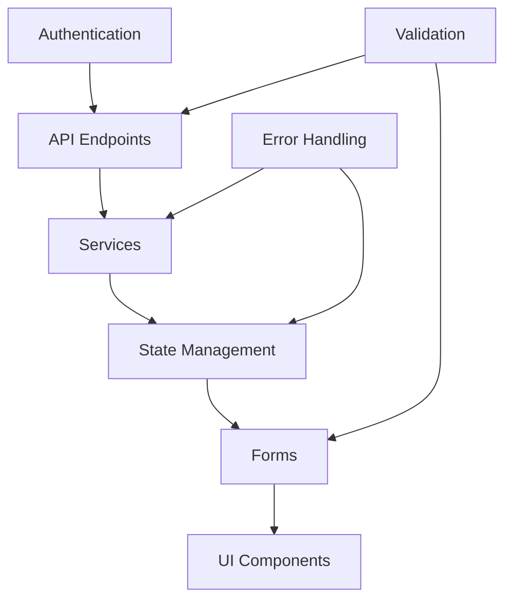

# Common Patterns Examples

This directory contains example implementations of common business logic and UI patterns used
throughout the application.

## 📁 Directory Structure

### 🔌 API Endpoints (`api-endpoints/`)

- **CRUD Operations**: Complete REST API patterns
- **Authentication**: JWT-based auth endpoints
- **File Upload**: Handling file uploads with validation
- **Pagination**: Implementing efficient pagination
- **Filtering & Search**: Advanced query patterns

### 🏗️ Services (`services/`)

- **Business Logic**: Service layer patterns
- **Data Transformation**: Data mapping and conversion
- **External APIs**: Third-party service integration
- **Caching**: Implementing caching strategies
- **Error Handling**: Centralized error management

### 🔄 State Management (`state-management/`)

- **NgRx Signals**: Modern reactive state patterns
- **Component State**: Local state management
- **Form State**: Form state with validation
- **Loading States**: Handling async operations
- **Error States**: Error state management

### 📝 Forms (`forms/`)

- **Reactive Forms**: Dynamic form creation
- **Validation**: Custom validators and error handling
- **Dynamic Forms**: Building forms from configuration
- **Multi-step Forms**: Wizard-style form flows
- **File Upload Forms**: Forms with file handling

## 🎯 Usage Examples

Each pattern directory contains:

- **README.md**: Pattern explanation and use cases
- **example.{ts,js}**: Complete implementation
- **test.{ts,js}**: Comprehensive tests
- **integration.md**: Integration guidelines

## 🔗 Pattern Relationships

## 🚀 Quick Start

1. **Choose a Pattern**: Browse directories for your use case
2. **Read the README**: Understand the pattern and its benefits
3. **Copy the Example**: Use the implementation as a starting point
4. **Run Tests**: Validate your implementation works correctly
5. **Customize**: Adapt the pattern to your specific needs

## 💡 Best Practices

- **Type Safety**: All examples use shared TypeScript types
- **Testing**: Each pattern includes comprehensive tests
- **Documentation**: JSDoc comments explain all public APIs
- **Consistency**: Patterns follow project coding standards
- **Performance**: Examples include optimization techniques
